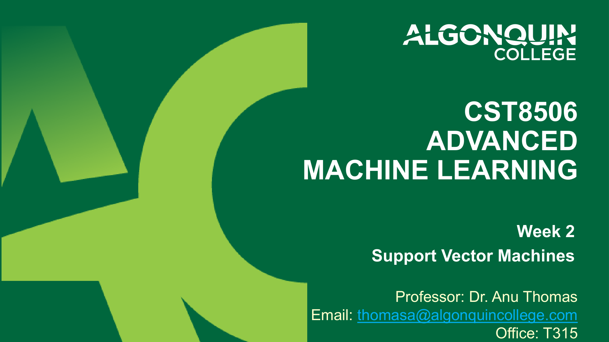
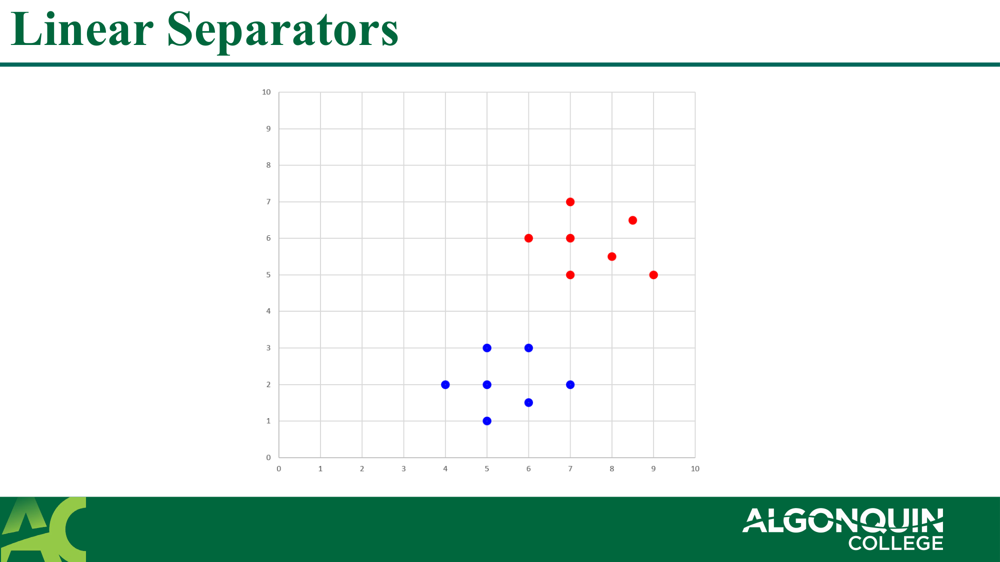
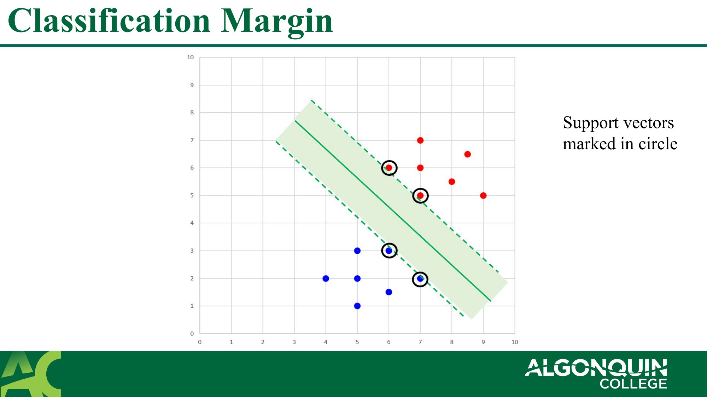
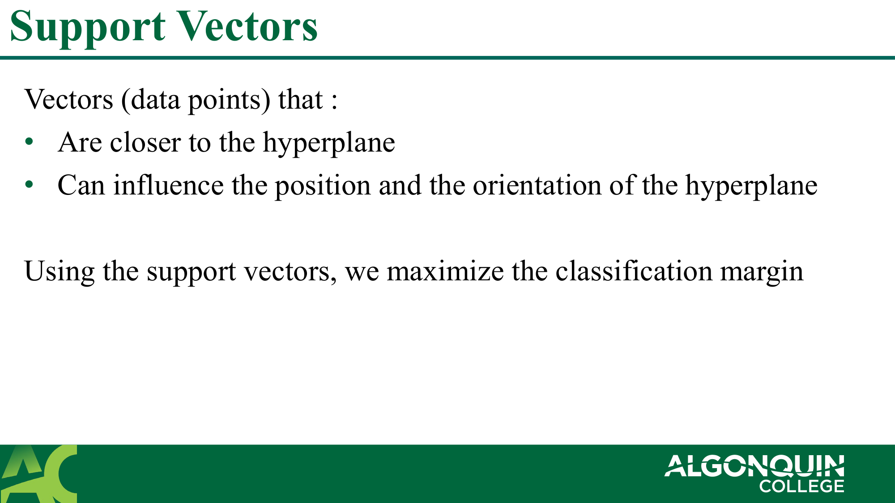
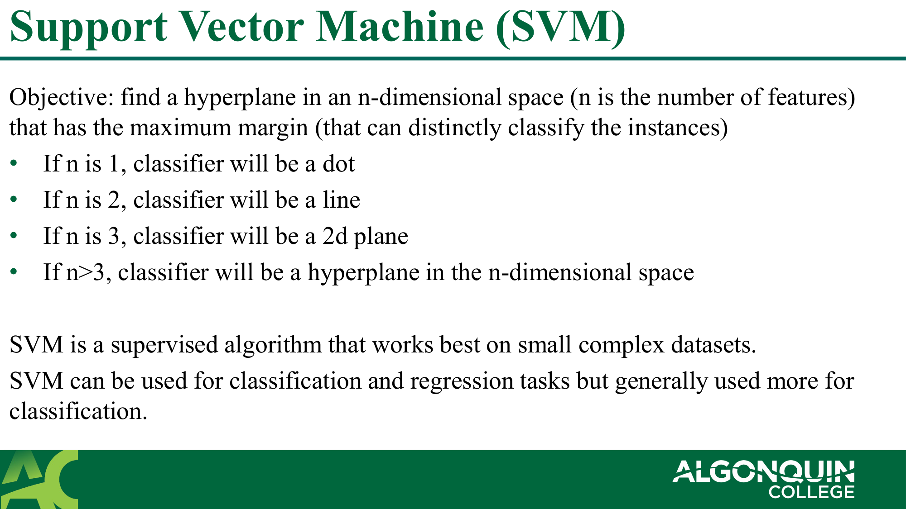
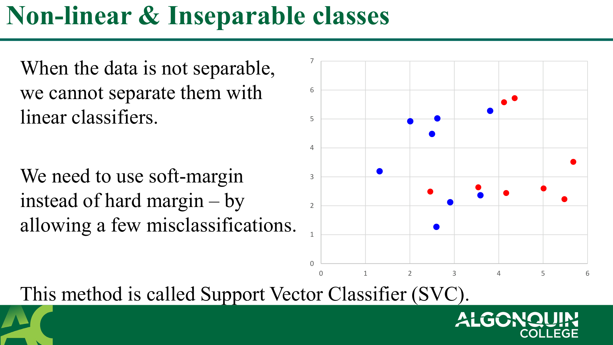
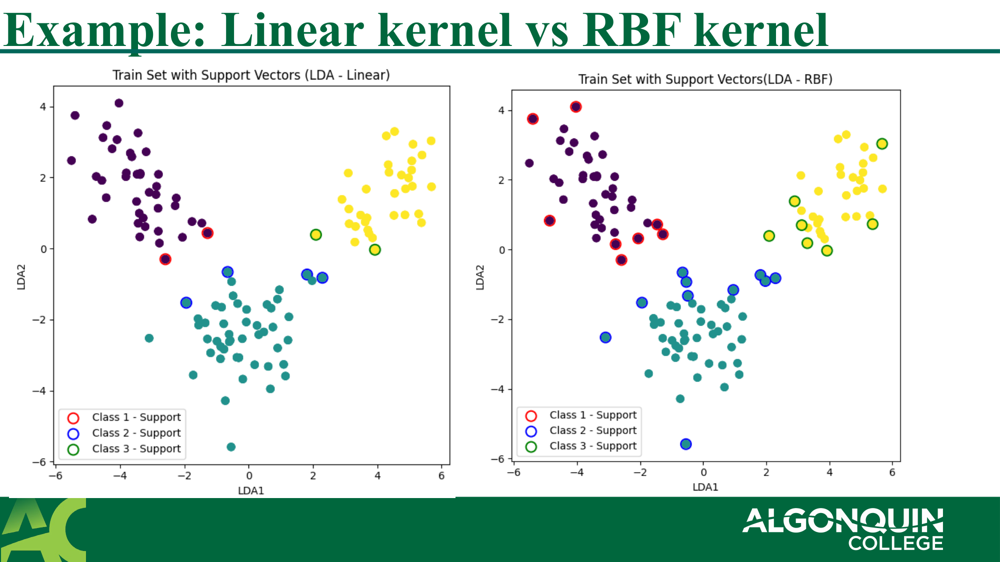
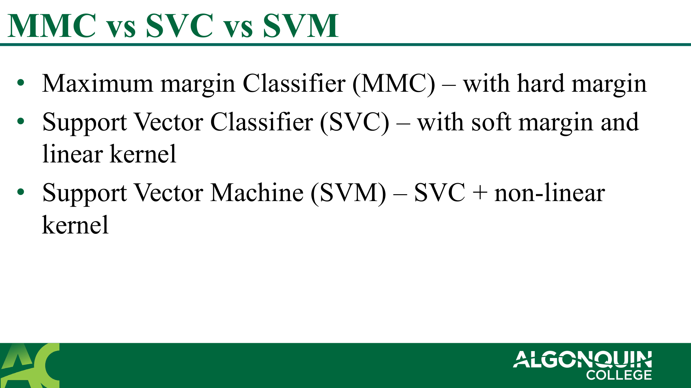
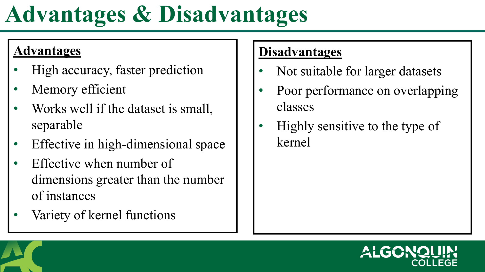
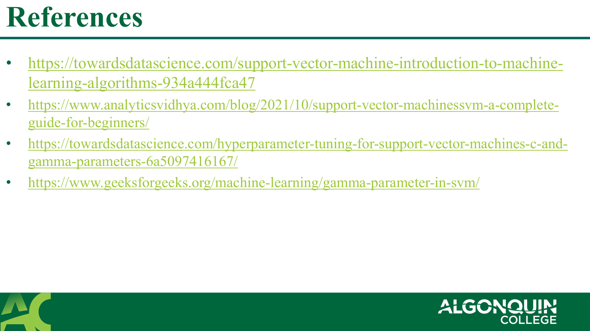

# 02 CST8506 SVM4

**Source:** `02_CST8506_SVM4.pdf`  
**Total Pages:** 25  
**Format:** Hybrid (pdfplumber + PyMuPDF)

---

## Page 1

### 📷 Page Image

### 📝 Text Content

**CST8506**

ADVANCED
MACHINE LEARNING
Week
Support Vector Machines
Professor: Dr. Anu Thomas
Email: thomasa@algonquincollege.com
Office: T315

### ✍️ Notes

**📝 笔记:**

**课程信息:**

- 课程：CST8506 高级机器学习 (Advanced Machine Learning)
- 主题：支持向量机 (Support Vector Machines)
- 第 2 周内容
- 教授：Dr. Anu Thomas

**💡 提示:** 这是 SVM 专题课程，建议复习线性代数和优化理论基础

---

## Page 2

### 📷 Page Image

### 📝 Text Content

**Linear Separators**

### ✍️ Notes

**📝 笔记:**

**线性分类器 (Linear Separators):**

- 用一条直线（或超平面）将数据分为两类
- 是 SVM 的基础概念
- 适用于线性可分的数据

**💡 提示:** 查看图片理解不同线性分类器的区别

---

## Page 3

### 📷 Page Image

### 📝 Text Content

**Linear Separators – which one is optimal?**

### ✍️ Notes

**📝 笔记:**

**最优线性分类器:**

- 存在多条可能的分类线时，需要选择"最优"的一条
- 最优标准：最大化分类间隔 (margin)
- SVM 的核心思想：找到间隔最大的分类边界

**💡 提示:** 图片展示了多个可能的分类线，SVM 会选择间隔最大的那条

---

## Page 4

### 📷 Page Image

### 📝 Text Content

**Classification Margin**

### ✍️ Notes

**📝 笔记:**

**分类间隔 (Classification Margin):**

- 定义：决策边界到最近数据点的距离
- 目标：最大化这个间隔
- 间隔越大，分类器越稳健，泛化能力越强

**💡 提示:** 图片中的虚线表示间隔边界

---

## Page 5

### 📷 Page Image

### 📝 Text Content

**Classification Margin**

Support vectors
marked in circle

### ✍️ Notes

**📝 笔记:**

**支持向量标记:**

- 图中圆圈标记的点是支持向量 (support vectors)
- 这些点最接近决策边界
- 它们决定了超平面的位置和方向

**💡 提示:** 只有支持向量影响模型，其他点可以移动而不改变决策边界

---

## Page 6

### 📷 Page Image

### 📝 Text Content

**Classification Margin**

Distance between the hyperplane and the vectors
closest to the hyperplane (support vectors)

### ✍️ Notes

**📝 笔记:**

**间隔的数学定义:**

- 间隔 = 超平面到最近向量（支持向量）的距离
- 这个距离在两侧是对称的
- SVM 优化目标：最大化这个距离

**💡 提示:** 支持向量恰好位于间隔边界上

---

## Page 7

### 📷 Page Image

### 📝 Text Content

**Support Vectors**

Vectors (data points) that :

• Are closer to the hyperplane

• Can influence the position and the orientation of the hyperplane
Using the support vectors, we maximize the classification margin

### ✍️ Notes

**📝 笔记:**

**支持向量 (Support Vectors):**

- 定义：最接近超平面的数据点
- 特性：
  - 距离超平面最近
  - 可以影响超平面的位置和方向
- 作用：利用支持向量最大化分类间隔

**💡 提示:** SVM 的名字来源于这些"支持"决策边界的向量，只有它们参与模型训练

---

## Page 8

### 📷 Page Image

### 📝 Text Content

**Support Vector Machine (SVM)**

Objective: find a hyperplane in an n-dimensional space (n is the number of features)
that has the maximum margin (that can distinctly classify the instances)

• If n is 1, classifier will be a dot

• If n is 2, classifier will be a line

• If n is 3, classifier will be a 2d plane

• If n>3, classifier will be a hyperplane in the n-dimensional space
SVM is a supervised algorithm that works best on small complex datasets.
SVM can be used for classification and regression tasks but generally used more for
classification.

### ✍️ Notes

**📝 笔记:**

**支持向量机 (SVM) 定义:**

- 目标：在 n 维空间中找到最大间隔的超平面
- 分类器形式取决于特征数量 n：
  - n=1: 点
  - n=2: 直线
  - n=3: 2D 平面
  - n>3: n 维超平面

**适用场景:**

- 小规模复杂数据集效果最好
- 主要用于分类，也可用于回归

**💡 提示:** SVM 是监督学习算法，需要标注数据训练

### 📷 Page Image

### 📝 Text Content

**Example – How to predict for black point?**

### ✍️ Notes

**📝 笔记:**

**预测示例:**

- 图示展示了如何使用超平面预测黑点的类别
- 通过观察点相对于分类边界的位置来判断

**💡 提示:** 这是 SVM 分类的直观理解，下一页会介绍数学原理

---

## Page 10

### 📷 Page Image

### 📝 Text Content

**Example – How to predict for black point?**

Vector w is perpendicular to the green line.
The projection of any vector or another vector is called
dot-product.
Vector x is projected on vector w.
If

_[Mathematical formula - see image above]_

### ✍️ Notes

**📝 笔记:**

**预测方法（数学原理）:**

- 向量 w 垂直于分类线（绿线）
- 使用点积 (dot-product) 计算向量 x 在 w 上的投影
- 判断规则：
  - 如果 x·w > c：点在边界一侧
  - 如果 x·w < c：点在边界另一侧

**关键概念:**

- 点积用于计算投影
- 通过投影值判断分类

**💡 提示:** 这是 SVM 决策函数的几何解释，公式见图片

---

## Page 11

### 📷 Page Image

### 📝 Text Content

**Optimization Function and its Constraints**

### ✍️ Notes

**📝 笔记:**

**优化函数和约束条件:**

- 目标：找到权重向量 w 和偏置 b，使间隔 d 最大化
- 需要满足约束条件（确保所有点被正确分类）
- L₁ 和 L₂ 表示两个间隔边界的超平面

**💡 提示:** 这是 SVM 的数学优化问题，公式见图片

---

## Page 12

### 📷 Page Image

### 📝 Text Content

**Optimization Function and its Constraints**

Let’s consider blue points as +1 and red points as -1.
L :

_[Mathematical formula - see image above]_

L :

_[Mathematical formula - see image above]_

For red points,
For blue points,

_[Mathematical formula - see image above]_

, where

_[Mathematical formula - see image above]_

### ✍️ Notes

**📝 笔记:**

**标签约定:**

- 蓝色点标记为 +1（正类）
- 红色点标记为 -1（负类）
- L₁ 和 L₂ 分别对应两类的间隔边界

**约束条件:**

- 红色点：满足特定不等式
- 蓝色点：满足另一个不等式

**💡 提示:** yᵢ 表示样本标签，用于统一表示约束条件

---

## Page 13

### 📷 Page Image

### 📝 Text Content

**Distance between two hyperplanes**

Distance between two parallel hyperplanes and is ,

_[Mathematical formula - see image above]_

dd = ww
Euclidean norm measures the "length" or "magnitude" of a vector in Euclidean space.

_[Mathematical formula - see image above]_

ww = ww1 + ww2 + ww3 + ⋯+ wwnn
Distance between and is .

_[Mathematical formula - see image above]_

### ✍️ Notes

**📝 笔记:**

**间隔计算:**

- 两个平行超平面之间的距离公式
- 欧几里得范数 (Euclidean norm)：衡量向量的"长度"或"大小"
- 计算公式：||w|| = √(w₁² + w₂² + w₃² + ... + wₙ²)

**关键公式:**

- 间隔 = 2/||w||

**💡 提示:** 最大化间隔等价于最小化 ||w||

---

## Page 14

### 📷 Page Image

### 📝 Text Content

**Optimization Function and its Constraints (Contd.)**

The goal when training an SVM is

• Maximize

_[Mathematical formula - see image above]_

• Subject to the constraint

_[Mathematical formula - see image above]_

This method is called Maximum Margin Classifier (MMC).

### ✍️ Notes

**📝 笔记:**

**SVM 训练目标:**

- 最大化 2/||w||（等价于最小化 ||w||）
- 约束条件：yᵢ(w·x + b) ≥ 1

**方法名称:**

- 这种方法称为最大间隔分类器 (Maximum Margin Classifier, MMC)
- 使用硬间隔 (hard margin)，不允许误分类

**💡 提示:** 这是线性可分数据的理想情况

---

## Page 15

### 📷 Page Image

### 📝 Text Content

**Types of SVM**

• Linear SVM (LSVM) – when the data is linearly separable

• Non-linear SVM – data cannot be separated into 2 classes
using a straight line.

### ✍️ Notes

**📝 笔记:**

**SVM 的两种类型:**

- 线性 SVM (Linear SVM, LSVM)：数据线性可分时使用
- 非线性 SVM (Non-linear SVM)：数据无法用直线分为两类时使用
- 选择依据：观察数据分布特征

**💡 提示:** 先尝试线性 SVM，如果效果不好再考虑非线性核函数

---

## Page 16

### 📷 Page Image

### 📝 Text Content

**Non-linear & Inseparable classes**

When the data is not separable
we cannot separate them with
linear classifiers.
We need to use soft-margin
instead of hard margin – by
allowing a few misclassifications.

_[Mathematical formula - see image above]_

This method is called Support Vector Classifier (SVC).

### ✍️ Notes

**📝 笔记:**

**软间隔 (Soft Margin):**

- 当数据不可分时，无法使用线性分类器
- 使用软间隔代替硬间隔，允许少量误分类
- 这种方法称为支持向量分类器 (Support Vector Classifier, SVC)

**关键区别:**

- 硬间隔：不允许任何误分类（MMC）
- 软间隔：允许少量误分类，提高泛化能力（SVC）

**💡 提示:** 软间隔更适合实际应用，因为真实数据往往不是完全可分的

---

## Page 17

### 📷 Page Image

### 📝 Text Content

**Non-linear & Inseparable classes**

When the data is not separable
like this, we cannot separate them
with linear classifiers.
We need to transform the low-
dimensional data into a higher
dimensional space, but this is
computationally expensive. We
can achieve similar results using

_[Mathematical formula - see image above]_

kernels.

### ✍️ Notes

**📝 笔记:**

**核函数 (Kernel) 的必要性:**

- 对于非线性可分数据，线性分类器无法处理
- 方法：将低维数据转换到高维空间
- 问题：直接转换计算成本高
- 解决方案：使用核函数 (kernel) 达到类似效果

**💡 提示:** 核函数是核技巧 (kernel trick) 的关键，可以在不显式转换到高维的情况下计算高维点积

---

## Page 18

### 📷 Page Image

### 📝 Text Content

**Kernel**

Kernel is a function that quantifies the similarities between observations
by summarizing the relationship between every instance in the dataset.
This will transform data into higher dimensions without going into
higher dimensions by computing dot products in a high-dimensional
feature space without explicitly mapping the data to that space.

1. Polynomial: generalized form of linear kernel. Useful for non-linear
   hyperplane.
2. Radial Basis Function (Gaussian): can map an input space to infinite
   dimensional space (widely used)
3. Sigmoid: rarely used, sometimes, works for specific datasets

### ✍️ Notes

**📝 笔记:**

**核函数定义:**

- 量化观测值之间相似度的函数
- 在高维特征空间计算点积，无需显式映射数据

**常用核函数:**

- 多项式核 (Polynomial)：线性核的泛化形式，适用于非线性超平面
- 径向基函数核 (RBF/Gaussian)：可映射到无限维空间，应用最广泛
- Sigmoid 核：很少使用，仅适用于特定数据集

**💡 提示:** 实践中优先尝试 RBF 核，它在大多数情况下表现良好

---

## Page 19

### 📷 Page Image

### 📝 Text Content

**Example: Linear kernel vs RBF kernel**

### ✍️ Notes

**📝 笔记:**

**线性核 vs RBF 核对比:**

- 图示展示了两种核函数在相同数据上的分类效果
- 线性核：适用于线性可分或近似线性可分的数据
- RBF 核：可以处理更复杂的非线性边界

**💡 提示:** 观察图片中的决策边界差异，理解核函数的作用

---

## Page 20

### 📷 Page Image

### 📝 Text Content

**Example: Linear vs Polynomial kernel**

### ✍️ Notes

**📝 笔记:**

**线性核 vs 多项式核示例（第1部分）:**

- 展示线性核和多项式核在同一数据集上的表现
- 多项式核可以拟合更复杂的曲线边界

**💡 提示:** 多项式核的阶数 (degree) 是重要超参数

---

## Page 21

### 📷 Page Image

### 📝 Text Content

**Example: Linear vs Polynomial kernel**

### ✍️ Notes

**📝 笔记:**

**线性核 vs 多项式核示例（第2部分）:**

- 继续展示不同核函数的分类效果对比
- 选择合适的核函数对模型性能影响很大

**💡 提示:** 通过交叉验证选择最佳核函数类型

---

## Page 22

### 📷 Page Image

### 📝 Text Content

**MMC vs SVC vs SVM**

• Maximum margin Classifier (MMC) – with hard margin

• Support Vector Classifier (SVC) – with soft margin and
linear kernel

• Support Vector Machine (SVM) – SVC + non-linear
kernel

### ✍️ Notes

**📝 笔记:**

**三种方法的区别:**

- 最大间隔分类器 (MMC)：硬间隔，不允许误分类
- 支持向量分类器 (SVC)：软间隔 + 线性核
- 支持向量机 (SVM)：SVC + 非线性核

**演进关系:**

- MMC → SVC：引入软间隔，允许误分类
- SVC → SVM：引入核函数，处理非线性问题

**💡 提示:** SVM 是最通用的形式，包含了 MMC 和 SVC 作为特例

---

## Page 23

### 📷 Page Image

### 📝 Text Content

**Other important parameters for SVM**

• C – (inversely proportional to the Regularization parameter)

• represents the acceptable amount of misclassification or error.

• A smaller C value (high regularization) creates a wider margin hyperplane, allows more
misclassifications (large margin - high misclassifications)

• larger value creates small-margin hyperplane (forcing the algorithm to classify every training point
correctly. (Larger value of C can cause overfitting).

• Gamma – factor that control how the model fit on the training data.

• Lower value: loosely fit the train data, more data points will influence the decision boundary. So,
decision boundary will be more generic (may cause underfitting)

• Higher. value: fewer data points will influence the decision boundary. So, this may cause overfitting

### ✍️ Notes

**📝 笔记:**

**重要超参数:**

**参数 C（正则化参数的倒数）:**

- 较小的 C：宽间隔，允许更多误分类（可能欠拟合）
- 较大的 C：窄间隔，强制正确分类所有训练点（可能过拟合）

**参数 Gamma（控制模型拟合程度）:**

- 较小的 gamma：松散拟合，更多数据点影响决策边界（可能欠拟合）
- 较大的 gamma：紧密拟合，较少数据点影响决策边界（可能过拟合）

**💡 提示:** 使用网格搜索 (Grid Search) 和交叉验证找到最佳 C 和 gamma 组合

---

## Page 24

### 📷 Page Image

### 📝 Text Content

**Advantages & Disadvantages**

Advantages Disadvantages

• High accuracy, faster prediction • Not suitable for larger datasets

• Memory efficient • Poor performance on overlapping

• Works well if the dataset is small, classes
separable • Highly sensitive to the type of

• Effective in high-dimensional space kernel

• Effective when number of
dimensions greater than the number
of instances

• Variety of kernel functions

### ✍️ Notes

**📝 笔记:**

**优点:**

- 高准确率，预测速度快
- 内存效率高
- 适合小规模、可分离的数据集
- 在高维空间表现优秀
- 特征数大于样本数时仍然有效
- 多种核函数可选

**缺点:**

- 不适合大规模数据集
- 类别重叠时性能差
- 对核函数类型高度敏感

**💡 提示:** SVM 最适合中小规模、高维、清晰可分的数据集

---

## Page 25

### 📷 Page Image

### 📝 Text Content

**References**

• https://towardsdatascience.com/support-vector-machine-introduction-to-machine-learning-algorithms-934a444fca47

• https://www.analyticsvidhya.com/blog/2021/10/support-vector-machinessvm-a-complete-guide-for-beginners/

• https://towardsdatascience.com/hyperparameter-tuning-for-support-vector-machines-c-and-gamma-parameters-6a5097416167/

• https://www.geeksforgeeks.org/machine-learning/gamma-parameter-in-svm/

### ✍️ Notes

**📝 笔记:**

**参考资源:**

- 四个在线资源涵盖 SVM 的不同方面
- 包括算法介绍、完整指南、超参数调优、Gamma 参数详解

**💡 提示:** 建议按顺序阅读，从基础到进阶逐步深入理解 SVM

---
