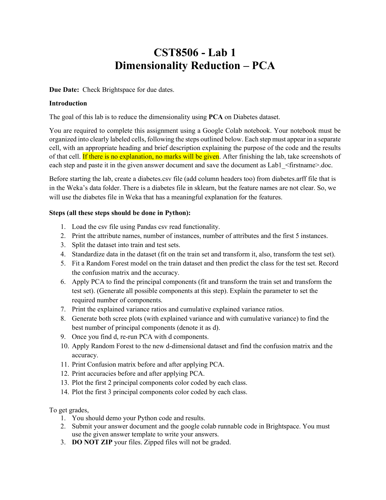

# Lab1 PCA

**Source:** `Lab1_PCA.pdf`  
**Total Pages:** 1  
**Format:** Hybrid (pdfplumber + PyMuPDF)

---

## Page 1

### 📷 Page Image



### 📝 Text Content

**CST8506 - Lab**

**📝 笔记:** 机器学习课程实验 - 主成分分析（PCA）降维

---

Dimensionality Reduction – PCA  
Due Date: Check Brightspace for due dates.

**📝 笔记:**

- **主题:** 降维技术 - PCA（主成分分析）
- **截止日期:** 查看 Brightspace

---

**Introduction**

The goal of this lab is to reduce the dimensionality using PCA on Diabetes dataset.
You are required to complete this assignment using a Google Colab notebook. Your notebook must be
organized into clearly labeled cells, following the steps outlined below. Each step must appear in a separate
cell, with an appropriate heading and brief description explaining the purpose of the code and the results
of that cell. If there is no explanation, no marks will be given. After finishing the lab, take screenshots of
each step and paste it in the given answer document and save the document as Lab1\_<firstname>.doc.

**📝 笔记 - 实验目标:**

- 使用 PCA 对 Diabetes 数据集进行降维
- 平台：Google Colab notebook
- 要求：每个步骤独立单元格，带标题和说明
- ⚠️ 重要：没有解释说明不给分！

**📝 笔记 - 提交要求:**

- ✅ 每步截图粘贴到答案文档
- ✅ 文件命名：`Lab1_<firstname>.doc`
- ✅ 提交：答案文档 + Colab 代码
- ❌ 不要压缩文件

---

Before starting the lab, create a diabetes.csv file (add column headers too) from diabetes.arff file that is
in the Weka's data folder. There is a diabetes file in sklearn, but the feature names are not clear. So, we
will use the diabetes file in Weka that has a meaningful explanation for the features.

**📝 笔记 - 数据准备:**

- 数据源：Weka 的 `diabetes.arff` 文件
- 需要转换为 CSV 格式并添加列标题
- 原因：sklearn 的 diabetes 数据集特征名不清晰，Weka 版本有明确的特征说明

---

**Steps (all these steps should be done in Python):**

**📝 笔记:** 以下所有步骤都需要用 Python 实现

---

**1. Load the csv file using Pandas csv read functionality.**

**📝 笔记 - 步骤1 (数据加载):**

```python
import pandas as pd
df = pd.read_csv('diabetes.csv')
```

---

**2. Print the attribute names, number of instances, number of attributes and the first 5 instances.**

**📝 笔记 - 步骤2 (数据探索):**

```python
print("属性名:", df.columns.tolist())
print("实例数:", len(df))
print("属性数:", len(df.columns))
print("前5行:\n", df.head())
```

---

**3. Split the dataset into train and test sets.**

**📝 笔记 - 步骤3 (数据划分):**

```python
from sklearn.model_selection import train_test_split
X = df.drop('class', axis=1)  # 特征
y = df['class']  # 标签
X_train, X_test, y_train, y_test = train_test_split(
    X, y, test_size=0.2, random_state=42
)
```

---

**4. Standardize data in the dataset (fit on the train set and transform it, also, transform the test set).**

**📝 笔记 - 步骤4 (数据标准化 - 重要！):**

- 标准化是必须的，PCA 对特征尺度敏感
- 先在训练集上 fit，再 transform 训练集和测试集

```python
from sklearn.preprocessing import StandardScaler
scaler = StandardScaler()
X_train_scaled = scaler.fit_transform(X_train)  # fit + transform 训练集
X_test_scaled = scaler.transform(X_test)  # 只 transform 测试集
```

---

**5. Fit a Random Forest model on the train dataset and then predict the class for the test set. Record the confusion matrix and the accuracy.**

**📝 笔记 - 步骤5 (基线模型):**

- 建立基线模型，用于后续对比降维效果

```python
from sklearn.ensemble import RandomForestClassifier
from sklearn.metrics import confusion_matrix, accuracy_score

rf_baseline = RandomForestClassifier(random_state=42)
rf_baseline.fit(X_train_scaled, y_train)
y_pred_baseline = rf_baseline.predict(X_test_scaled)

cm_baseline = confusion_matrix(y_test, y_pred_baseline)
acc_baseline = accuracy_score(y_test, y_pred_baseline)
print("基线混淆矩阵:\n", cm_baseline)
print("基线准确率:", acc_baseline)
```

---

**6. Apply PCA to find the principal components (fit and transform the train set and transform the test set). (Generate all possible components at this step). Explain the parameter to set the required number of components.**

**📝 笔记 - 步骤6 (PCA 初步分析):**

- 生成所有可能的主成分
- **`n_components` 参数说明：**
  - `None`: 保留所有成分（min(n_samples, n_features)）
  - 整数（如5）: 保留指定数量的成分
  - 浮点数（如0.95）: 保留解释指定方差比例的成分
  - `'mle'`: 使用 MLE 自动选择

```python
from sklearn.decomposition import PCA

pca_full = PCA()  # 生成所有成分
X_train_pca_full = pca_full.fit_transform(X_train_scaled)
X_test_pca_full = pca_full.transform(X_test_scaled)
```

---

**7. Print the explained variance ratios and cumulative explained variance ratios.**

**📝 笔记 - 步骤7 (方差分析):**

```python
import numpy as np

# 每个成分解释的方差比例
explained_var = pca_full.explained_variance_ratio_
print("方差解释率:", explained_var)

# 累积方差解释率
cumulative_var = np.cumsum(explained_var)
print("累积方差解释率:", cumulative_var)
```

---

**8. Generate both scree plots (with explained variance and with cumulative variance) to find the best number of principal components (denote it as d).**

**📝 笔记 - 步骤8 (Scree Plot 碎石图):**

- **图1：方差解释率** - 找"肘部"（曲线变平缓的点）
- **图2：累积方差解释率** - 通常保留85%-95%方差

```python
import matplotlib.pyplot as plt

# 图1：方差解释率
plt.figure(figsize=(12, 5))
plt.subplot(1, 2, 1)
plt.plot(range(1, len(explained_var)+1), explained_var, 'bo-')
plt.xlabel('主成分编号')
plt.ylabel('方差解释率')
plt.title('Scree Plot - 方差解释率')
plt.grid(True)

# 图2：累积方差解释率
plt.subplot(1, 2, 2)
plt.plot(range(1, len(cumulative_var)+1), cumulative_var, 'ro-')
plt.axhline(y=0.95, color='g', linestyle='--', label='95%方差')
plt.xlabel('主成分编号')
plt.ylabel('累积方差解释率')
plt.title('Scree Plot - 累积方差')
plt.legend()
plt.grid(True)
plt.tight_layout()
plt.show()

# 找到保留95%方差的成分数
d = np.argmax(cumulative_var >= 0.95) + 1
print(f"保留95%方差需要 {d} 个主成分")
```

---

**9. Once you find d, re-run PCA with d components.**

**📝 笔记 - 步骤9 (最终降维):**

```python
pca_final = PCA(n_components=d)
X_train_pca = pca_final.fit_transform(X_train_scaled)
X_test_pca = pca_final.transform(X_test_scaled)
print(f"降维后维度: {X_train_pca.shape}")
```

---

**10. Apply Random Forest to the new d-dimensional dataset and find the confusion matrix and the accuracy.**

**📝 笔记 - 步骤10 (降维后模型):**

```python
rf_pca = RandomForestClassifier(random_state=42)
rf_pca.fit(X_train_pca, y_train)
y_pred_pca = rf_pca.predict(X_test_pca)

cm_pca = confusion_matrix(y_test, y_pred_pca)
acc_pca = accuracy_score(y_test, y_pred_pca)
```

---

**11. Print Confusion matrix before and after applying PCA.**

**📝 笔记 - 步骤11 (对比混淆矩阵):**

```python
print("降维前混淆矩阵:\n", cm_baseline)
print("\n降维后混淆矩阵:\n", cm_pca)
```

---

**12. Print accuracies before and after applying PCA.**

**📝 笔记 - 步骤12 (对比准确率):**

```python
print(f"降维前准确率: {acc_baseline:.4f}")
print(f"降维后准确率: {acc_pca:.4f}")
print(f"准确率变化: {acc_pca - acc_baseline:.4f}")
print(f"维度减少: {X_train_scaled.shape[1]} -> {d}")
```

---

**13. Plot the first 2 principal components color coded by each class.**

**📝 笔记 - 步骤13 (2D可视化):**

```python
plt.figure(figsize=(8, 6))
for class_label in np.unique(y_train):
    mask = y_train == class_label
    plt.scatter(X_train_pca[mask, 0], X_train_pca[mask, 1],
                label=f'Class {class_label}', alpha=0.6)
plt.xlabel('第1主成分 (PC1)')
plt.ylabel('第2主成分 (PC2)')
plt.title('前2个主成分可视化')
plt.legend()
plt.grid(True)
plt.show()
```

---

**14. Plot the first 3 principal components color coded by each class.**

**📝 笔记 - 步骤14 (3D可视化):**

```python
from mpl_toolkits.mplot3d import Axes3D

fig = plt.figure(figsize=(10, 8))
ax = fig.add_subplot(111, projection='3d')

for class_label in np.unique(y_train):
    mask = y_train == class_label
    ax.scatter(X_train_pca[mask, 0],
               X_train_pca[mask, 1],
               X_train_pca[mask, 2],
               label=f'Class {class_label}', alpha=0.6)

ax.set_xlabel('第1主成分 (PC1)')
ax.set_ylabel('第2主成分 (PC2)')
ax.set_zlabel('第3主成分 (PC3)')
ax.set_title('前3个主成分可视化')
ax.legend()
plt.show()
```

---

**To get grades:**

1. You should demo your Python code and results.
2. Submit your answer document and the google colab runnable code in Brightspace. You must use the given answer template to write your answers.
3. DO NOT ZIP your files. Zipped files will not be graded.

**📝 笔记 - 评分要求:**

1. ✅ 演示代码和结果
2. ✅ 提交答案文档（使用模板）+ Colab 代码
3. ❌ 不要压缩文件（压缩文件不评分）

**💡 总结提示:**

- PCA 降维可以减少计算量，但可能略微降低准确率
- 通常保留 85%-95% 的累积方差是合理的
- 可视化可以帮助理解数据在主成分空间的分布
- 记得每个步骤都要有解释说明！

---
