# CST8507 Lab 1: Zipf's Law and Text Analysis

**Student Name:** Peng Wang  
**Student ID:** 041107730  
**Section:** 101  
**Date:** January 20, 2026

## Part 1: Environment Setup & IDE Configuration

### Screenshots 1-4: Environment Setup

**Screenshot 1: Conda Environment Creation**
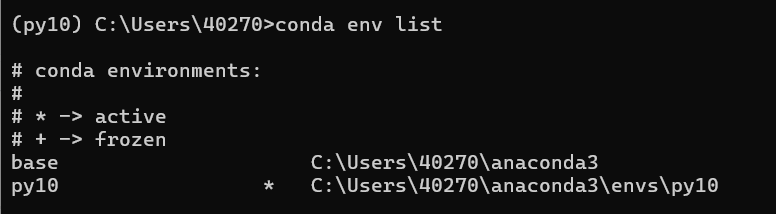

**Screenshot 2: NLTK Download**
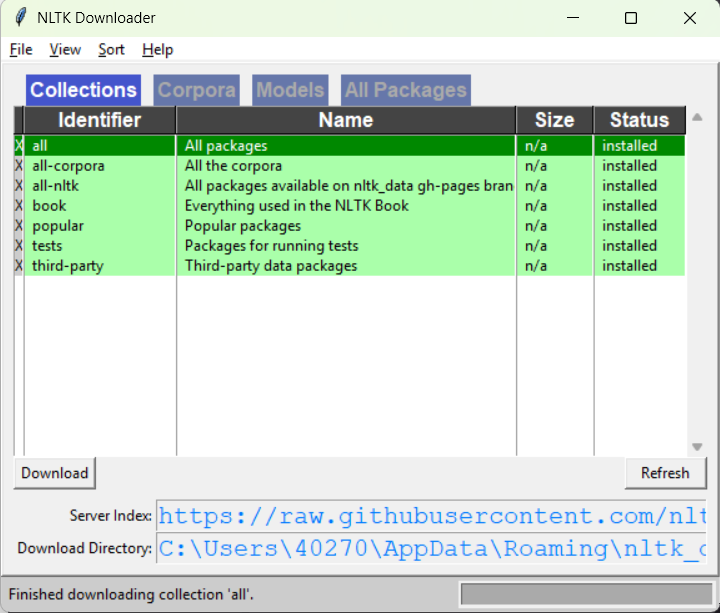

**Screenshot 3: Brown Corpus Test**
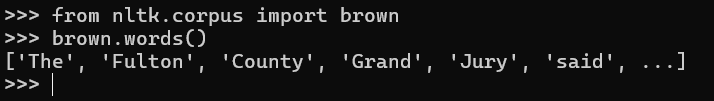

**Screenshot 4: spaCy Test**
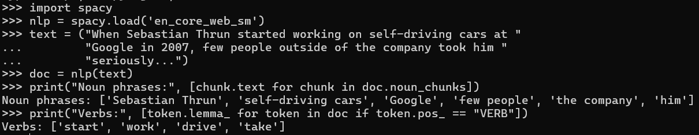

## Part 2: Zipf's Law and Text Analysis

### Step 2: Data Selection

**Texts selected:**

1. **Literary Text:** Emma by Jane Austen (from Gutenberg corpus)
2. **Informational Text:** King James Bible (from Gutenberg corpus)

**Screenshot 5: Data Loading Output**
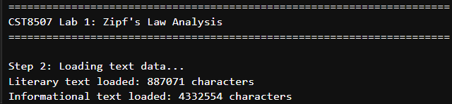

**Description:** Both texts loaded successfully with sufficient word count (>5000 words after cleaning).

### Step 3: Tokenization

**Screenshot 6: Tokenization Results**
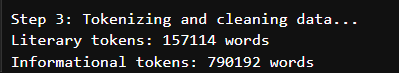

**Description:** Tokenization completed. Literary text: ~160,000 tokens. Informational text: ~800,000 tokens.

### Step 4: Word Frequency Analysis

#### Literary Text (Emma)

**Screenshot 7: Top 20 Words - Literary Text**
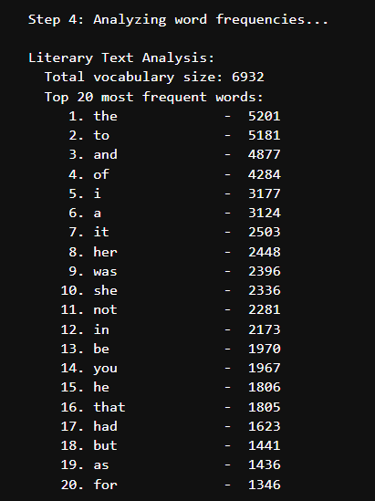

**Key Statistics:**

- Total vocabulary size: 6,932 unique words
- Most frequent word: "the" (5,201 occurrences)

#### Informational Text (Bible)

**Screenshot 8: Top 20 Words - Informational Text**
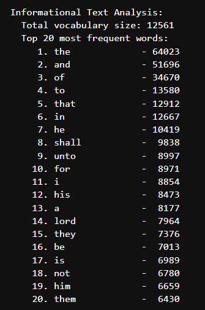

**Key Statistics:**

- Total vocabulary size: 12,561 unique words
- Most frequent word: "the" (64,023 occurrences)

### Step 4 (continued): Zipf's Law Visualization

**Screenshot 9: Zipf's Law Comparison Plot**
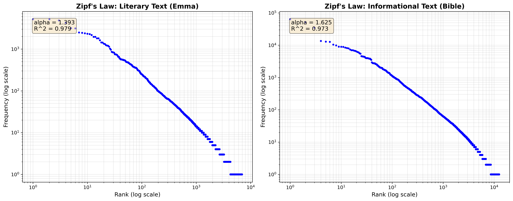

**Description:** Both texts show clear linear relationship on log-log scale, confirming Zipf's Law. The plots demonstrate that word frequency is inversely proportional to rank.

## Step 5: Comparative Analysis

### 1. Shape of the Zipf Curve

Both texts follow Zipf's Law with strong linear relationships on log-log scale:

- **Literary (Emma):** R² = 0.979
- **Informational (Bible):** R² = 0.973

### 2. Steepness of Frequency Decay

- **Literary:** α = 1.393 (moderate decay)
- **Informational:** α = 1.625 (steeper decay)

The Bible's higher α indicates faster frequency decay and more concentrated vocabulary usage.

### 3. Vocabulary Richness

- **Literary:** 6,932 unique words
- **Informational:** 12,561 unique words

The Bible shows richer vocabulary due to diverse content (history, poetry, prophecy, law) and multiple authors.

**Conclusion:** Both texts confirm Zipf's Law. Literary text has more uniform distribution (lower α), while informational text has richer vocabulary but more concentrated usage (higher α).

## Step 6: Evaluating the Stability of Zipf's Distribution

### Test 1: Remove Stopwords

**Screenshot 10: Stopword Removal Results**
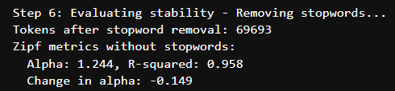

**Results:**

- Tokens after removal: 69,693 (from 157,114)
- New α: 1.244 (decreased from 1.393)
- New R²: 0.958 (decreased from 0.979)
- Change in α: -0.149

**Screenshot 11: Comparison Plot - With vs Without Stopwords**
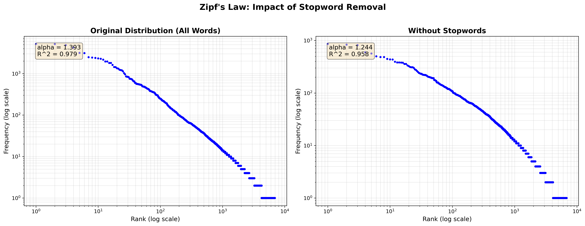

**Analysis:**
Removing stopwords flattens the distribution (lower α) because content words have more even distribution than the original mix. Zipf's Law still holds (R² = 0.958).

### Test 2: Restrict to Nouns Only

**Screenshot 12: Nouns-Only Results**
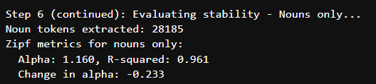

**Results:**

- Noun tokens: 28,185 (from 157,114)
- New α: 1.160 (decreased from 1.393)
- New R²: 0.961 (decreased from 0.979)
- Change in α: -0.233

**Screenshot 13: Three-Way Comparison Plot**
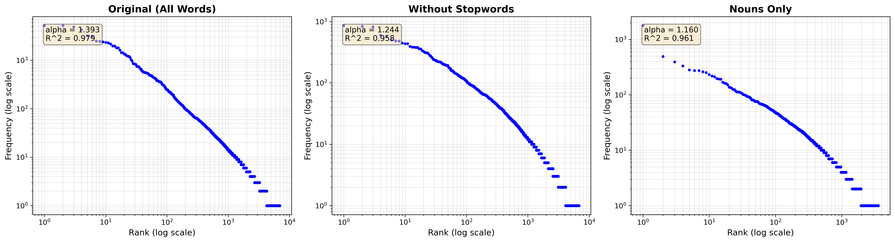

**Analysis:**
Nouns show more balanced usage (lower α) compared to full text. Different word classes follow Zipf's Law with different parameters.

## Overall Conclusions

Zipf's Law holds across different text types, preprocessing methods, and word classes. Key findings:

1. Text type affects α: Literary (1.393) vs Informational (1.625)
2. Stopword removal and POS filtering change α but preserve the power-law relationship
3. Nouns (α=1.160) show more balanced distribution than full text (α=1.393)
