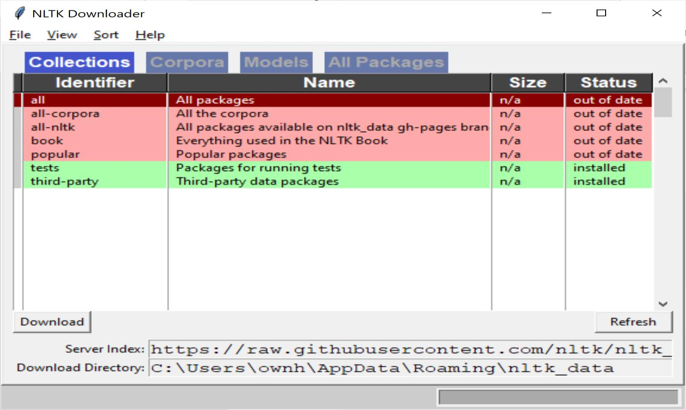
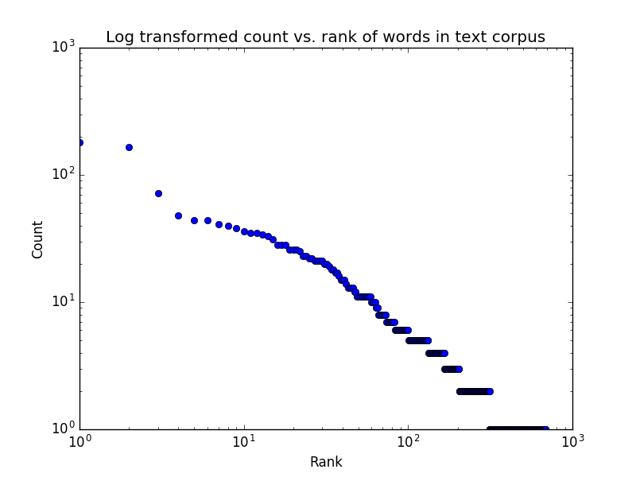

# Cst8507 Lab 1 W26

**Source:** `CST8507_Lab 1_W26.pdf`
**Total Pages:** 10

---

## Page 1

CST8507: Natural Language Processing

### Lab 1

Part 1: IDE Setup
The Lab1 commands are demonstrated for Windows, for other OS please refer to the
original documentation.
Conventions used within this document:

```python
Anaconda Command Prompt
Python code
User supplied values
```

### Objectives

Install Main Python Libraries for NLP

### Create Your Environment

1. You can create as much environments as you want, each environment can have
   different Python version or even similar versions with different libraries. For
   example: you can create one environment for Python 3.10 using the following
   command:

```bash
conda create -n myenv python=3.10
```

(name myenv py10 for a better reference)
Note: using the above command you can even install the required packages, but for
simplicity we will do it step-by-step. 2. You can check the environment that you created using the following command:

```bash
conda env list
```

3. You can activate the new environment: using the following command:

```bash
conda activate py10
```

For conda management use the following reference:

**📝 笔记:**

**Conda环境管理:**

- 每个环境独立，可使用不同Python版本和库
- 建议命名有意义，如 `py10` 而非 `myenv`
- 常用命令：`conda create -n name python=3.10`、`conda activate name`、`conda env list`

---

## Page 2

https://conda.io/projects/conda/en/latest/user-guide/tasks/manage-environments.html

### Install Important Libraries

```bash
conda install numpy
conda install -c conda-forge matplotlib
conda install pandas
conda install -c conda-forge statsmodels
conda install -c anaconda scikit-learn
conda install -c anaconda scipy
```

Or

```bash
conda install conda-forge::scip
```

We can do the steps in anaconda navigator
Install Main Python Libraries for NLP
We have a large collection of NLP libraries available in Python.

1. Natural Language Toolkit (NLTK)
   To install NLTK and its dependencies by running the following command:

```bash
conda install -c anaconda nltk
```

To Import package and download model type :

```bash
python
import nltk
nltk.download()
```

NLTK Downloaded Window Opens. Click the Download Button to download the dataset.

**📝 笔记:**

**NLTK库:**

- Python的NLP工具包，提供文本处理和语料库
- 安装命令：`conda install -c anaconda nltk`
- 安装后需要下载数据集：运行 `nltk.download()`打开下载窗口

**💡 提示:** 首次使用会弹出下载窗口，点击Download按钮下载数据集

---

## Page 3

**📷 Images:**



To test the installed data, use the following code

```python
from nltk.corpus import brown
brown.words()
```

- Create a Microsoft word file, name it” Lab1.docx”.
- Take a screenshot and save in “Lab1.docx”.
  Note: to exit from Python console use:

```python
exit()
```

2. spaCy
   It is one of the most trending and advanced libraries for implementing NLP today.
   It is many distinct features that provide clear advantage for processing text data
   and modeling. To install spaCy and its dependencies by running the following
   command:

```bash
conda install -c conda-forge spacy
python -m spacy download en_core_web_sm
```

**📝 笔记:**

**Brown语料库:**

- 1960年代创建的第一个电子英语语料库
- 包含500个文本样本，约100万词
- 测试代码：`brown.words()` 获取所有单词

**spaCy安装:**

- 安装命令：`conda install -c conda-forge spacy`
- 下载英语模型：`python -m spacy download en_core_web_sm`

---

## Page 4

To Import package and download model type:

```bash
python
import spacy
```

To load the models and data for English Language, you have to use

```python
nlp = spacy.load('en_core_web_sm')
```

nlp object is referred as language model instance.
To test the installed data, use the following code

```python
text = ("When Sebastian Thrun started working on self-driving cars at "
"Google in 2007, few people outside of the company took him "
"seriously. “I can tell you very senior CEOs of major American "
"car companies would shake my hand and turn away because I wasn’t "
"worth talking to,” said Thrun, in an interview with Recode earlier "
"this week.")
doc = nlp(text)
print("Noun phrases:", [chunk.text for chunk in doc.noun_chunks])
print("Verbs:", [token.lemma_ for token in doc if token.pos_ == "VERB"])
```

- Take a screenshot and save in “Lab1.docx”.

**📝 笔记:**

**spaCy库:**

- 高级NLP库，用于文本处理和建模
- 安装：`conda install -c conda-forge spacy`
- 下载英语模型：`python -m spacy download en_core_web_sm`

**核心功能:**

- `nlp = spacy.load('en_core_web_sm')` - 加载语言模型
- `doc.noun_chunks` - 提取名词短语
- `token.lemma_` - 获取词的原形
- `token.pos_` - 获取词性标签

**💡 提示:** 测试代码运行后，截图保存到Lab1.docx

---

## Page 5

**📷 Images:**



Part 2: Zipf’s Law and Text Analysis

### Objectives

- Preprocess raw text for NLP analysis
- Compute and analyze word frequency distributions
- Empirically test Zipf’s Law on real-world data

### Learning Resources

Lecture Slides and resources including Hybrid work (week 1,2).

### Background

About 80 years ago, George Kingsley Zipf reported an observation that the frequency of
a word seems to be a power law function of its frequency rank, formulated as f(r) ∝ 𝑟𝛼 ,
where f is word frequency, r is the rank of frequency, and 𝛼 is the exponent(1, 2). This
linguistic regularity was later termed as Zipf’s law. For almost any corpus the frequency
of the occurrence of a word (i.e., how many times it occurs) is inversely proportional to
the word’s frequency rank in the corpus, i.e. For example, the most frequent word (rank
of 1) generally occurs twice as many times as the second most frequent word (rank of 2),
etc.
As you see in the lecture, Zipf’s law is most easily observed by plotting the data on a log-
log plot. In this form we would expect a linear relationship of the form.

**📝 笔记:**

**Zipf定律:**

- 词频与排名成反比：排名第1的词出现频率约是第2名的2倍
- 公式：f(r) ∝ r^α，其中f是词频，r是排名，α是指数
- 在对数-对数图上呈现线性关系

**实验目标:**

- 预处理文本
- 计算词频分布
- 用真实数据验证Zipf定律

---

## Page 6

In this lab, you will empirically investigate Zipf’s Law using real text data. The goal is not
only to confirm the law, but to understand how text preprocessing choices, genre,
and linguistic structure affect word frequency distributions.
Steps:

Step 1:Import the required libraries, for example:

```python
import string
from collections import Counter
import numpy as np
import pandas as pd
import matplotlib.pyplot as plt
import nltk
from nltk.tokenize import word_tokenize
from nltk.probability import FreqDist
```

Step2: Data selection
You must select two English text datasets:
▪ Literary text
Examples: novel chapter, short story collection, play, or public-domain
literature
▪ Informational / non-literary text
Examples: news articles, Wikipedia pages, technical blogs, reports

- Each text must contain at least 5,000 words after cleaning to show a clear plot.
  For example, you can use NLTK library to import gutenberg .
  The Gutenberg corpus is a collection of books that are in the public domain and
  can be freely used for natural language processing tasks.

```python
from nltk.corpus import gutenberg
print('The following books exist in gutenberg :')
```

gutenberg.fileids()
#This will print the list of books

# After executing this statement, the variable text will contain the ent

#ire raw text content of "Emma", allowing you to perform various text pr
#ocessing tasks or analyses on it using Python.

```python
text = gutenberg.raw('austen-emma.txt')
```

**📝 笔记:**

**数据选择要求:**

- 需要两种文本：文学文本（小说、诗歌等）和信息文本（新闻、维基等）
- 每个文本清洗后至少5000词
- 可使用Gutenberg语料库：`gutenberg.fileids()` 查看可用书籍
- 获取文本：`text = gutenberg.raw('austen-emma.txt')`

**💡 提示:** Gutenberg包含60,000+免费电子书，NLTK提供18本经典作品

---

## Page 7

gutenberg.raw('austen-emma.txt') is a function from the Natural Language Toolkit
(NLTK) library in Python that is used to access the raw text of a book from the
NLTK's Gutenberg corpus.
The function will return the raw text of the book "Emma" by Jane Austen as a
single string.
Step 3: Tokenizing the data
Tokenization is a common pre-processing step in natural language processing
(NLP) tasks such as text analysis, text mining, and machine learning. Tokenization
can help to make text data more manageable and easier to work with by breaking
it down into smaller, more manageable pieces. For example, once text is
tokenized, it is much easier to perform operations such as counting the frequency
of words, removing stop words, or creating a Zipf's Law plot.

```python
tokens = word_tokenize(text)
```

Step 4: Empirical verification of Zipf’s Law
For each text, perform the following:

- Compute word frequencies
- Rank words from most frequent to least frequent
- Calculate and print:
  o Top 20 most frequent words
  o Total vocabulary size
  o Plot word rank vs frequency using a log–log scale.

```python
fdist = FreqDist(tokens)
sorted_fdist = sorted(fdist.items(), key=lambda x: x[1], reverse=True)
```

Your output graph may look like the following

**📝 笔记:**

**分词 (Tokenization):**

- 将文本分割成单词和标点的过程
- `tokens = word_tokenize(text)` - 使用NLTK进行分词

**词频分析:**

- `fdist = FreqDist(tokens)` - 创建词频分布对象
- `sorted_fdist = sorted(fdist.items(), key=lambda x: x[1], reverse=True)` - 按频率降序排序

**实验步骤:**

- 计算词频
- 从高到低排名
- 打印前20个高频词和总词汇量
- 用对数-对数图绘制排名vs频率

---

## Page 8

Step 5: Comparative analysis
Write and submit a comparative discussion that compare the two texts with respect to:

- Shape of the Zipf curve
- Steepness of the frequency decay
- Vocabulary richness and long-tail behavior
  Add your discussion to Lab1.docx (section title: ‘Step 5: Comparative Analysis’).
  Step 6: Evaluating the Stability of Zipf’s Distribution
  To test the limitations of Zipf’s Law, the following analysis was repeated on the one

```python
for one text:
```

- Remove stopwords
  Create a new log–log plot and write a discussion on of how and why
  the distribution changed.
- Restrict analysis to a single part of speech (e.g., nouns only)
  Create a new log–log plot and write a discussion on of how and why
  the distribution changed.
  Add your discussion to Lab1.docx (section title: ‘step 6: Evaluating the
  Stability of Zipf’s Distribution).

**📝 Notes / 笔记:**

**对比分析与稳定性测试 / Comparative Analysis & Stability Testing:**

**Step 5: 对比分析要点 / Comparative Analysis Points:**

**分析维度/Analysis Dimensions:**

1. **曲线形状 (Curve Shape):**
   - 文学文本：更平滑的曲线，词汇多样性高
   - 信息文本：可能有更陡峭的下降，专业术语集中

2. **频率衰减速度 (Frequency Decay):**

   ```python
   # 计算斜率（α值）
   import numpy as np
   from scipy import stats

   # 取对数
   log_rank = np.log(df['rank'])
   log_freq = np.log(df['frequency'])

   # 线性拟合
   slope, intercept, r_value, p_value, std_err = stats.linregress(log_rank, log_freq)
   print(f"Zipf exponent (α): {-slope:.3f}")
   print(f"R-squared: {r_value**2:.3f}")
   ```

3. **词汇丰富度 (Vocabulary Richness):**

   ```python
   # Type-Token Ratio (TTR)
   ttr = len(set(tokens)) / len(tokens)
   print(f"TTR: {ttr:.3f}")

   # 高TTR = 词汇多样性高（文学文本通常更高）
   # 低TTR = 词汇重复度高（技术文档可能更低）
   ```

4. **长尾行为 (Long-tail Behavior):**

   ```python
   # 统计只出现1次的词（hapax legomena）
   hapax = [word for word, freq in fdist.items() if freq == 1]
   print(f"Hapax words: {len(hapax)} ({len(hapax)/len(fdist)*100:.1f}%)")
   ```

**Step 6: 稳定性测试 / Stability Testing:**

**测试1: 移除停用词 (Remove Stopwords):**

```python
from nltk.corpus import stopwords

# 获取英语停用词列表
stop_words = set(stopwords.words('english'))

# 过滤停用词
tokens_no_stop = [t for t in tokens_clean if t not in stop_words]

# 重新分析
fdist_no_stop = FreqDist(tokens_no_stop)
sorted_no_stop = sorted(fdist_no_stop.items(), key=lambda x: x[1], reverse=True)

# 绘制对比图
fig, (ax1, ax2) = plt.subplots(1, 2, figsize=(15, 6))

# 原始数据
ax1.loglog(df['rank'], df['frequency'], 'b-')
ax1.set_title('With Stopwords')
ax1.set_xlabel('Rank')
ax1.set_ylabel('Frequency')
ax1.grid(True, alpha=0.3)

# 移除停用词后
df_no_stop = pd.DataFrame(sorted_no_stop, columns=['word', 'frequency'])
df_no_stop['rank'] = range(1, len(df_no_stop) + 1)
ax2.loglog(df_no_stop['rank'], df_no_stop['frequency'], 'r-')
ax2.set_title('Without Stopwords')
ax2.set_xlabel('Rank')
ax2.set_ylabel('Frequency')
ax2.grid(True, alpha=0.3)

plt.tight_layout()
plt.show()
```

**预期变化:**

- 曲线整体下移（总词数减少）
- 高频区域变化明显（停用词被移除）
- 斜率可能略有变化
- Zipf规律依然成立，但分布更集中在内容词

**测试2: 限制词性 (Restrict to Nouns):**

```python
import nltk

# 词性标注
pos_tags = nltk.pos_tag(tokens_clean)

# 只保留名词（NN, NNS, NNP, NNPS）
nouns_only = [word for word, pos in pos_tags if pos.startswith('NN')]

# 分析名词分布
fdist_nouns = FreqDist(nouns_only)
sorted_nouns = sorted(fdist_nouns.items(), key=lambda x: x[1], reverse=True)

# 绘图
df_nouns = pd.DataFrame(sorted_nouns, columns=['word', 'frequency'])
df_nouns['rank'] = range(1, len(df_nouns) + 1)

plt.figure(figsize=(10, 6))
plt.loglog(df_nouns['rank'], df_nouns['frequency'], 'g-')
plt.xlabel('Rank (log scale)')
plt.ylabel('Frequency (log scale)')
plt.title("Zipf's Law: Nouns Only")
plt.grid(True, alpha=0.3)
plt.show()

print(f"Total nouns: {len(nouns_only)}")
print(f"Unique nouns: {len(fdist_nouns)}")
print(f"Top 10 nouns: {fdist_nouns.most_common(10)}")
```

**预期变化:**

- 词汇量大幅减少（只有名词）
- 曲线可能更陡峭（名词分布更不均匀）
- 专有名词可能占据高频位置
- Zipf规律仍然适用，但参数不同

**讨论要点/Discussion Points:**

**对比分析应包含:**

- 两种文本的α值对比
- 词汇丰富度差异
- 高频词的类型差异（功能词 vs 内容词）
- 长尾部分的占比

**稳定性分析应包含:**

- 预处理对分布的影响程度
- Zipf定律的鲁棒性
- 不同词类的分布特征
- 实际应用中的启示（如何选择特征）

---

## Page 9

Code design and style Requirements.
Make sure that your program is properly documented:

- You should have a docstring at the very beginning of the file briefly describing
  your program and stating your name, section, and creativity additions.
- Each function should have an appropriate docstring (including arguments and
  return value if applicable).
- Other miscellaneous comments to make things clear.
  In addition, make sure that you have used good code design and style (including
  meaningful variable names, constants where relevant, vertical white space, etc.).

### Submission Instruction

Submit your code as a Jupyter Notebook with the running code, you can do the
following steps:

1. Open your Jupyter Notebook: You can open Jupyter Notebook either from the
   command line by typing "jupyter notebook" or from Anaconda Navigator.
2. Write your code: Write the code you want to submit in the cells of the Jupyter
   Notebook. Make sure to run the cells so that the output is generated.
3. Save the Notebook: Once you have written and run your code, save the Jupyter
   Notebook by clicking on File -> Save and Checkpoint or by pressing "Ctrl + S".
4. Export the Notebook: To export the Jupyter Notebook, go to File -> Download as
   -> Notebook (.ipynb). This will download the Notebook as a .ipynb file on your
   laptop.

### Submitting Your Lab Files

1. Create a Folder and name the folder lab1.
   o Place your program file, named lab1_zipf_law, inside the lab1 folder.
   o Place your document file, Lab1.docx , inside the lab1 folder.
2. Zip the entire lab1 folder.
3. Upload the zipped file to Brightspace.

**📝 笔记:**

**代码规范要求:**

- 文件开头需要docstring：说明程序功能、作者、section
- 每个函数需要docstring：说明参数和返回值
- 使用有意义的变量名和常量
- 适当的注释和垂直空白

**提交步骤:**

1. 在Jupyter Notebook中编写并运行代码
2. 保存：File -> Save and Checkpoint (Ctrl+S)
3. 导出：File -> Download as -> Notebook (.ipynb)
4. 创建lab1文件夹，放入lab1_zipf_law.ipynb和Lab1.docx
5. 压缩lab1文件夹并上传到Brightspace

**💡 提示:** 确保所有单元格都已运行并显示输出

---

## Page 10

Ensure your files are correctly named and organized before submission.
You can submit multiple times, with only the most recent submission (before the due
date) graded.

### Due Date

Check the Brightspace.

### Grading Criteria

Criterion 10 points 5 points 0 points
Data selection Texts are well- Texts meet Texts not meeting
chosen, distinct requirements <5000 requirements
genres, >5000
Tokenization Correctly applied Some minor errors Incorrect
Word frequency Accurate frequency Minor errors in Analysis missing
analysis counts, rankings, top analysis
words, vocabulary
size
Empirical verification Correct log–log plots, Correct plots but Plots missing,
of Zipf’s Law labeled, Zipf interpretation limited incorrect, or
exponent estimated, misinterpreted
clear explanation
Comparative analysis Insightful Comparison present Comparison missing
comparison, explains but not complete or incorrect
why differences
occur between texts
Evaluating the Modification applied Modification done but Experiment missing
Stability of Zipf’s correctly, Clear explanation is or incorrect
Distribution explanation is missing
provided
Submission Follow submission Missing some Not follow the
instructions submission submission
instructions instruction

**📝 笔记:**

**提交说明:**

- 文件命名和组织要正确
- 可以多次提交，只评最后一次
- 截止日期查看Brightspace

**评分标准 (10分制):**

- 数据选择：文本类型不同，每个>5000词
- 分词：正确应用
- 词频分析：准确的频率统计、排名、前20词、词汇量
- Zipf验证：正确的对数-对数图，有标签，估算α值
- 对比分析：深入比较，解释差异原因
- 稳定性测试：正确应用修改，清晰解释
- 提交：遵循提交说明

**💡 提示:** 确保文件命名正确，所有要求都完成

---
