# Lecture 1 W26

**Source:** `lecture_1_W26.pdf`

**Total Pages:** 55

---

## Page 1

CST8507: NATURAL LANGUAGE PROCESSING

WEEK#1

COURSE OVERVIEW & INTRODUCTION TO NLP BY

HALA OWN, PH.D.

**📝 Notes / 笔记:**

**课程信息 / Course Info:**

- 课程代码: CST8507
- 主题: Natural Language Processing (自然语言处理)
- 第一周: 课程概览 + NLP 入门

---

## Page 2

### Lesson Agenda

- Course CSI
- What is Natural Language Processing (NLP)?
- Applications of Natural Language Processing
- Challenges in Natural Language Processing
- Approaches to NLP
- NLP Libraries in Python

**📝 Notes / 笔记:**

**课程大纲 / Course Overview:**

- 第一周主要介绍 NLP 基础概念、应用场景、面临的挑战
- 重点：理解 NLP 的定义和实际应用
- 工具：Python NLP 库（NLTK, spaCy 等）

---

## Page 3

Contacting your Professor

- Office hours: TBA
  Room#: WT315
  Email: ownh@algonquincollege.com
- Expect email reply is within Two business days. Therefore,
  you need plan your emails accordingly
- Include in your email:
- Your name
- Course name and code
- Section No.

**📝 Notes / 笔记:**

**联系方式 / Contact:**

- Office: WT315
- Email: ownh@algonquincollege.com
- 回复时间: 2个工作日内

---

## Page 4

### Evaluation Breakdown

Assessment Value CLRs
Lab (4x 5%) 20% 1, 2,3, 4,5
Assignment (Week 6) 10% 1, 2,3, 4
Assignment 2 (Group Project) 20% 1, 2,3,
4,5,6

### Total Practical 50%

Midterm (1 x 15%, Week 7) 15% 1, 2,3, 4
Final Exam (1 x 25%, Week 15) 25% 1, 2,3,
4,5,6
Participation (5 out of 8) 10% 1, 2,3, 4,5

### Total Theory 50%

**📝 Notes / 笔记:**

**评分结构 / Grading:**

- **Practical 50%**: Labs 20% + Assignment1 10% + Project 20%
- **Theory 50%**: Midterm 15% + Final 25% + Participation 10%
- ⚠️ **及格要求**: Practical ≥50% 且 Theory ≥50%

---

## Page 5

### Labs (5) 15%

Lab1

Lab2

Lab 3 Grades are equally distributed

Lab 4

- Labs must be demonstrated according to their scheduled
  weeks (stated in the CSI).
- Lab professor may ask you to do something else to verify
  that you have done the lab by yourself.

**📝 Notes / 笔记:**

**Labs 重点:**

- 共4个 Labs，每个5%
- 必须按时 demo
- 教授可能要求额外验证

---

## Page 6

### Assignments

week 6: Individual work

### • Assignment 1 (10%) • Assignment 2(Project) 20%

- proposal Week #9
- Submission(Code+ Report+ Presentation) Week #12
- group working (max. two members)

**📝 Notes / 笔记:**

**Assignments:**

- **Assignment 1 (10%)**: Week 6, 个人作业
- **Assignment 2 (20%)**: 小组项目 (最多2人)
  - Proposal: Week 9
  - Submission: Week 12 (代码+报告+演示)

---

## Page 7

### Midterm Exam ❑ Week 7 Lecture

- 60 min
- Materials :Week 1 till Week 6

### ❑ Weight: 15% ❑ Closed Book

- On paper
  Bring your own cheat sheet

**📝 Notes / 笔记:**

**Midterm:**

- Week 7, 60分钟, 15%
- 范围: Week 1-6
- Closed book, 可带 cheat sheet

---

## Page 8

### Final Exam(Theory) ❑ Week 15

- Materials:Week1 till Week 12

### ❑ Weight: 25% ❑ Closed Book

- On paper
  Bring your own cheat sheet

**📝 Notes / 笔记:**

**Final Exam:**

- Week 15, 25%
- 范围: Week 1-12
- Closed book, 可带 cheat sheet

---

## Page 9

### Participation (10%)…

▪ Five best Participation will be counted into final score. Each will occupy 2% of final
score
▪ The content in the Participation will be based on the hybrid which have been posted
that week
that week and the topic which has been covered

### ▪ On Brightspace

▪ Multiple Choice / True & False
▪ Open book
▪ one attempt
▪ Time : 10 min.
▪ Participation will be proctored during the lecture.
▪ Participation must be completed in person during the scheduled lecture time.
Submitting a participation without attending the lecture will result in a grade of zero.

**📝 Notes / 笔记:**

**Participation (10%):**

- 取最好的5次，每次2%
- 基于 hybrid 材料和当周主题
- Brightspace 上完成，10分钟
- 必须课堂现场完成，否则0分

---

## Page 10

### Lecture Rules

- Feel free to ask questions at anytime at all. Don’t be shy, you’re not the only
  one who will have questions.
- Most topics covered in the lecture slides will be demonstrated. Feel
  free to follow along with the demonstrations with your own computers.

### • Note-Taking

**📝 Notes / 笔记:**

**课堂规则:**

- 随时提问
- 可以跟着演示操作
- 做好笔记

---

## Page 11

### Lab Rules

- Attendance is mandatory for the weeks that have lab activities
  assigned or require you to demo your work.
- Working with others is encouraged. Explaining concepts and your
  way of thinking is allowed. Copying someone’s answers is not.
- Come and go as you please, just ensure you have time to demo
  the lab to the instructor before the class ends.

**📝 Notes / 笔记:**

**Lab 规则:**

- 有 lab 的周必须出席
- 鼓励合作讨论，但不能抄袭
- 必须在课程结束前完成 demo

---

## Page 12

### Important Information

Passing the course

- You must get at least 50% in practical (labs, assignments)
  and at least 50% in theory (quizzes, midterm and final
  exam) to pass the course. Simply getting 50% overall
  without meeting the 50% min in each theory and practical is
  not sufficient to pass the course.

**📝 Notes / 笔记:**

**⚠️ 及格要求:**

- Practical ≥ 50% **且** Theory ≥ 50%
- 总分 ≥ 50% 但某一项 < 50% 仍不及格

---

## Page 13

### Important Information…

- Labs, and Assignments must be demonstrated immediately after
  the due date and according to their scheduled weeks (as stated
  in the CSI). Missed Demo on the specified date may result in zero
  mark.
- Demos will be conducted during your lab session, during which your
  lab professor may ask you to perform additional tasks to ensure the
  authenticity of your work. Failure to answer questions about your
  work may result in a Zero mark.

**📝 Notes / 笔记:**

**Demo 要求:**

- 必须在截止日期后立即 demo
- 错过 demo = 0分
- 教授会提问验证是否本人完成

---

## Page 14

### Important Information…

- The demo is not for evaluation
- Demonstrating something that does not match what you
  submitted on Brightspace would result in a zero mark.
- The official submission deadline for all labs and assignments is
  Friday night (11:59 PM). To accommodate all learners, I allow
  submissions until Sunday night (11:59 PM) without any penalties.
- No Extension or late submission for the Assignment 2 (Project).

**📝 Notes / 笔记:**

**提交规则:**

- 官方截止: 周五 11:59 PM
- 宽限期: 周日 11:59 PM (无惩罚)
- Demo 内容必须与提交一致
- Project 不接受延期

---

## Page 15

### Hybrid Work

- Each Week , Hybrid materials will be released
- Part from your course
- Additional materials related to each week’s topic

**📝 Notes / 笔记:**

**Hybrid Work:**

- 每周发布额外学习材料
- 与当周主题相关

---

## Page 16

### Textbooks

- Jurafsky, D. & Martin, J. H. (2024) Speech and Language
  Processing (3rd ed. draft).
  https://web.stanford.edu/~jurafsky/slp3/ed3book.pdf
- Bird, S., Klein, E., & Loper, E. Natural Language Processing with
  Python. (O’Reilly 2009, website 2018), http://www.nltk.org/book/

**📝 Notes / 笔记:**

**教材:**

1. Jurafsky & Martin - Speech and Language Processing
2. Bird et al. - NLP with Python (NLTK)

---

## Page 17

### Tools

Jupyter Notebook

Google Colab

**📝 Notes / 笔记:**

**工具:**

- Jupyter Notebook
- Google Colab (云端运行)

---

## Page 18

### Pre-Requisites

Fundamental Knowledge of Machine Learning( CST8502)
❑
Fundamental Knowledge of Python
❑

**📝 Notes / 笔记:**

**先修课程:**

- CST8502: Machine Learning 基础
- Python 编程基础

---

## Page 19

### Lesson Agenda

- Course CSI
- What is Natural Language Processing (NLP)?
- Applications of Natural Language Processing
- Challenges in Natural Language Processing
- Approaches to NLP
- NLP Libraries in Python

**📝 Notes / 笔记:**

**本节结束，开始核心内容**

---

## Page 20

### Knowledge Representation

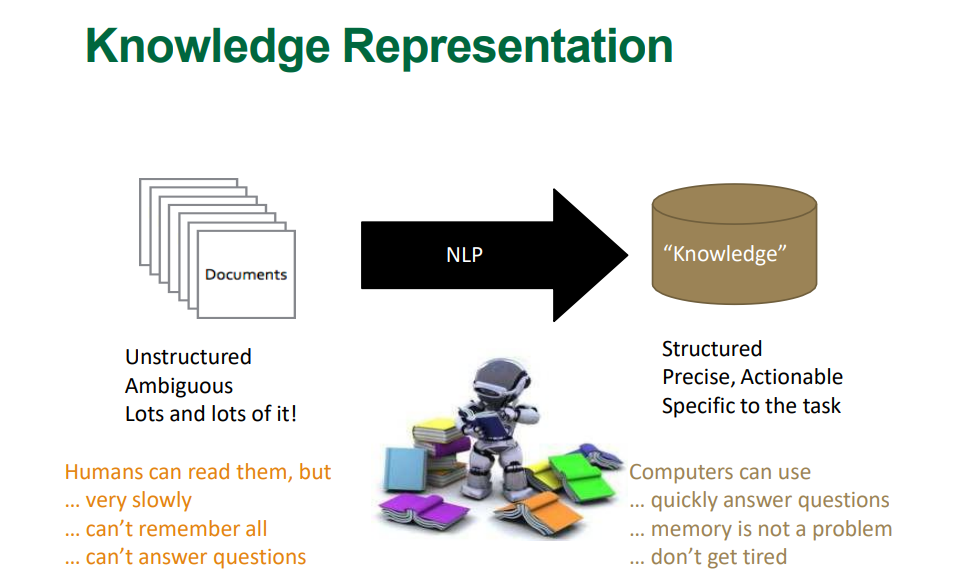

**📝 Notes / 笔记:**

**知识表示的两种形式:**

- **Structured (结构化)**: 精确、可操作，计算机易处理（数据库、知识图谱）
- **Unstructured (非结构化)**: 模糊、海量，人类易理解（文本、语音）
- **NLP 核心任务**: 将非结构化语言转换为结构化知识

**📊 原始 Slide 有示意图:**

- 左侧: Documents (非结构化文档) - 人类可读但处理慢
- 中间: NLP 处理 + 机器人图标
- 右侧: "Knowledge" Database (结构化知识库) - 计算机可快速查询
- 展示了 NLP 的核心价值：从文本到知识的转换

---

## Page 21

**📷 Images:**

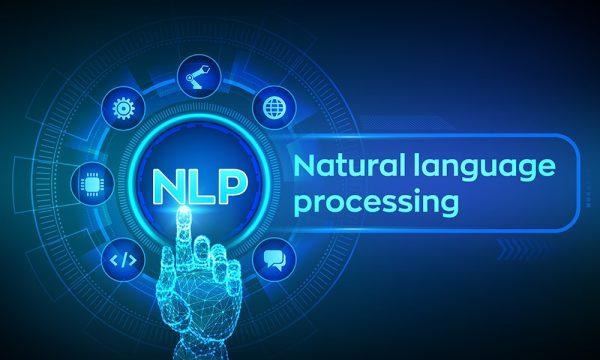

### What Is Natural Language Processing?

- Subfield of linguistics, computer science,
  and artificial intelligence concerned with
  the interactions between computers and
  human language.
- How to program computers to process and
  analyze large amounts of natural
  language data.

**📝 Notes / 笔记:**

**NLP 定义 / Definition:**

- 语言学 + 计算机科学 + 人工智能的交叉学科
- 核心目标：让计算机理解和生成人类语言
- 处理大规模自然语言数据

**代码示例:**

```python
import nltk
from nltk.tokenize import word_tokenize
text = "I love NLP!"
tokens = word_tokenize(text)  # ['I', 'love', 'NLP', '!']
```

---

## Page 22

### Motivations

- Enables computers to understand and process human language
- Helping businesses to analyze customer feedback and improve
  customer service
- Making it easier for individuals with disabilities to interact with
  computers and access information
- Extract insights and make sense from data

**📝 Notes / 笔记:**

**为什么需要 NLP？/ Why NLP Matters:**

1. **人机交互 / Human-Computer Interaction**: 语音助手、聊天机器人
2. **商业价值 / Business Value**: 客户反馈分析、情感分析、市场趋势
3. **无障碍访问 / Accessibility**: 语音转文字、文字转语音、自动翻译
4. **数据洞察 / Data Insights**: 从海量文本中提取有价值信息

**代码示例 - 情感分析:**

```python
from textblob import TextBlob
reviews = ["This is amazing!", "Terrible product"]
for review in reviews:
    sentiment = TextBlob(review).sentiment.polarity
    print(f"{review} → {'😊 Positive' if sentiment > 0 else '😞 Negative'}")
```

---

## Page 23

**📷 Images:**

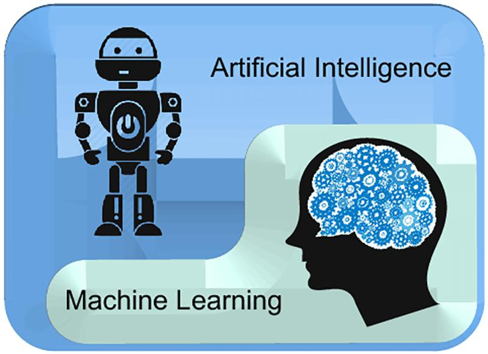


### Discussion Activity

Image source:https://pub.towardsai.net/future-of-data-science-machine-learning-or-artificial-intelligence-6e9cbb93f547

**📝 Notes / 笔记:**

**讨论活动:**

- 思考 AI、ML、DL 之间的关系
- 理解技术演进路径

---

## Page 24

**📷 Images:**

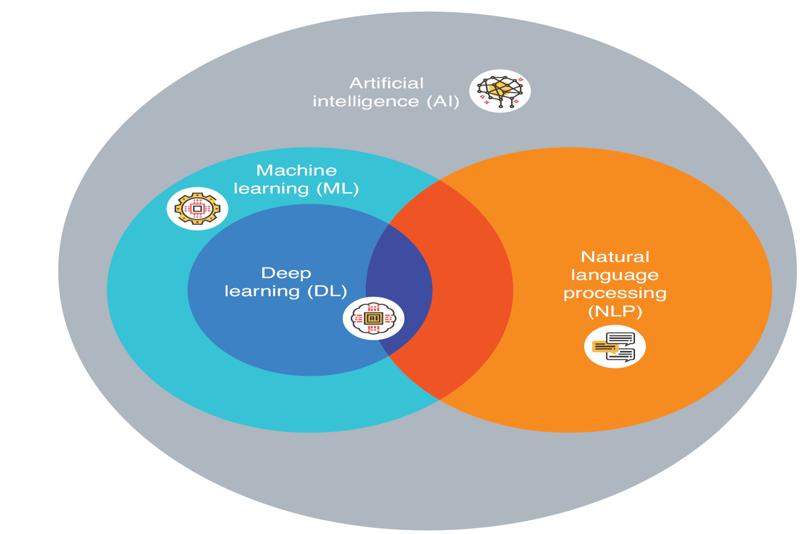

Interconnections Between AI, ML, DL, and NLP
Image source: Real -World NLP, 2021 by Manning Publications Co.

**📝 Notes / 笔记:**

**AI 技术栈层次关系 / Hierarchy:**

- **AI (人工智能)**: 最广泛概念，让机器模拟人类智能
- **ML (机器学习)**: AI 的实现方法，通过数据学习模式
- **DL (深度学习)**: ML 的高级形式，使用神经网络
- **NLP**: AI 的应用领域，专注于语言处理

**关系**: AI ⊃ ML ⊃ DL，NLP 使用 ML/DL 技术

**NLP 技术演进**: 规则 → 统计 → 机器学习 → 深度学习 → 大模型(BERT/GPT)

---

## Page 25

**📷 Images:**

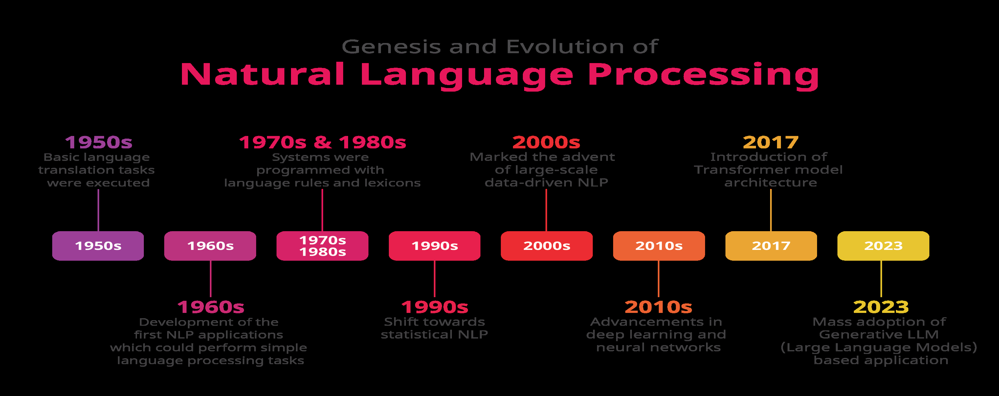

History of NLP
Image source: https://commtelnetworks.com/exploring-the-impact-of-
natural-languageprocessing-on-cni-operations

**📝 Notes / 笔记:**

**NLP 发展历史关键节点:**

- **1950s**: Turing Test 提出，机器翻译开始
- **1980s-1990s**: 统计方法（HMM, N-gram）
- **2000s**: 机器学习（SVM, CRF）
- **2013**: Word2Vec - 词向量革命
- **2017**: Transformer 架构
- **2018**: BERT - 预训练模型时代
- **2020s**: GPT-3/4, ChatGPT - 大模型时代

---

## Page 26

Turing’s test for Artificial Intelligence
Ability to understand and generate language ~ intelligence
Image source:https://botsociety.io/blog/2018/03/the-turing-test/

**📝 Notes / 笔记:**

**图灵测试 / Turing Test:**

- 1950年提出，测试机器是否具有智能
- 核心：通过对话判断是人还是机器
- 与 NLP 关系：语言理解和生成是智能的标志

---

## Page 27

### Lesson Agenda

- Course CSI
- What is Natural Language Processing (NLP)?
- Applications of Natural Language Processing
- Challenges in Natural Language Processing
- Approaches to NLP
- NLP Libraries in Python

### Page

**📝 Notes / 笔记:**

**过渡页 - 进入应用部分**

---

## Page 28

**📷 Images:**

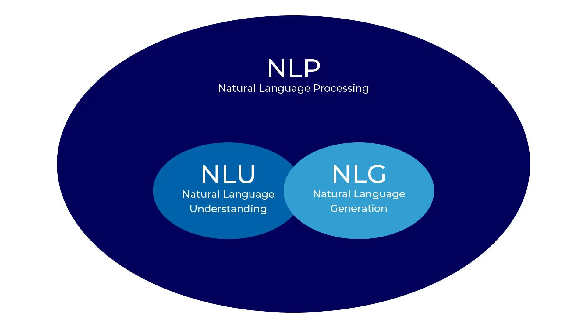

NLP Applications

### NLP=NLU+NLG

**📝 Notes / 笔记:**

**NLP 两大核心任务:**

- **NLU (Natural Language Understanding / 理解)**: 让计算机理解人类语言
  - 任务：文本分类、情感分析、命名实体识别、问答系统
- **NLG (Natural Language Generation / 生成)**: 让计算机生成自然语言
  - 任务：机器翻译、文本摘要、对话生成、文章写作

**流程**: Input Text → NLU (理解) → Semantic Representation → NLG (生成) → Output Text

---

## Page 29

**📷 Images:**

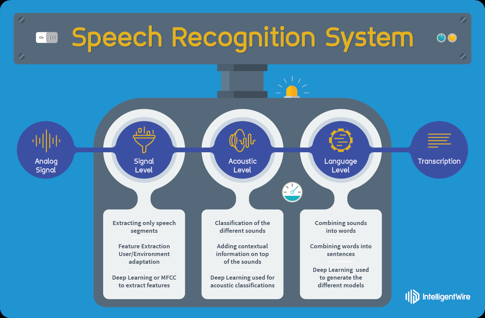

NLP Applications: Speech Recognition
Image source: https://www.phonon.io/understanding-nlp-speech-recognition/

**📝 Notes / 笔记:**

**语音识别 / Speech Recognition:**

- **定义**: 将语音信号转换为文本
- **技术**: 声学模型 + 语言模型 + 深度学习(Wav2Vec, Whisper)
- **应用**: Siri, Alexa, 语音输入法, 会议转录

**代码示例:**

```python
import speech_recognition as sr
recognizer = sr.Recognizer()
with sr.AudioFile("audio.wav") as source:
    audio = recognizer.record(source)
    text = recognizer.recognize_google(audio)
```

---

## Page 30

**📷 Images:**

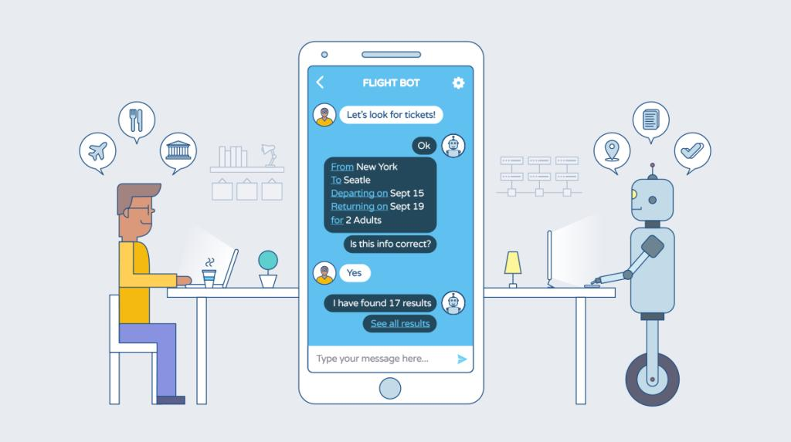

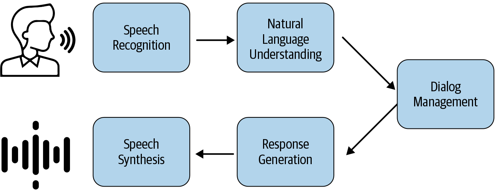

NLP Applications: Conversation Agents and

### Chatbots

**📝 Notes / 笔记:**

**对话系统 / Chatbots:**

- **类型**:
  - Rule-based (规则): 预定义对话流程
  - Retrieval-based (检索): 从数据库检索回复
  - Generative (生成): 使用模型生成新回复
- **关键技术**: 意图识别、实体提取、对话管理、回复生成
- **应用**: 客服机器人、虚拟助手、智能客服

**简单架构:**

```python
def chatbot(user_input):
    intent = recognize_intent(user_input)  # 识别意图
    entities = extract_entities(user_input)  # 提取实体
    response = generate_response(intent, entities)  # 生成回复
    return response
```

---

## Page 31

**📷 Images:**

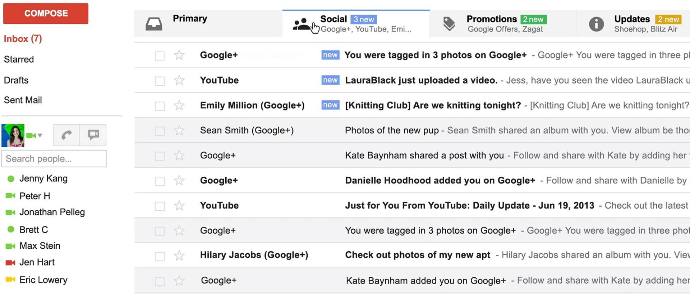

NLP Applications :Text Classification

- spam / not spam
- prioritylevel
- category (primary / social / promotions / updates)

**📝 Notes / 笔记:**

**文本分类 / Text Classification:**

- **定义**: 将文本分配到预定义类别
- **常见任务**: 垃圾邮件检测、邮件分类、主题分类、情感分类
- **方法**: 传统ML (Naive Bayes, SVM) → 深度学习 (BERT, RoBERTa)

**代码示例:**

```python
from sklearn.feature_extraction.text import TfidfVectorizer
from sklearn.naive_bayes import MultinomialNB
from sklearn.pipeline import Pipeline

texts = ["I love this!", "This is terrible"]
labels = ["positive", "negative"]
classifier = Pipeline([
    ('tfidf', TfidfVectorizer()),
    ('clf', MultinomialNB())
])
classifier.fit(texts, labels)
```

---

## Page 32

**📷 Images:**

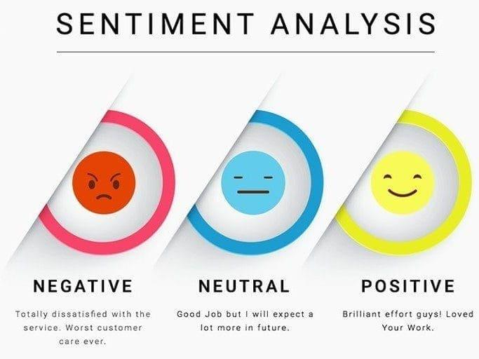

NLP Applications :Sentiment Analysis
Image source: text book

**📝 Notes / 笔记:**

**情感分析 / Sentiment Analysis:**

- **定义**: 识别文本中的情感倾向（正面/负面/中性）
- **层次**:
  - Document-level (文档级): 整篇文档情感
  - Sentence-level (句子级): 每句话情感
  - Aspect-level (方面级): 针对特定方面的情感
- **应用**: 产品评论分析、社交媒体监控、客户反馈

**代码示例:**

```python
from textblob import TextBlob
text = "The food was excellent but service was terrible."
sentiment = TextBlob(text).sentiment.polarity  # -1 to 1
# Overall: Mixed (食物正面 + 服务负面)
```

---

## Page 33

**📷 Images:**

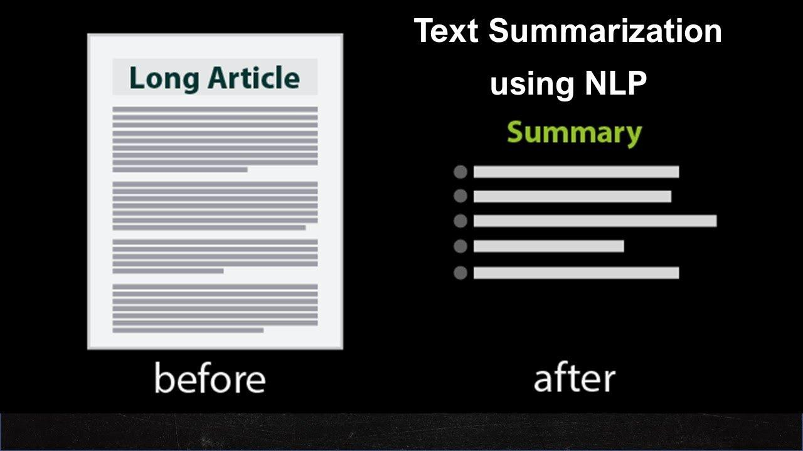

NLP Applications :Text Summarization

**📝 Notes / 笔记:**

**文本摘要 / Text Summarization:**

- **类型**:
  - Extractive (抽取式): 从原文选择重要句子
  - Abstractive (生成式): 生成新的摘要文本
- **应用**: 新闻摘要、文档总结、会议纪要

**代码示例:**

```python
# 抽取式
from sumy.parsers.plaintext import PlaintextParser
from sumy.summarizers.lsa import LsaSummarizer
summarizer = LsaSummarizer()
summary = summarizer(parser.document, 2)  # 2句摘要

# 生成式
from transformers import pipeline
summarizer = pipeline("summarization")
summary = summarizer(article, max_length=130)
```

---

## Page 34

**📷 Images:**

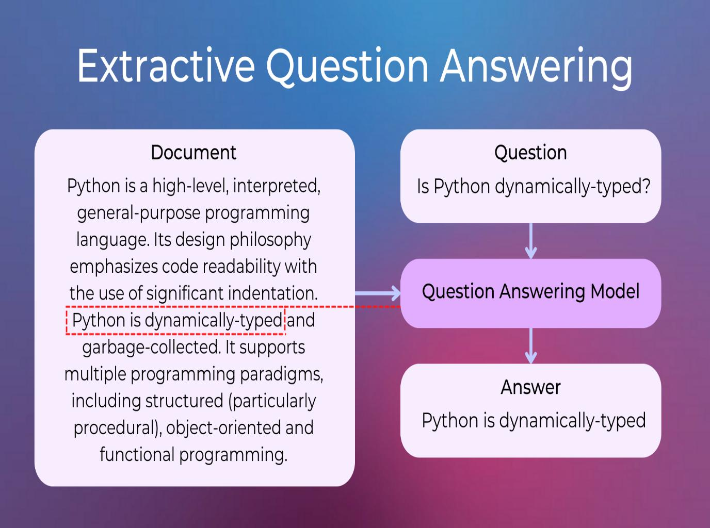

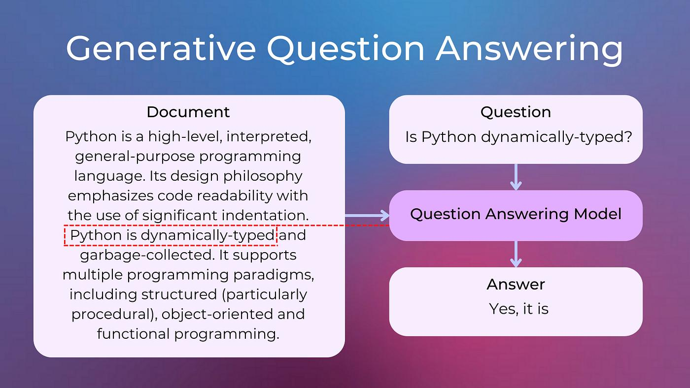

NLP Applications :Question Answering
Image source https://www.nlplanet.org/course-practical-nlp/02-practical-nlp-first-
tasks/17-question-answering /

**📝 Notes / 笔记:**

**问答系统 / Question Answering:**

- **定义**: 根据给定文本回答问题
- **类型**:
  - Extractive QA: 从文本中提取答案片段
  - Generative QA: 生成新的答案文本
- **应用**: 搜索引擎、智能助手、客服系统

**代码示例:**

```python
from transformers import pipeline
qa = pipeline("question-answering")
context = "NLP is a subfield of AI that focuses on language."
question = "What is NLP?"
answer = qa(question=question, context=context)
print(answer['answer'])  # "a subfield of AI"
```

---

## Page 35

**📷 Images:**

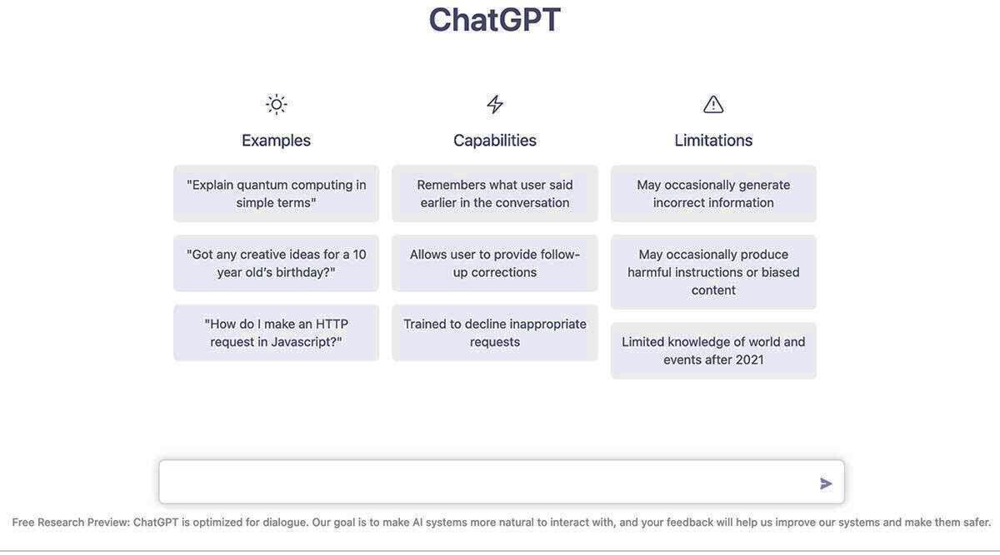

Generative AI: OpenAI’s ChatGPT

**📝 Notes / 笔记:**

**生成式 AI / Generative AI:**

- **代表**: ChatGPT, GPT-4, Claude
- **特点**: 基于大规模预训练模型，能理解和生成自然语言
- **能力**: 对话、写作、翻译、代码生成、问答、推理
- **技术**: Transformer 架构 + 大规模数据 + RLHF
- **影响**: 从任务特定模型到通用模型

---

## Page 36

### Lesson Agenda

- Course CSI
- What is Natural Language Processing (NLP)?
- Applications of Natural Language Processing
- Challenges in Natural Language Processing
- Approaches to NLP
- NLP Libraries in Python

### Page

**📝 Notes / 笔记:**

**过渡页 - 进入挑战部分**

---

## Page 37

## Challenges in NLP

Ambiguity 

Sparsity 

Variation

Common knowledge

**📝 Notes / 笔记:**

**NLP 面临的四大挑战:**

1. **Ambiguity (歧义性)**: 词义、句法、指代歧义
2. **Sparsity (稀疏性)**: 大量词汇只出现一次，数据稀疏
3. **Variation (变异性)**: 同一语言内部和不同语言间的变化
4. **Common Knowledge (常识)**: 人类常识难以编码

---

## Page 38

**📷 Images:**

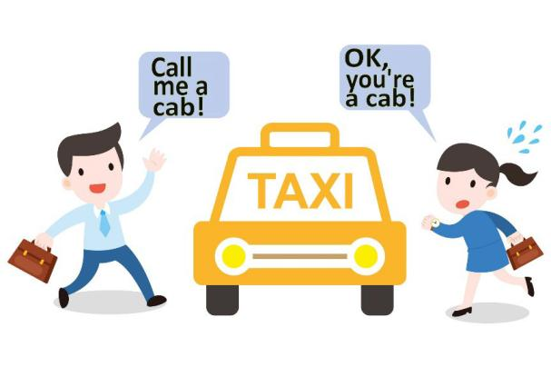

Language is Ambiguous :Words Have Many

### Meanings

- word "bass" can refer to a type of fish or a low-frequency sound.
- The word "bank" can refer to a financial institution or the edge of a
  river.

**📝 Notes / 笔记:**

**词义歧义 / Word Sense Ambiguity:**

- **定义**: 同一个词有多个含义
- **例子**:
  - "bass": 鱼 vs. 低音
  - "bank": 银行 vs. 河岸
  - "apple": 苹果 vs. 苹果公司
- **解决**: Word Sense Disambiguation (WSD) - 根据上下文确定词义

**代码示例:**

```python
from nltk.wsd import lesk
from nltk import word_tokenize
sentence = "I went to the bank to deposit money"
word = "bank"
sense = lesk(word_tokenize(sentence), word)
print(sense.definition())  # "a financial institution"
```

---

## Page 39

Language is Ambiguous :Attachment Ambiguities
She saw the man with the telescope
.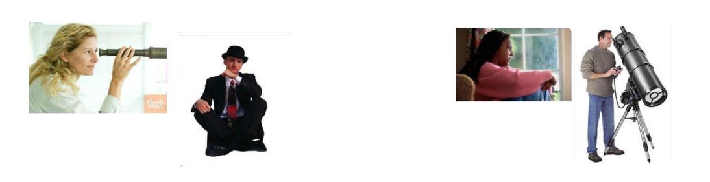

**📝 Notes / 笔记:**

**句法歧义 / Syntactic Ambiguity:**

- **定义**: 句子结构可以有多种解释
- **例子**: "She saw the man with the telescope"
  - 解释1: 她用望远镜看到了那个男人 (with telescope 修饰 saw)
  - 解释2: 她看到了拿着望远镜的男人 (with telescope 修饰 man)
- **解决**: 依赖上下文和语义理解

---

## Page 40

Language is Ambiguous :Coreference

### Ambiguities

My girlfriend and I met my lawyer for a drink
but she became ill and had to leave.

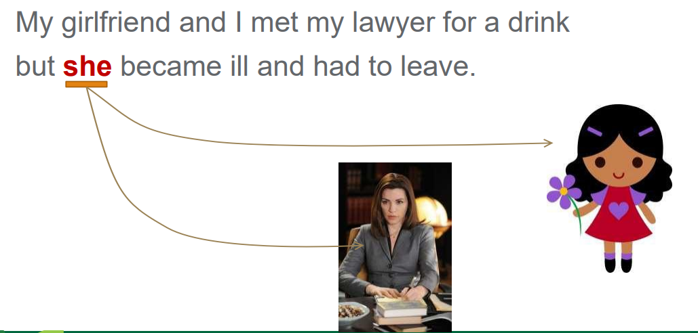

**📝 Notes / 笔记:**

**指代歧义 / Coreference Ambiguity:**

- **定义**: 代词指代不明确
- **例子**: "My girlfriend and I met my lawyer for a drink but she became ill"
  - "she" 指代谁？girlfriend 还是 lawyer？
- **解决**: Coreference Resolution - 确定代词指代的实体
- **应用**: 文本理解、问答系统、信息提取

---

## Page 41

**📷 Images:**


Challenges in NLP

### Ambiguity Sparsity Variation Common

knowledge

**📝 Notes / 笔记:**

**过渡页 - Sparsity 部分**

---

## Page 42

Zipf’s law: the long tail
How many words occur once, twice, 100 times, 1000 times?
How many words occur N times?
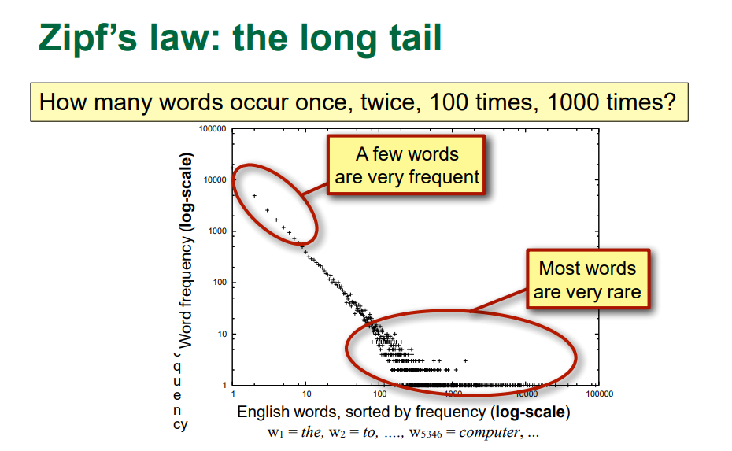

**📝 Notes / 笔记:**

**Zipf's Law (齐普夫定律):**

- **定义**: 少数词汇非常频繁，大多数词汇非常罕见
- **规律**: 词频排名第 n 的词，频率约为第 1 名的 1/n
- **影响**: 数据稀疏、OOV 问题、需要大量数据
- **解决**: 子词分词 (BPE, WordPiece)、字符级模型

---

## Page 43

**📷 Images:**

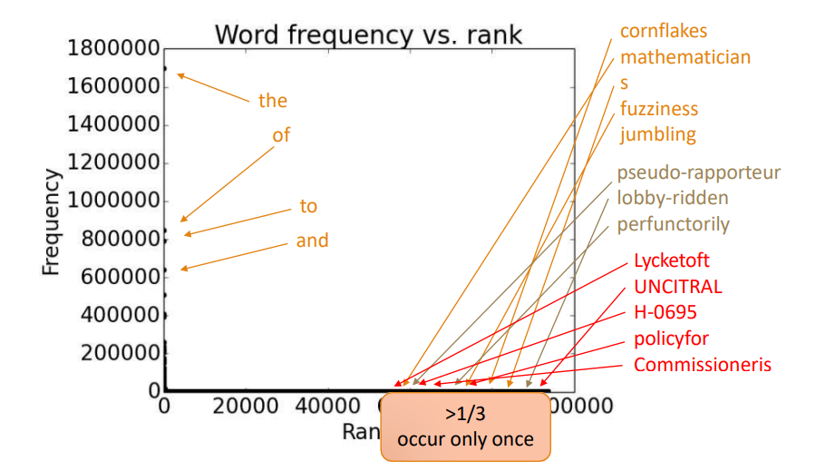

## Sparsity

**📝 Notes / 笔记:**

**数据稀疏性 / Sparsity:**

- **现象**: 超过 1/3 的词汇只出现一次
- **问题**:
  - 训练数据不足以学习罕见词
  - 测试时遇到未见过的词 (OOV)
  - 统计模型效果差
- **解决方案**:
  - 子词分词: 将罕见词拆分成常见子词
  - 字符级模型: 直接处理字符
  - 预训练模型: 在大规模语料上预训练

---

## Page 44

**📷 Images:**


## Challenges in NLP

Ambiguity 

Sparsity 

Variation 

Common knowledge

**📝 Notes / 笔记:**

**过渡页 - Variation 部分**

---

## Page 45

## Variation within the same language

- Variation within the same language
  - Lexical variation
    - She gave the book to Tom vs. She gave Tom the book

  - Regional or Geographic Variation
  - Social Variation 
  - Stylistic Variation 
  -  Generational Variation


- Variation between different languages

**📝 Notes / 笔记:**

**语言变异性 / Language Variation:**

- **词汇变异**: 同一意思的不同表达 ("She gave the book to Tom" vs "She gave Tom the book")
- **地域变异**: 不同地区的方言和用词差异 (UK: lift vs US: elevator)
- **社会变异**: 不同社会群体的语言习惯
- **风格变异**: 正式 vs 非正式语言
- **代际变异**: 不同年龄段的语言使用
- **跨语言变异**: 不同语言之间的差异
- **挑战**: 模型需要处理多种变体

---

## Page 46

**📷 Images:**


## Challenges in NLP

Ambiguity

Sparsity

Variation 

## Common knowledge

**📝 Notes / 笔记:**

**过渡页 - Common Knowledge 部分**

---

## Page 47

**📷 Images:**

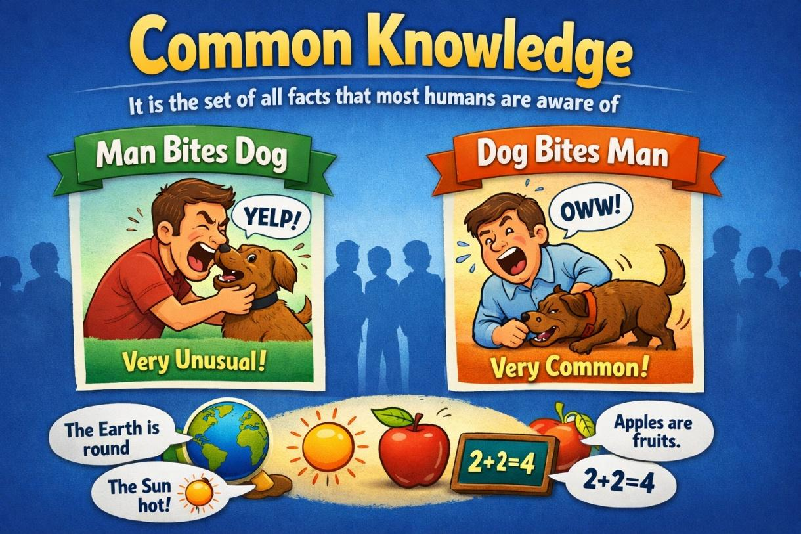

Common knowledge
It is the set of all facts that most humans are aware of
➢ man bit dog
➢ dog bit man
Image generated by ChatGPT

**📝 Notes / 笔记:**

**常识知识 / Common Knowledge:**

- **定义**: 人类普遍知道的事实和常识
- **例子**:
  - "man bit dog" (人咬狗) - 不寻常，是新闻
  - "dog bit man" (狗咬人) - 常见，不是新闻
- **挑战**:
  - 常识难以形式化和编码
  - 需要大量背景知识
  - 人类自动理解，但机器需要明确学习
- **解决**: 知识图谱、常识推理模型、大规模预训练

---

## Page 48

**📷 Images:**


### Other Challenges ?

**📝 Notes / 笔记:**

**其他挑战:**

- 多语言处理
- 讽刺和幽默理解
- 上下文依赖
- 实时处理需求

---

## Page 49

### Lesson Agenda

- Course CSI
- What is Natural Language Processing (NLP)?
- Applications of Natural Language Processing
- Challenges in Natural Language Processing
- Approaches to NLP
- NLP Libraries in Python

### Page

**📝 Notes / 笔记:**

**过渡页 - 进入方法部分**

---

## Page 50

Approaches to NLP

- Heuristics-Based NLP

### • Regular Expression

- Machine Learning for NLP

### • Supervised • Unsupervised

- Deep Learning for NLP
- Recurrent neural networks
- Long short-term memory

### • Transformers

**📝 Notes / 笔记:**

**NLP 的三大方法 / Three Approaches:**

**1. Heuristics-Based (基于规则):**

- 使用正则表达式和手工规则
- 优点: 可解释、精确
- 缺点: 难以扩展、维护成本高

**2. Machine Learning (机器学习):**

- Supervised (监督学习): 需要标注数据 (分类、标注)
- Unsupervised (无监督学习): 聚类、主题模型
- 优点: 自动学习模式
- 缺点: 需要特征工程

**3. Deep Learning (深度学习):**

- RNN: 处理序列数据
- LSTM: 解决长期依赖问题
- Transformer: 并行处理、注意力机制
- 优点: 端到端学习、性能最佳
- 缺点: 需要大量数据和计算资源

---

## Page 51

### Lesson Agenda

- Course CSI
- What is Natural Language Processing (NLP)?
- Applications of Natural Language Processing
- Challenges in Natural Language Processing
- Approaches to NLP
- NLP Libraries in Python

### Page

**📝 Notes / 笔记:**

**过渡页 - 进入 Python 库部分**

---

## Page 52

**📷 Images:**

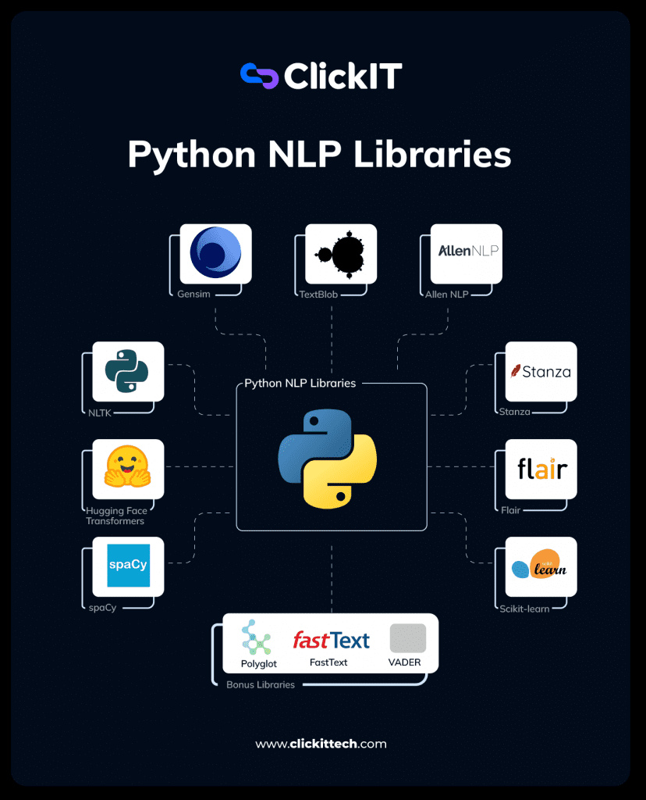

NLP Libraries in Python
Image source: https://www.appventurez.com/blog/beginners-guide-to-natural-language-processing-nlp/

**📝 Notes / 笔记:**

**Python NLP 库 / Libraries:**

**1. NLTK (Natural Language Toolkit):**

- 教学和研究用途
- 功能: 分词、词性标注、命名实体识别
- 适合: 学习 NLP 基础

**2. spaCy:**

- 工业级 NLP 库
- 快速、高效
- 功能: 分词、词性标注、NER、依存句法分析
- 适合: 生产环境

**3. Transformers (Hugging Face):**

- 预训练模型库
- 包含 BERT, GPT, T5 等
- 适合: 最新的深度学习模型

**4. Gensim:**

- 主题模型和词向量
- Word2Vec, Doc2Vec, LDA

**代码示例:**

```python
# NLTK
import nltk
tokens = nltk.word_tokenize("I love NLP")

# spaCy
import spacy
nlp = spacy.load("en_core_web_sm")
doc = nlp("I love NLP")

# Transformers
from transformers import pipeline
classifier = pipeline("sentiment-analysis")
```

---

## Page 53

### Summary

- Language to Knowledge
- Clearing the Confusion: AI vs. Machine Learning vs.Deep Learning Differences

- Lots of applications…
- It’s quite difficult
- Varied, sparse, and lots of ambiguities

**📝 Notes / 笔记:**

**本讲总结 / Lecture Summary:**

**核心要点:**

1. **NLP 定义**: 语言学 + 计算机科学 + AI，让计算机理解和生成人类语言
2. **技术层次**: AI ⊃ ML ⊃ DL，NLP 是 AI 的应用领域
3. **主要应用**: 语音识别、聊天机器人、文本分类、情感分析、摘要、问答
4. **四大挑战**: 歧义性、稀疏性、变异性、常识知识
5. **三种方法**: 规则 → 机器学习 → 深度学习
6. **常用库**: NLTK, spaCy, Transformers, Gensim

---

## Page 54

**📷 Images:**

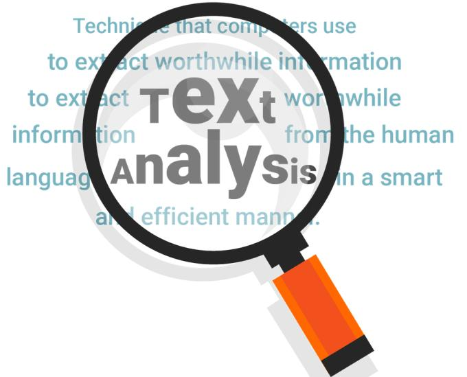

What’s Next?
Text preprocessing and exploratory analysis

- Regular expression
- Tokenization 
- Stemming

- Removing stop words
- Part Of Speech tagging (POS)

**📝 Notes / 笔记:**

**下一讲预告 / What's Next:**

**文本预处理和探索性分析 / Text Preprocessing:**

1. **Regular Expression (正则表达式)**: 模式匹配和文本提取
2. **Tokenization (分词)**: 将文本分割成词或子词
3. **Stemming (词干提取)**: 将词还原为词根形式 (running → run)
4. **Stop Words Removal (停用词移除)**: 去除常见无意义词 (the, a, is)
5. **POS Tagging (词性标注)**: 标注每个词的词性 (名词、动词等)

**这些是 NLP 的基础步骤，为后续任务做准备！**

---

## Page 55

### Q&A

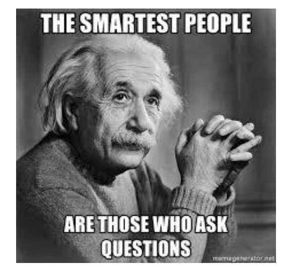

**📝 Notes / 笔记:**

**课程结束 - 问答环节**

---
