# Lecture 2 W26

**Source:** `lecture_2_W26.pdf`

**Total Pages:** 56

---

## Page 1

### CST8507: NATURAL LANGUAGE PROCESSING WEEK#2 TEXT PREPROCESSING AND EXPLORATORY ANALYSIS DEVELOPED BY

HALA OWN, PH.D.

**📝 Notes / 笔记:**

> [Add your notes here / 在此添加笔记]

---

## Page 2

### Lesson Agenda

❑Regular expression
❑Tokenization
❑Stemming
❑Noise Entities Removal
❑Part Of Speech (POS) tagging
❑Named Entity Recognition

**📝 Notes / 笔记:**

> [Add your notes here / 在此添加笔记]

---

## Page 3

Approaches to NLP

- Heuristics-Based NLP
- Regular Expression
- Machine Learning for NLP
- Supervised
- Unsupervised
- Deep Learning for NLP
- Recurrent neural networks
- Long short-term memory
- Transformers

**📝 Notes / 笔记:**

> [Add your notes here / 在此添加笔记]

---

## Page 4

### Rule Based System Computer Troubleshooting

Rule 1: If the computer does not power on, check if the power cable is connected.
Rule 2: If the power is on but the screen is blank, check the monitor's connections.
Rule 3: If there is no sound, check the speaker connections and volume settings.
Rule 4: If the computer is slow, check for malware and free up disk space.

- Design a simple rule-based inference engine to match user-reported symptoms with
  corresponding rules and provide recommendations.

### User Query Example

User: My computer is not powering on.
System: Recommendation - Check if the power cable is connected.

**📝 Notes / 笔记:**

> [Add your notes here / 在此添加笔记]

---

## Page 5

What are Regular Expressions?
❑In computing, a regular expression, also referred to as "regex"
or "regexp", provides a concise and flexible means for matching
strings of text, such as particular characters, words, or patterns
of characters.
❑A regular expression is written in a formal language that can be
interpreted by a regular expression processor.

**📝 Notes / 笔记:**

**正则表达式定义 / Regular Expression Definition:**

**定义**: 用于匹配文本模式的形式化语言

**别名**: regex, regexp

**用途**:

- 文本搜索和匹配
- 数据验证（邮箱、电话号码）
- 文本清洗和提取
- 分词和标记化

**为什么重要?**

- NLP 预处理的基础工具
- 高效的文本模式匹配
- 几乎所有编程语言都支持

**代码示例:**

```python
import re

# 匹配邮箱
email_pattern = r'\b[A-Za-z0-9._%+-]+@[A-Za-z0-9.-]+\.[A-Z|a-z]{2,}\b'
text = "Contact: john@example.com"
emails = re.findall(email_pattern, text)
print(emails)  # ['john@example.com']
```

---

## Page 6

Regular Expression Quick Guide:metacharacters
.

- Matches any single character
  [ ]
- Matches a single character in the listed set
  ^
- Beginning of string(based on the position)
  $
- End of string

*

- matches 0 or more characters
  ❑+
  matches 1 or more characters
  ?
- zero or one occurrence of the preceding character

**📝 Notes / 笔记:**

> [Add your notes here / 在此添加笔记]

---

## Page 7

### Regular Expression Quick Guide…

{ m,n}

- specify number of times character is matched
  between m and n times
  \
- escape character
  |
- or
  ( )
- capture group inside parenthesis

**📝 Notes / 笔记:**

> [Add your notes here / 在此添加笔记]

---

## Page 8

### Character Classes

\s

- - matches any whitespace
    \w
- - matches any alpha character. Equivalent to [A-Za-z]
    \d
- - matches any numeric character. Equivalent to [0-9]
- You may negate these by capitalizing. For example, \D
  matches anything not a digit

**📝 Notes / 笔记:**

> [Add your notes here / 在此添加笔记]

---

## Page 9

### Regular Expressions: Examples

Letters inside square brackets []

### Pattern Matches

[wW]oodchuck Woodchuck, woodchuck
[1234567890] Any digit

### Ranges [A-Z] Pattern Matches

[A-Z] An upper case letter
[a-z] A lower case letter
[0-9] A single digit
Source: Text book

**📝 Notes / 笔记:**

> [Add your notes here / 在此添加笔记]

---

## Page 10

Regular Expressions: ? \*+.

### Pattern Matches

colou?r Optional color colour
previous char
oo\*h! 0 or more of oh! ooh! oooh! ooooh!
previous char
o+h! 1 or more of oh! ooh! oooh! ooooh!
previous char
baa+ baa baaa baaaa baaaaa
beg.n begin begun begun beg3n
Source: Text book

**📝 Notes / 笔记:**

> [Add your notes here / 在此添加笔记]

---

## Page 11

### Regular Expressions: Negation Negations [^Ss]

Carat means negation only when first in []

### Pattern Matches

[^A-Z] Not an upper case letter
[^Ss] Neither ‘S’ nor ‘s’
[^e^] Neither e nor ^
Source: Text book

**📝 Notes / 笔记:**

> [Add your notes here / 在此添加笔记]

---

## Page 12

### Regular Expressions: Anchors ^ $ Pattern Matches ^[A-Z] Palo Alto

^[^A-Za-z] 1

### “Hello”

\.$ The end.
.$ The end?
The end!
Source: Text book

**📝 Notes / 笔记:**

> [Add your notes here / 在此添加笔记]

---

## Page 13

**📷 Images:**

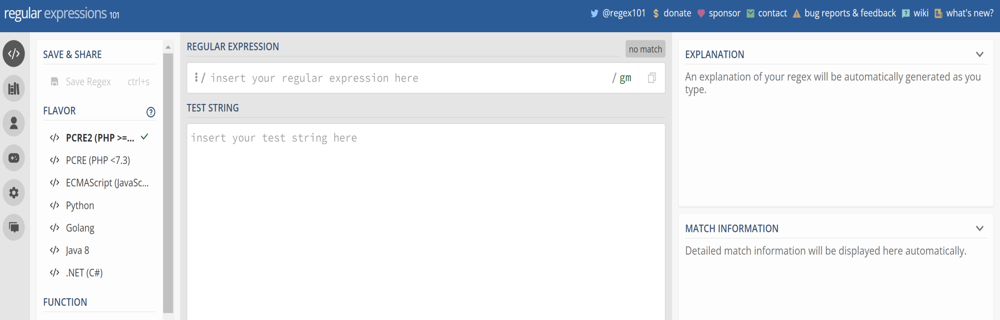

### Online Regular Expressions

- https://regex101.com/

**📝 Notes / 笔记:**

> [Add your notes here / 在此添加笔记]

---

## Page 14

### Python Regex Functions

- re.match(r, s) returns a matched object if the regex r matches at the
  start of string s
- re.search(r, s) returns a matched object if the regex r matches
  anywhere in string s
- findall(pattern, string ) return a list of strings giving all
  nonoverlapping matches of pattern in string.

**📝 Notes / 笔记:**

> [Add your notes here / 在此添加笔记]

---

## Page 15

### Python Regex Functions…

- sub(pattern, repl, string) returns the string obtained by replacing
  the (first count) leftmost nonoverlapping occurrences of pattern (a string or a
  pattern object) in string by repl.
- compile(pattern ) compiles a regular expression pattern string into a
  regular expression pattern object, for later matching.

**📝 Notes / 笔记:**

> [Add your notes here / 在此添加笔记]

---

## Page 16

### Python Regex Functions…

❑groups() Returns a tuple of all group’s substrings of the match .
❑span([group]) Returns the two-item tuple:
(start(group),end(group))

**📝 Notes / 笔记:**

> [Add your notes here / 在此添加笔记]

---

## Page 17

### Python Regex Functions…

import re
re.split(" ", "ab bc cd")
['ab', 'bc', 'cd']
re.split("\d", "ab1bc4cd") ['ab', 'bc', 'cd']

**📝 Notes / 笔记:**

> [Add your notes here / 在此添加笔记]

---

## Page 18

### Regular Expression: Use Cases

- Text cleaning
- Tokenization
- Information Retrieval
- Sentiment Analysis
- Language Detection

**📝 Notes / 笔记:**

> [Add your notes here / 在此添加笔记]

---

## Page 19

Class Activity(work on groups)
Q:Write a regexp to check if any URL exists in the text. Test
your solution with the following text
text = "Visit my website at https://www.example.com or check out
http://another-example.org/path/page.html"

### Page

**📝 Notes / 笔记:**

> [Add your notes here / 在此添加笔记]

---

## Page 20

Class Activity(work on groups)…

- Given a text, list all the longest possible substrings that are proper variable
  names in most of the programming languages. A proper variable name is
  defined as the one that does not start with a digit and does not contain any
  special character other than under score, and it can have arbitrary number
  of characters.
- Test your solution with the following text
  Text='hsdgkjdh;efjewipjrndendrwerji2;;;;8888p9nskdj3905jdkwqld\*\*\*w3w94
  5{{{{{jwkqs ;weoijrtwioejri’
  The output
  ['hsdgkjdh', 'efjewipjrndendrwerji2', 'p9nskdj3905jdkwqld', 'w3w945', 'jwkqs',
  'weoijrtwioejri']

**📝 Notes / 笔记:**

> [Add your notes here / 在此添加笔记]

---

## Page 21

**📷 Images:**

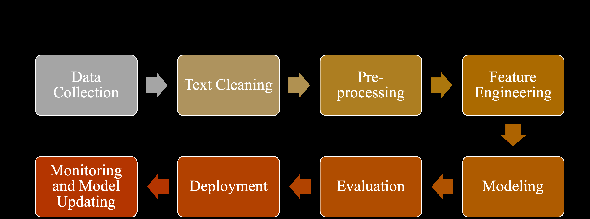

NLP Development Life Cycle

### Requirements

gathering
Gather more Improve the
data model

**📝 Notes / 笔记:**

> [Add your notes here / 在此添加笔记]

---

## Page 22

Text-Preprocessing and Cleaning :Motivations

- Clean And standardize the text data to make it more suitable for
  NLP tasks.
- Convert The text data into A format that can be easily understood
  and processed by NLP algorithms.
- Improve The performance and accuracy of NLP models.

**📝 Notes / 笔记:**

> [Add your notes here / 在此添加笔记]

---

## Page 23

### Text Pre-Processing Pipeline Documents Noise Entities Normalization Tokenization Removal

May be varied depending on the task you are
working on and the data you have

**📝 Notes / 笔记:**

> [Add your notes here / 在此添加笔记]

---

## Page 24

**📷 Images:**

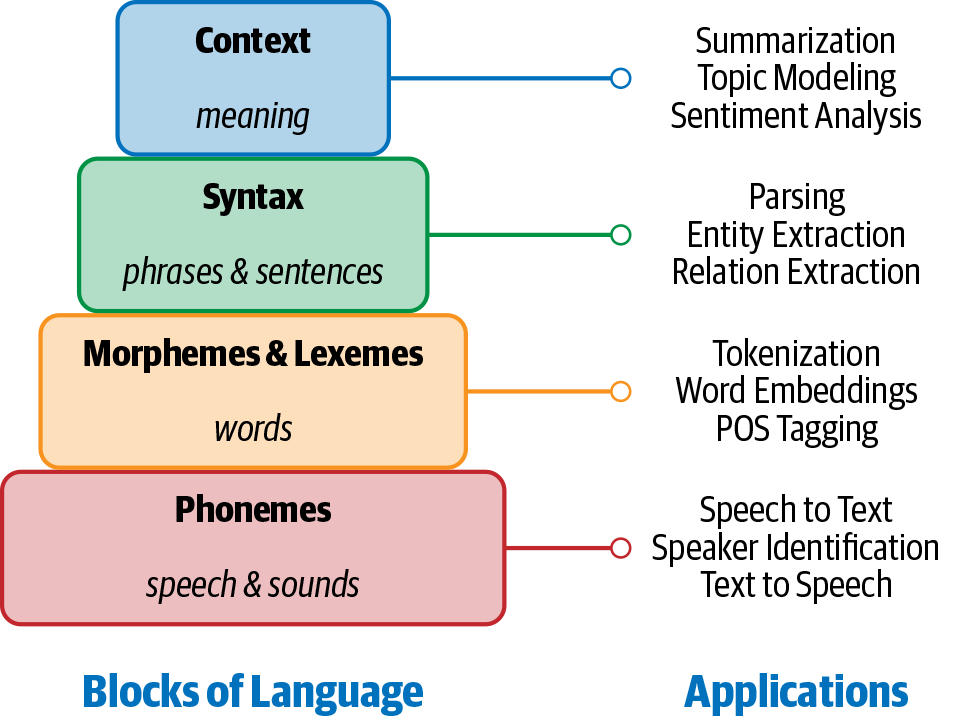

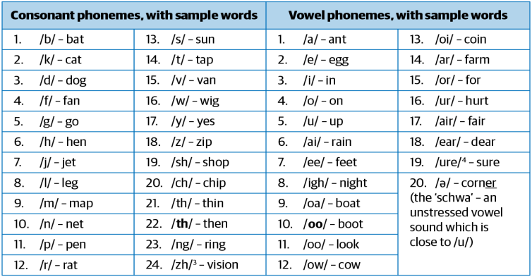

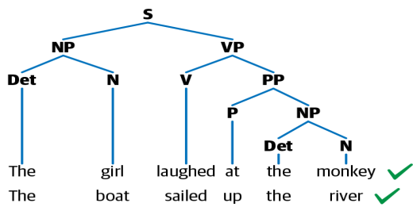

Building Blocks of Language

**📝 Notes / 笔记:**

> [Add your notes here / 在此添加笔记]

---

## Page 25

### Text Preprocessing: Basic Terminology

❑Corpus
A Corpus is defined as a collection of text documents.

- A data set containing news.
- The tweets containing Twitter.
  ❑Words
- unit of language that has a specific meaning and is separated by
  spaces or punctuation.

**📝 Notes / 笔记:**

> [Add your notes here / 在此添加笔记]

---

## Page 26

**📷 Images:**

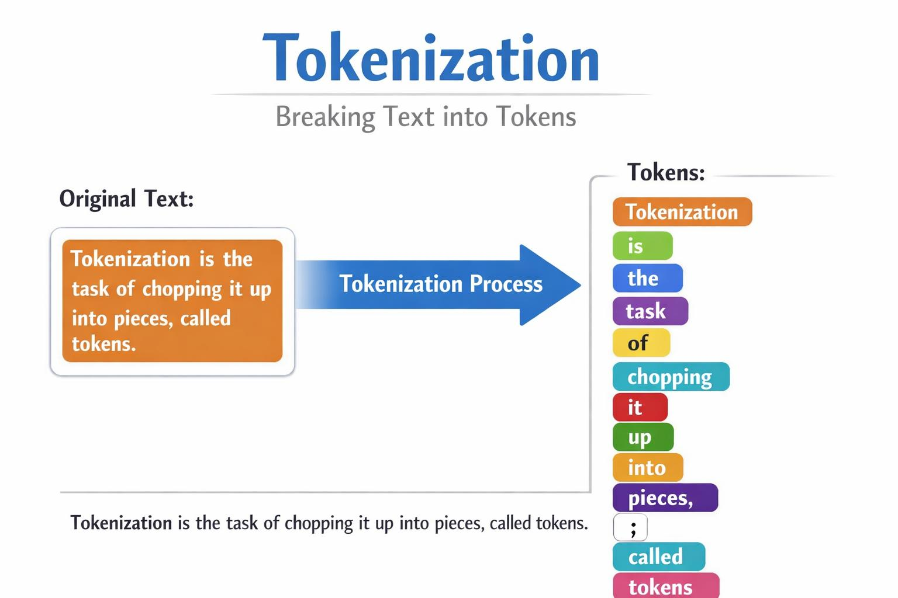

### Tokenization

Image created by ChatGPT

**📝 Notes / 笔记:**

> [Add your notes here / 在此添加笔记]

---

## Page 27

**📷 Images:**

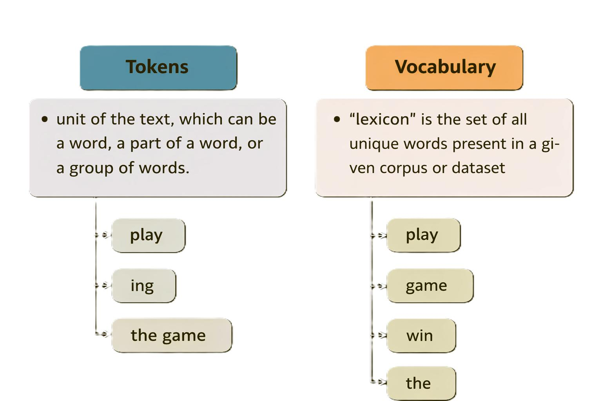

Text Pre-processing: Basic Terminology…
Image created by ChatGPT

**📝 Notes / 笔记:**

> [Add your notes here / 在此添加笔记]

---

## Page 28

### Tokenization

- Demo
  https://text-processing.com/demo/tokenize/

### Page

**📝 Notes / 笔记:**

> [Add your notes here / 在此添加笔记]

---

## Page 29

### Noise Entities Removal(Cleaning Data)

Noise is considered as that piece of text which is not relevant to the
context of the data .
Removing Capital letters
•
lowercased_text = text.lower()

### Removing Numbers

•
clean_text = re.sub('\w*\d\w*', ' ', clean_text)

### Removing Punctuation

•
Removing stop words
•

**📝 Notes / 笔记:**

> [Add your notes here / 在此添加笔记]

---

## Page 30

### Cleaning Data… Demo

**📝 Notes / 笔记:**

> [Add your notes here / 在此添加笔记]

---

## Page 31

### Cleaning Data - Punctuations

**📝 Notes / 笔记:**

> [Add your notes here / 在此添加笔记]

---

## Page 32

Cleaning Data – Stop words

### Page

**📝 Notes / 笔记:**

> [Add your notes here / 在此添加笔记]

---

## Page 33

### Cleaning Data…

Language stop words:

### Demo

**📝 Notes / 笔记:**

> [Add your notes here / 在此添加笔记]

---

## Page 34

**📷 Images:**

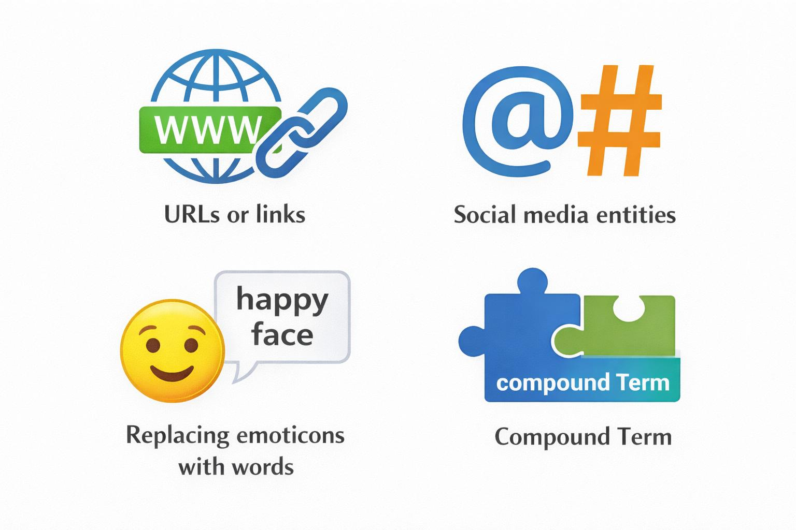

### Other Noise Entities

Image created by ChatGPT

**📝 Notes / 笔记:**

> [Add your notes here / 在此添加笔记]

---

## Page 35

**📷 Images:**

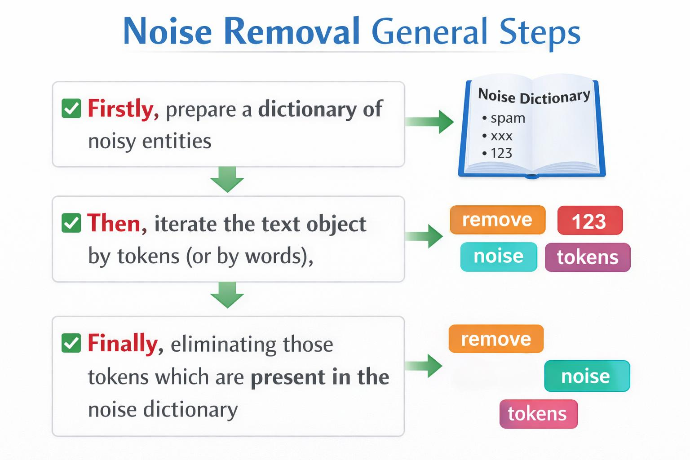

### Noise Removal General Steps

Image created by flowcastGPT with some added updates

**📝 Notes / 笔记:**

> [Add your notes here / 在此添加笔记]

---

## Page 36

### Compound Term Extraction

- Extracting and tagging compound words or phrases in text
- Demo

**📝 Notes / 笔记:**

> [Add your notes here / 在此添加笔记]

---

## Page 37

What is Normalization?

- Normalization is the process of converting a token into its
  base form.
- Inflection from a word is removed

**📝 Notes / 笔记:**

> [Add your notes here / 在此添加笔记]

---

## Page 38

### Stemming

- Word stems, known as the base
  form of a word.
  Example:

**📝 Notes / 笔记:**

> [Add your notes here / 在此添加笔记]

---

## Page 39

Stemming Algorithms(NLTK)

- Porter Stemmer
- Snowball Stemmer
- Lancaster Stemmer

**📝 Notes / 笔记:**

> [Add your notes here / 在此添加笔记]

---

## Page 40

### Stemming: Applications

- Classifying text
- Clustering text, and
- Information retrieval, etc.

**📝 Notes / 笔记:**

> [Add your notes here / 在此添加笔记]

---

## Page 41

### Lemmatization

Obtaining the root form of the word, as it makes use of vocabulary
(dictionary importance of words) and morphological analysis (word
structure and grammar relations).
The output of lemmatization is the root word called lemma
Example:

### Am, Are, Is >> Be Running, Ran, Run >> Run

**📝 Notes / 笔记:**

> [Add your notes here / 在此添加笔记]

---

## Page 42

**📷 Images:**

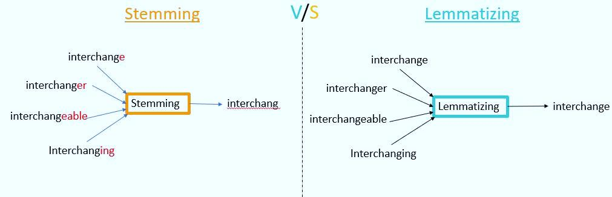

### Normalization Techniques

- Lemmatization is a potentially more accurate way to normalize a word
  than stemming, because it takes into account a word’s meaning.
- A lemmatizer uses a knowledge base of word synonyms and word
  endings to ensure that only words that mean similar things are
  consolidated into a single token.
  https://www.pluralsight.com/guides/importance-of-text-pre-processing

**📝 Notes / 笔记:**

> [Add your notes here / 在此添加笔记]

---

## Page 43

Example of Difference between Stemming and

### Lemmatization

- Based on Context Consideration
- Stemming is Typically faster but not that accurate
- Lemmatization is typically more Accurate
- Speed vs Accuracy trade-off
  lemmatization
  stemming

**📝 Notes / 笔记:**

> [Add your notes here / 在此添加笔记]

---

## Page 44

### Lemmatization Tools

- Wordnet Lemmatizer(NLTK)
- Spacy Lemmatizer
- TextBlob
- CLiPS Pattern
- Stanford CoreNLP
- Gensim Lemmatizer
- TreeTagger

**📝 Notes / 笔记:**

> [Add your notes here / 在此添加笔记]

---

## Page 45

When Not to Use Lemmatization and Stemming

- Specific tasks
- Computational cost
- Social media

**📝 Notes / 笔记:**

> [Add your notes here / 在此添加笔记]

---

## Page 46

**📷 Images:**

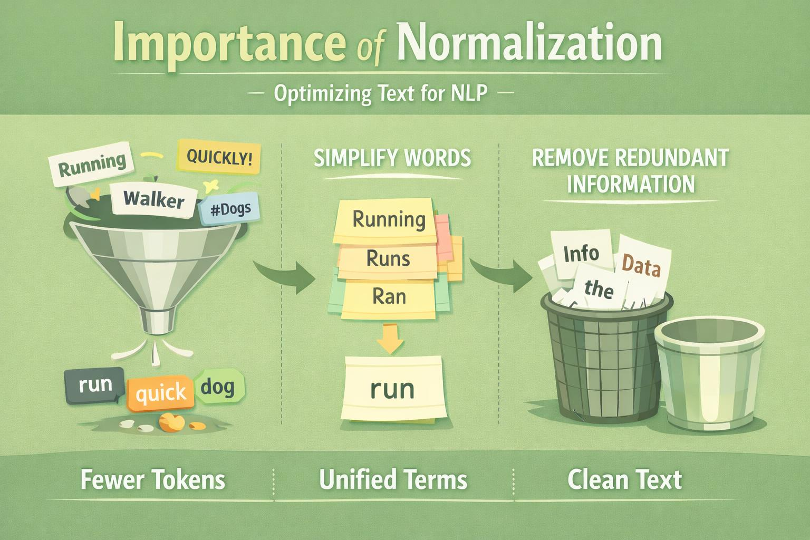

Importance of Normalization
Image created by ChatGPT

**📝 Notes / 笔记:**

> [Add your notes here / 在此添加笔记]

---

## Page 47

### How Do They Work?

❑Demo

**📝 Notes / 笔记:**

> [Add your notes here / 在此添加笔记]

---

## Page 48

**📷 Images:**

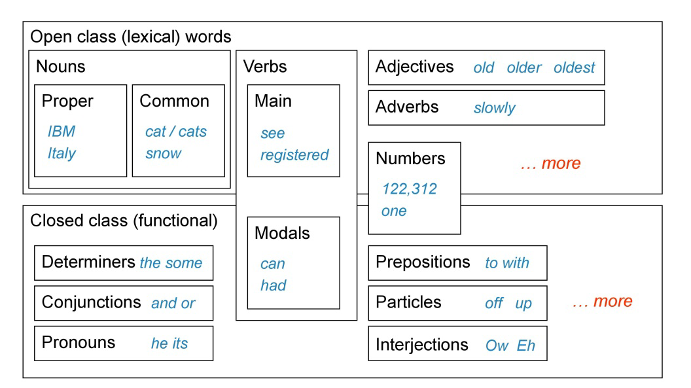

Parts of Speech (POS) Tagging

- process of identifying a word as nouns, pronouns, verbs, adjectives,
  etc.
  https://nlpforhackers.io/tag/part-of-speech/

**📝 Notes / 笔记:**

> [Add your notes here / 在此添加笔记]

---

## Page 49

**📷 Images:**

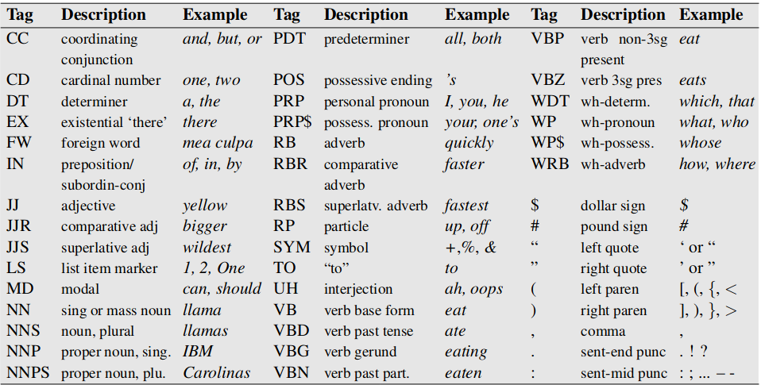

Parts of Speech (POS) Tagging
You can print it Using Python

> > > nltk.help.upenn_tagset()
> > > https://thottingal.in/blog/2019/09/10/bis-pos-tagset-review/

**📝 Notes / 笔记:**

> [Add your notes here / 在此添加笔记]

---

## Page 50

Parts of Speech (POS) Tagging
Part-of-Speech Tagging | Demo

**📝 Notes / 笔记:**

> [Add your notes here / 在此添加笔记]

---

## Page 51

Why Do We Need Part Of Speech (POS)?
❑Syntactic and semantic analysis.
❑Structure and meaning of sentences.

- improve the accuracy of other NLP tasks

**📝 Notes / 笔记:**

> [Add your notes here / 在此添加笔记]

---

## Page 52

### Named Entity Recognition

- Identifies and tags named entities in text (people, places,
  organizations, phone numbers, emails, etc.)
  from nltk.chunk import ne_chunk
  text="James Smith lives in the United States."
  tokens = pos_tag(word_tokenize(text))
  entities = ne_chunk(tokens)

**📝 Notes / 笔记:**

> [Add your notes here / 在此添加笔记]

---

## Page 53

Why Do We Need Named Entity Recognition

- Information extraction
- Searching and indexing
- Sentiment analysis

**📝 Notes / 笔记:**

> [Add your notes here / 在此添加笔记]

---

## Page 54

**📷 Images:**


### Class Activity

For which of the following tasks
we shouldn’t do
stemming/lemmatization?

### A.Poetry Analysis B.Text Classification C.Sentiment Analysis

**📝 Notes / 笔记:**

> [Add your notes here / 在此添加笔记]

---

## Page 55

### Summary

- Regular expressions, which will play an important part
  throughout the course
- Fundamental operations in text analysis:
- tokenization: breaking up a character string into words, punctuation marks
  and other meaningful expressions;
- stemming: removing affixes from words
- tagging: associating each word in a text with a grammatical category or
  part of speech.

**📝 Notes / 笔记:**

> [Add your notes here / 在此添加笔记]

---

## Page 56

### Q&A

**📝 Notes / 笔记:**

> [Add your notes here / 在此添加笔记]

---
