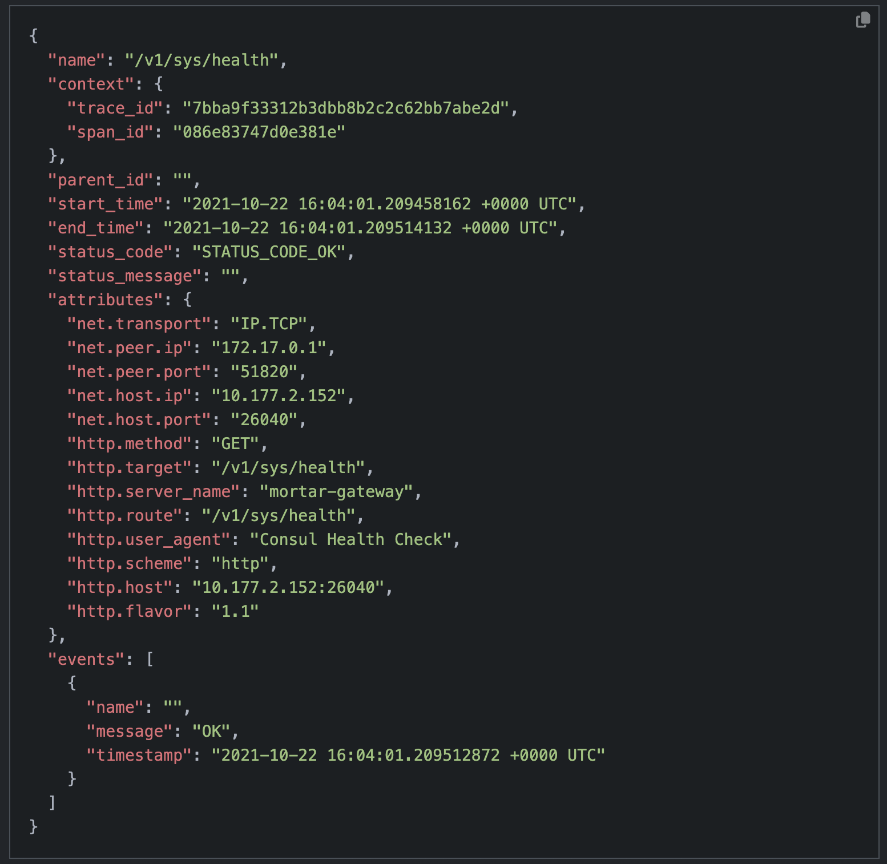
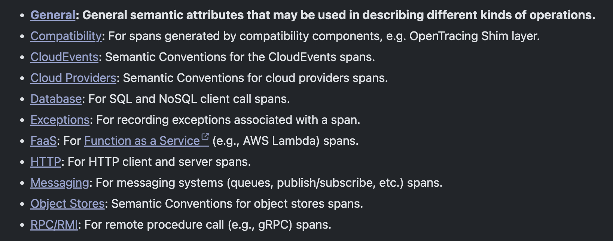
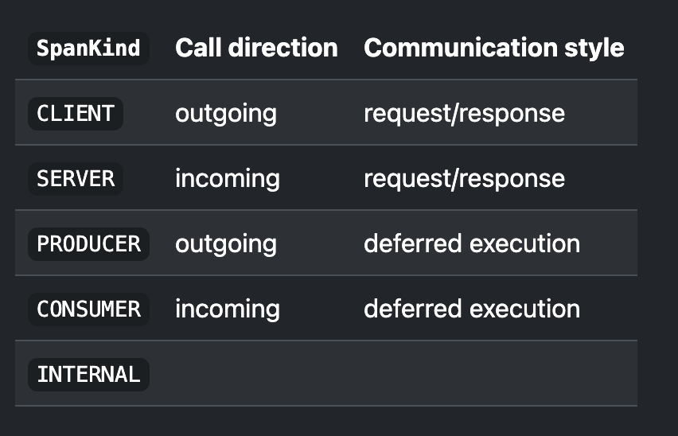
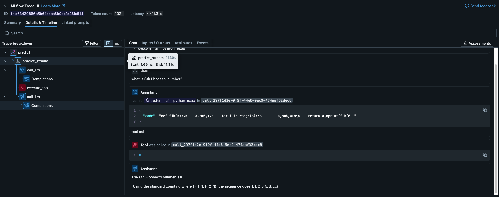
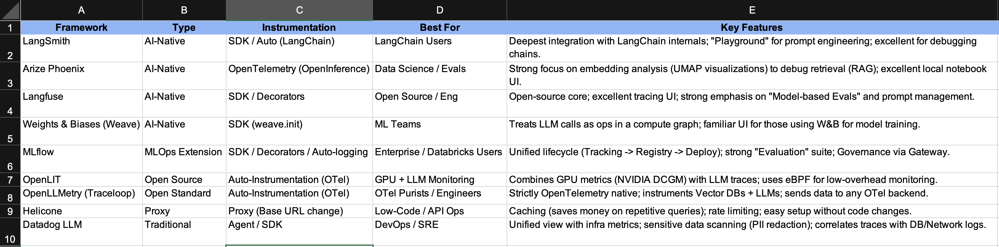
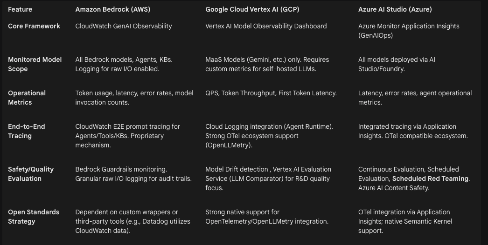
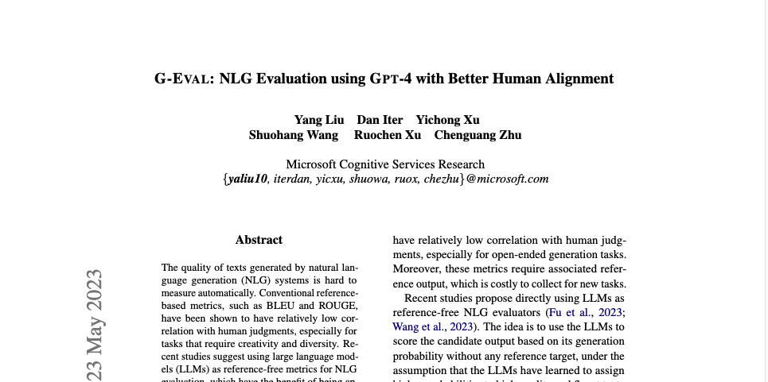
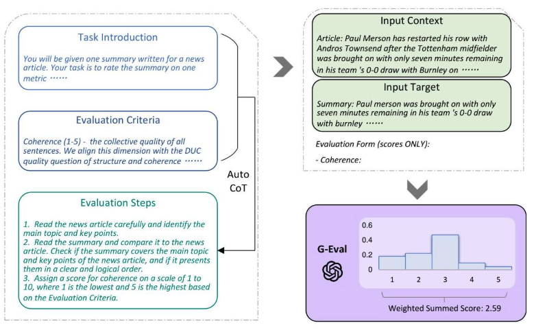
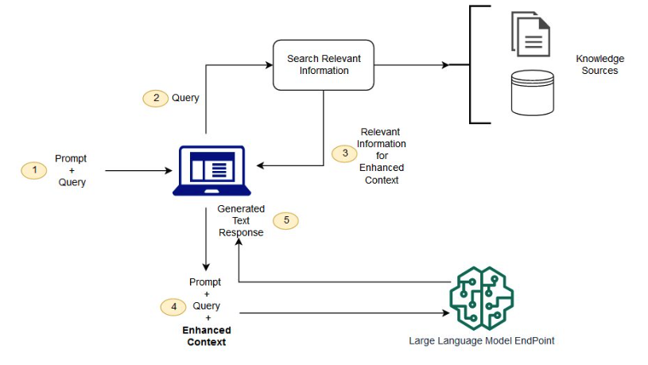
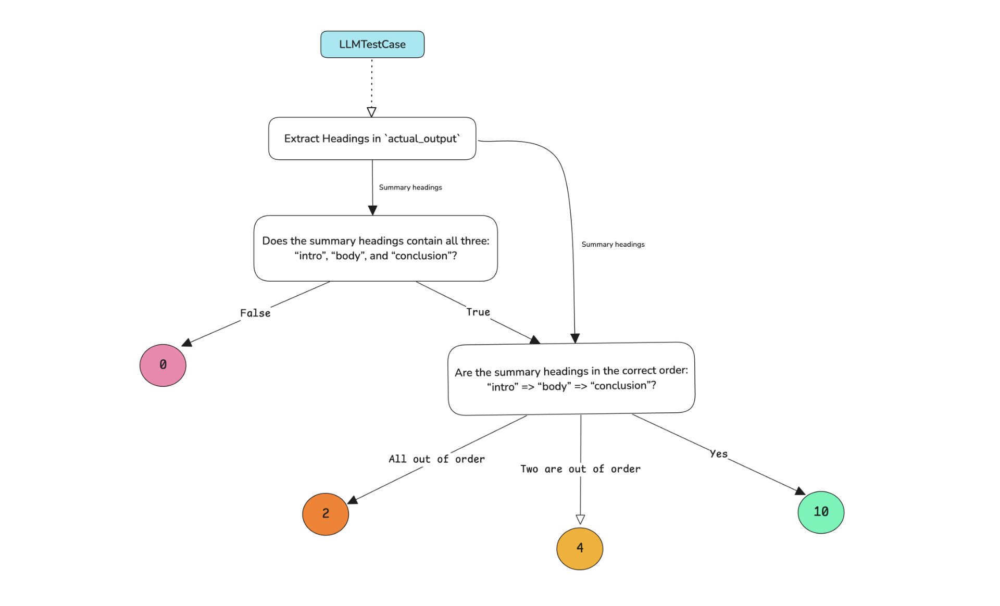

<div class="title-slide">

# Module 2.1 - Evaluation Frameworks and Tools   
<span style="font-size:20px; line-height:2;">
Dr. Hari Manassery Koduvely <br> 
Principal Data Scientist  <br>  
Cybersecurity Analytics <br>  
Ottawa, Canada <br>  
December 08, 2025

## How to Clone this Respository on your Work Laptop

- <span style="font-size:18px;">If your laptop do not have Git, install from https://github.com/git-guides/install-git</span>
- <span style="font-size:18px;">If your laptop do not have an IDE to open Jupyter Notebook install Vistual Studio Code from here https://code.visualstudio.com/download</span>
- <span style="font-size:18px;">To clone the repository:</span>
  - <span style="font-size:16px;">git clone https://github.com/harik68/Course-Evaluation-of-GenAI-Applications.git</span>
  - <span style="font-size:16px;">git clone https://github.com/harik68/Course-Evaluation-of-GenAI-Applications.git</span>
- <span style="font-size:18px;">Change directory to Course-Evaluation-of-GenAI-Applications/Session-1-Evaluation-Principles-and-Methods</span>
- <span style="font-size:18px;">Open the Jupyter Notebook Module1.1-Foundations-of-GenAI-Evaluation.ipynb using the IDE</span>

### Importing Libraries

```python
from typing import Dict
from collections import Counter
import pandas as pd
from IPython.display import Image, display
import textwrap
import os
import openai
from IPython.display import Image, display, HTML
from openai import OpenAI
```

## Quick Recap of Session 1

- <span style="font-size:18px;">**GenAI Application** evaluation is a Holistic Process.</span>
- <span style="font-size:18px;">**Reference-Based** and **Reference-Free** Evaluations.</span>
- <span style="font-size:18px;">**Classical Metrics** for Reference-Based Evaluations for Text Generation use cases.</span>
  - <span style="font-size:16px;">ROUGE</span>
  - <span style="font-size:16px;">BLEU</span>
  - <span style="font-size:16px;">METEOR</span>
  - <span style="font-size:16px;">BERT Score</span>
- <span style="font-size:18px;">**LLM-as-a-Judge** method</span>
  - <span style="font-size:16px;">Single output scoring without a reference.</span>
  - <span style="font-size:16px;">Single output scoring with a reference.</span>
  - <span style="font-size:16px;">Pairwise comparison.</span>
- <span style="font-size:18px;">LLM-as-a-Judge method **Prompt Guidelines**</span>
  - <span style="font-size:16px;">Discrete scores</span>
  - <span style="font-size:16px;">Rubrics</span>
- <span style="font-size:18px;">**Biases** in LLM-as-a-Judge method and their mitigations.</span>

[**Reference to Session 1 Jupyter Notebook**](./Module2.1-Evaluation-Frameworks-and-Tools.ipynb)

## Sesssion 2 Learning Objectives

- <span style="font-size:18px;"> What is **Observability** ?</span>
- <span style="font-size:18px;"> How to instrument Observability using **Open Telemetry**</span>
- <span style="font-size:18px;"> **G-Eval** Framework </span>
- <span style="font-size:18px;"> **RAGAS** Framework </span>

- <span style="font-size:18px;"> Open Source tool **DeepEval** </span>

- <span style="font-size:18px;"> **DAG Eval** Framework </span>

## Observability

- <span style="font-size:18px;">**External queries**: Ask about system behavior without needing internal knowledge.</span>
- <span style="font-size:18px;">**Faster troubleshooting**: Diagnose and resolve novel problems quickly.</span>
- <span style="font-size:18px;">**Behavior explanation**: Surface signals that reveal why something is happening.</span>

> **📝 笔记：为什么 Observability 对 GenAI 应用很重要？**
>
> 1. **复杂性高**：GenAI 应用涉及多个组件（LLM、向量数据库、检索器等），需要端到端的可见性
> 2. **非确定性**：LLM 输出不确定，需要追踪每次请求的完整路径来调试问题
> 3. **成本优化**：通过观察 token 使用、延迟等指标来优化成本
> 4. **质量保证**：实时监控输出质量，及时发现 hallucination 或性能下降
>
> **与传统监控的区别**：
>
> - 传统监控：预定义指标（CPU、内存、错误率）
> - Observability：可以问任何问题，探索未知问题

## Telemetry

- <span style="font-size:18px;">Data emitted from a system and its behavior.</span>
- <span style="font-size:18px;">Data comes in the form of signals: </span>
  - <span style="font-size:16px;">Spans </span>
  - <span style="font-size:16px;">Traces </span>
  - <span style="font-size:16px;">Metrics </span>
  - <span style="font-size:16px;">Logs </span>
- <span style="font-size:18px;">**Open Telemetry** - an open source **industry standard** for instrumenting observability. </span>

## Different Instrumentation Methodologies

<span style="font-size:18px;">**1.SDK-based (Decorators/Wrappers)**:</span>

- <span style="font-size:16px;">Mechanism: Developers manually wrap functions or use a vendor-specific SDK client.</span>

- <span style="font-size:16px;">Pros:</span>
  - <span style="font-size:16px;">Highest granularity.</span>
  - <span style="font-size:16px;">Allows capturing custom metadata and intermediate reasoning steps easily.</span>

- <span style="font-size:16px;">Cons:</span>
  - <span style="font-size:16px;">High code intrusion.</span>
  - <span style="font-size:16px;">Creates vendor lock-in.</span>

- <span style="font-size:16px;">Supporting Frameworks: LangSmith, Langfuse, MLflow.</span>

<span style="font-size:18px;">**2.Auto-Instrumentation using OpenTelemetry Standards (OTel)**:</span>

- <span style="font-size:16px;">Mechanism: **Monkey-patch** (replace original function with a wrapped function) a standard library (e.g ChatCompletion.create from OpenAI) at run time to:</span>
  - <span style="font-size:16px;">Emit traces.</span>
  - <span style="font-size:16px;">Calls the original API.</span>

- <span style="font-size:16px;">Pros:</span>
  - <span style="font-size:16px;">Minimal code changes (often just an initialization line @autotrace)</span>
  - <span style="font-size:16px;">Vendor-neutral (can switch backends easily)</span>
  - <span style="font-size:16px;">Compliant with industry standards.</span>

- <span style="font-size:16px;">Cons:
  - <span style="font-size:16px;">Could create conflict with other libraries.</span>
  - <span style="font-size:16px;">Less control over exactly what is logged compared to manual decorators.</span>

- <span style="font-size:16px;">Supporting Frameworks: OpenLLMetry, OpenLIT, Arize Phoenix.</span>

<span style="font-size:18px;">**3.Proxy-based**:</span>

- <span style="font-size:16px;">Mechanism: The application routes LLM requests through a middleware proxy server.</span>

- <span style="font-size:16px;">Pros:</span>
  - <span style="font-size:16px;">Zero overhead on the application.</span>
  - <span style="font-size:16px;">Language agnostic.</span>
  - <span style="font-size:16px;">Easiest to set up.</span>

- <span style="font-size:16px;">Cons:</span>
  - <span style="font-size:16px;"> "Black box" visibility (sees inputs/outputs but not internal app logic/retrieval steps)</span>
  - <span style="font-size:16px;"> Adds a network hop.</span>

- <span style="font-size:16px;">Supporting Frameworks: Helicone, MLflow AI Gateway.</span>

## What Does Observability Data Contains?

- <span style="font-size:20px;">Traces, which record the complete end-to-end journey of a request through the application.</span>

- <span style="font-size:20px;">Spans, each of which represent a single timed unit of work within a trace.</span>

### Spans

- <span style="font-size:18px;">**Unit of work**: represents a single request. </span>
- <span style="font-size:18px;">**Tracks** operations within a request.</span>
- <span style="font-size:18px;">**Reveals** what happened during execution.</span>
- <span style="font-size:18px;">**Open Telemetry Span Contains**:</span>
  - <span style="font-size:16px;">Name</span>
  - <span style="font-size:16px;">Parent Span ID</span>
  - <span style="font-size:16px;">Start and End Timestamps</span>
  - <span style="font-size:16px;">Span Context</span>
  - <span style="font-size:16px;">Attributes</span>
  - <span style="font-size:16px;">Span Events</span>
  - <span style="font-size:16px;">Span Links</span>
  - <span style="font-size:16px;">Span Status</span>

<div style='text-align: center;'>
    
    <div style='font-size:16px; color:gray; margin-top:8px;'>
        Figure 1 A: An Example for a Span in Telemetry Data.<br>
        Reference: Open Telemetry Documentation.
    </div>
</div>

> **📝 图片说明 - Figure 1A: Span 示例**
>
> 这张图展示了一个完整的 Span 数据结构：
>
> - **Trace ID**: 唯一标识整个请求链路
> - **Span ID**: 当前操作的唯一标识
> - **Duration**: 操作耗时（如 234ms）
> - **Attributes**: 包含模型名称、输入输出 token 数等
> - **Events**: 记录关键时间点（如开始、结束、错误）

<div style='text-align: center;'>
    
    <div style='font-size:16px; color:gray; margin-top:8px;'>
        Figure 1 B: Span Semantic Conventions.<br>
        Reference: Open Telemetry Documentation.
    </div>
</div>

> **📝 图片说明 - Figure 1B: Span 语义约定**
>
> OpenTelemetry 定义了标准的命名规范：
>
> - **gen_ai.system**: LLM 提供商（如 "openai", "anthropic"）
> - **gen_ai.request.model**: 模型名称（如 "gpt-4"）
> - **gen_ai.usage.input_tokens**: 输入 token 数
> - **gen_ai.usage.output_tokens**: 输出 token 数
> - **gen_ai.request.temperature**: 温度参数
>
> **为什么需要语义约定？**
>
> - 统一不同厂商的数据格式
> - 便于跨平台分析和对比
> - 支持自动化的成本计算和性能分析

<div style='text-align: center;'>
    
    <div style='font-size:16px; color:gray; margin-top:8px;'>
        Figure 1 C: Span Types.<br>
        Reference: Open Telemetry Documentation.
    </div>
</div>

> **📝 图片说明 - Figure 1C: Span 类型**
>
> OpenTelemetry 定义了多种 Span 类型：
>
> 1. **CLIENT**: 客户端发起的请求（如调用 OpenAI API）
> 2. **SERVER**: 服务端处理的请求（如 FastAPI 接收请求）
> 3. **INTERNAL**: 内部操作（如数据处理、向量化）
> 4. **PRODUCER**: 消息生产者（如发送到消息队列）
> 5. **CONSUMER**: 消息消费者（如从队列读取）
>
> **GenAI 应用中的典型 Span 类型**：
>
> - 用户请求 → SERVER span
> - 调用 LLM → CLIENT span
> - 向量检索 → INTERNAL span
> - 数据预处理 → INTERNAL span

### Traces

- <span style="font-size:18px;">The path of a request through the application. </span>
- <span style="font-size:18px;">Consists of multiple Spans.</span>
- <span style="font-size:18px;">Gives the full picture of end-to-end operations during a request.</span>

<div style='text-align: center;'>
    
    <div style='font-size:16px; color:gray; margin-top:8px;'>
        Figure 2: An Example for a Trace.<br>
    </div>
</div>

> **📝 图片说明 - Figure 2: Fibonacci Agent Trace**
>
> 这是一个 AI Agent 计算斐波那契数列的完整 Trace：
>
> **Trace 结构分析**：
>
> 1. **根 Span**: Agent 接收任务
> 2. **子 Span 层级**:
>    - 规划阶段：分解任务
>    - 执行阶段：调用工具/函数
>    - 验证阶段：检查结果
> 3. **并行 Span**: 某些操作可以并行执行
> 4. **错误 Span**: 标记为红色，显示失败的操作
>
> **从 Trace 中可以看出**：
>
> - Agent 的推理步骤和决策过程
> - 每个步骤的耗时分布
> - 哪些工具被调用了多少次
> - 错误发生在哪个环节
>
> **调试技巧**：
>
> - 找最长的 Span → 优化性能
> - 找重复的 Span → 优化逻辑
> - 找错误的 Span → 定位 bug

## Exercise 1: Hellow World Example for Tracing with OpenTelemetry

```python
%pip install opentracing
%pip install opentelemetry-sdk  -q
```

```python
from opentelemetry import trace
from opentelemetry.sdk.trace import TracerProvider
from opentelemetry.sdk.trace.export import SimpleSpanProcessor, ConsoleSpanExporter

```

```python
provider = TracerProvider()
console_exporter = ConsoleSpanExporter()
provider.add_span_processor(SimpleSpanProcessor(console_exporter))
trace.set_tracer_provider(provider)
```

```python
tracer = trace.get_tracer("hello-world")
```

```python
import sys
import time
from tracing import init_tracer
import opentracing
tracer = opentracing.tracer
```

```python
def say_hello(hello_to):
    with tracer.start_as_current_span("say-hello") as span:
        span.set_attribute("hello-to", hello_to)
        hello_str = format_string(hello_to)
        print_hello(hello_str)

def format_string(hello_to):
    with tracer.start_as_current_span("format") as span:
        hello_str = f"Hello, {hello_to}!"
        span.add_event("string-format", {"value": hello_str})
        return hello_str

def print_hello(hello_str):
    with tracer.start_as_current_span("println") as span:
        print(hello_str)
        span.add_event("println")

```

```python
from pprint import pprint
pprint(say_hello("World"))
```

## Top Observability Frameworks

<div style='text-align: center;'>
    
    <div style='font-size:16px; color:gray; margin-top:8px;'>
        Figure 3: Comparison between Top Observability Frameworks.
    </div>
</div>

> **📝 图片说明 - Figure 3: 主流 Observability 框架对比**
>
> **开源框架**：
>
> 1. **OpenLLMetry**:
>    - 专注于 LLM 应用
>    - 基于 OpenTelemetry
>    - 自动追踪 LangChain、LlamaIndex
> 2. **Arize Phoenix**:
>    - 强大的可视化界面
>    - 支持 LLM 评估和追踪
>    - 本地部署友好
> 3. **OpenLIT**:
>    - 轻量级
>    - 专注于成本和性能监控
>
> **商业平台**：
>
> 1. **LangSmith**: LangChain 官方，深度集成
> 2. **Langfuse**: 开源 + 云服务，功能全面
> 3. **Helicone**: 代理模式，零代码改动
>
> **选择建议**：
>
> - 使用 LangChain → LangSmith
> - 需要开源 → Arize Phoenix
> - 快速上线 → Helicone
> - 标准化 → OpenLLMetry

## Observability Frameworks in AWS Azure and GCP AI Studios

<div style='text-align: center;'>
    
    <div style='font-size:16px; color:gray; margin-top:8px;'>
        Figure 4: Comparison between Observability Frameworks in AWS AZure and GCP AI Studios.
    </div>
</div>

> **📝 图片说明 - Figure 4: 云平台 AI Observability 对比**
>
> | 功能         | AWS Bedrock        | Azure AI Studio      | GCP Vertex AI    |
> | ------------ | ------------------ | -------------------- | ---------------- |
> | **追踪**     | CloudWatch Logs    | Application Insights | Cloud Trace      |
> | **指标**     | CloudWatch Metrics | Azure Monitor        | Cloud Monitoring |
> | **成本分析** | Cost Explorer      | Cost Management      | Billing Reports  |
> | **模型监控** | Model Monitor      | Model Monitoring     | Model Monitoring |
> | **集成难度** | 中等               | 简单                 | 中等             |
>
> **关键差异**：
>
> 1. **AWS Bedrock**:
>    - 与 CloudWatch 深度集成
>    - 支持自定义指标
>    - 需要额外配置 X-Ray 进行分布式追踪
> 2. **Azure AI Studio**:
>    - 开箱即用的可视化界面
>    - 自动记录所有 LLM 调用
>    - 与 Azure DevOps 集成好
> 3. **GCP Vertex AI**:
>    - 强大的 BigQuery 集成
>    - 支持自定义 ML 指标
>    - 与 TensorBoard 集成
>
> **多云策略**：
>
> - 使用 OpenTelemetry 作为统一层
> - 数据导出到中心化平台（如 Datadog）
> - 避免云厂商锁定

=================================================================================================================================================================

## G-Eval Framework

<div style='text-align: center;'>
    
    <div style='font-size:16px; color:gray; margin-top:8px;'>
        Figure 5: G-Eval Publication.<br>
    </div>
</div>

> **📝 图片说明 - Figure 5: G-Eval 论文**
>
> **G-Eval 核心创新**：
>
> 1. **自动生成评估步骤**：不需要人工定义详细的评分规则
> 2. **概率加权评分**：利用 LLM 输出的 token 概率，而不是简单的文本输出
> 3. **更好的人类对齐**：在多个基准测试中超越传统指标
>
> **论文关键发现**：
>
> - G-Eval 与人类评分的相关性达到 0.514（Spearman）
> - 传统指标（ROUGE、BLEU）相关性仅 0.3-0.4
> - 在摘要、对话、数据到文本等任务中都表现优异

-<span style="font-size:20px;">A structured approach to evaluate GenAI outputs on a Reference-free basis.</span>

-<span style="font-size:20px;">Combibes _Automatic Chain-of-Thought Reasoning_ and _Probability-Weighted Scoring_.</span>

-<span style="font-size:20px;">Achives better alignment with human judgements.</span>

<div style='text-align: center;'>
    
    <div style='font-size:16px; color:gray; margin-top:8px;'>
        Figure 5: G-Eval Overview.<br>
    </div>
</div>

> **📝 图片说明 - G-Eval 工作流程**
>
> **完整流程**：
>
> 1. **输入**：评估任务描述 + 评分标准
> 2. **CoT 生成**：LLM 生成评估步骤
> 3. **评估执行**：按步骤评估实际输出
> 4. **概率提取**：获取每个分数的 logprobs
> 5. **加权计算**：计算最终分数
>
> **与传统方法对比**：
> | 方法 | 灵活性 | 准确性 | 成本 |
> |------|--------|--------|------|
> | ROUGE/BLEU | 低 | 中 | 低 |
> | 人工评估 | 高 | 高 | 极高 |
> | G-Eval | 高 | 高 | 中 |

<span style="font-size:18px;">**Step1**: Design a detailed natural languge prompt that explicitly define the evaluation task and criteria.</span>

<span style="font-size:18px;">**Step2**: Automatic Chain-of-Thought Generation.</span>

<span style="font-size:16px;">LLM generates it own detailed evaluation stepss based on the task and criteria.</span>

<span style="font-size:18px;">**Step3**: Calculation of Probability-weighted score.</span>  
<span style="font-size:20px;">

$$
score = \sum_{i=1}^{n} p(s_i)\space s_i
$$

</span>
<span style="font-size:16px;">Where $\{s_1, s_2, ..., s_n\}$ represents set of possible integer scores defined in the criteria.</span>   

<span style="font-size:16px;">And $p(s_i)$ is the probability of generating token $s_i$ by LLM.</span>

## RAGAS (Retrieval Augmented Generation Assessment) Framework

<span style="font-size:20px;">Retrieval Augmented Generation (RAG) is an efficient and cost-effective way to solve 3 main drawbacks of LLMs:</span>

- <span style="font-size:18px;">Lack of internal knowledge about events past their training cut-off date.</span>

- <span style="font-size:18px;">Lack of sufficient knowledge about highly specialized domains or company internal documents.</span>

- <span style="font-size:18px;">Prone to generating factually incorrect information.</span>

<div style='text-align: center;'>
    
    <div style='font-size:16px; color:gray; margin-top:8px;'>
        Figure 6: RAG High-Level Architecture.<br>
        Reference: AWS RAG Documentation.
    </div>
</div>

> **📝 图片说明 - Figure 6: RAG 架构**
>
> **RAG 的两个核心组件**：
>
> 1. **Retriever（检索器）**：
>    - 向量化查询
>    - 从知识库检索相关文档
>    - 重排序和过滤
> 2. **Generator（生成器）**：
>    - 接收检索到的上下文
>    - 结合用户问题生成答案
>    - 确保答案基于上下文
>
> **为什么需要 RAG？**
>
> - ✅ 解决 LLM 知识截止日期问题
> - ✅ 提供专业领域知识
> - ✅ 减少 hallucination
> - ✅ 可追溯答案来源
>
> **RAG 的挑战**：
>
> - 检索质量直接影响答案质量
> - 上下文窗口限制
> - 检索和生成的平衡

<span style="font-size:20px;">Challenges in evaluation of RAG systems:</span>

- <span style="font-size:18px;">**Interplay of Components**: Quality of final answer depends on both the retriever and the generator.</span>

- <span style="font-size:18px;">**Lack of Universal Benchmarks**: No single benchmark dataset that applies to every RAG system.</span>

- <span style="font-size:18px;">**Dynamic Data and Drift**: Evaluation results can be outdated quickly when knowledge base get udated.</span>

- <span style="font-size:18px;">**Cost of Human Evaluation**: Frequent Human evaluation is time consuming and costly.</span>

<div style='text-align: center;'>
    
    <div style='font-size:16px; color:gray; margin-top:8px;'>
        Figure 7: RAGAS Framework Paper.<br>
    </div>
</div>

> **📝 图片说明 - Figure 7: RAGAS 论文**
>
> **RAGAS 的创新点**：
>
> 1. **无需人工标注**：完全基于 LLM 的自动评估
> 2. **组件级评估**：分别评估检索器和生成器
> 3. **端到端评估**：也支持整体质量评估
>
> **论文关键贡献**：
>
> - 提出了 RAG 专用的评估指标体系
> - 在多个数据集上验证了有效性
> - 开源了完整的评估框架
>
> **使用 RAGAS 的最佳实践**：
>
> ```python
> from ragas import evaluate
> from ragas.metrics import (
>     faithfulness,
>     answer_relevancy,
>     context_relevancy
> )
>
> # 准备评估数据
> data = {
>     "question": [...],
>     "answer": [...],
>     "contexts": [...],
>     "ground_truths": [...]  # 可选
> }
>
> # 运行评估
> result = evaluate(
>     data,
>     metrics=[faithfulness, answer_relevancy, context_relevancy]
> )
> ```

<span style="font-size:20px;">RAGAS Introduced 3 core Metrics.</span>

<span style="font-size:20px;">1. **Faithfulness**: Measures whether claims in the generated answer can be supported by the retrieved context.</span>

- <span style="font-size:18px;">Direct measure of the degree of hallucination.</span>
- <span style="font-size:18px;">Judge-LLM extracts individual statements from the geneerated answer.</span>
- <span style="font-size:18px;">Verifies each statement against the context.</span>
- <span style="font-size:18px;">Faithfulness Score F is calculated as:</span>  
  <span style="font-size:18px;">
  $$
  F = \frac{V}{S}
  $$
  <span style="font-size:18px;"></span>
- <span style="font-size:18px;"> V - Number of verified statements.</span>
- <span style="font-size:18px;"> S - Number of total statements.</span>

<span style="font-size:20px;">2. **Answer Relevance**: Measures whether the generated response directly address the original question.</span>

- <span style="font-size:18px;">Judge-LLM first generate the potential questions the given answer could respond to.</span>
- <span style="font-size:18px;">Theen compute the average cosine similarity between generated questions and the original query</span>
- <span style="font-size:18px;">Answer Relevance Score AR is calculated as:</span>  
  <span style="font-size:18px;">

  $$
  AR = \frac{1}{n}\space \sum_{i=1}^{n}sim(q,q_i)
  $$

  <span style="font-size:18px;"></span>  
  <span style="font-size:20px;">2. **Context Relevance**: Measures how relevant the context is for answering the original question.</span>

- <span style="font-size:18px;">Judge-LLM extracts sentences from the context that are essential for answering the question.</span>
- <span style="font-size:18px;">Context Relevance Score CR is calculated as:</span>  
  <span style="font-size:18px;">
  $$
  CR = \frac{E}{S}
  $$
  <span style="font-size:18px;"></span>
- <span style="font-size:18px;"> E - Number of extracted sentences from context.</span>
- <span style="font-size:18px;"> S - Number of total sentences in context.</span>

## DeepEval Open-Source Evaluation Framework

- <span style="font-size:18px;"> Built on top of G-Eval framework.</span>

- <span style="font-size:18px;"> Plug-and-Use 30+ LLM-evaluated metrics.</span>

- <span style="font-size:18px;"> Supports both end-to-end and component level evaluation.</span>

- <span style="font-size:18px;"> Evaluation for RAG, Agents, Chatbots etc.</span>
- <span style="font-size:18px;"> Synthetic dataset generation capability.</span>
- <span style="font-size:18px;"> Customizable metrics.</span>
- <span style="font-size:18px;"> SecOps support for red teaming and safety scan for vulnerabilitites.</span>

### Plug-and-Use Metrics

<span style="font-size:22px;">1. Custom Metrics</span>

- <span style="font-size:18px;">G-Eval</span>
- <span style="font-size:18px;">Deep Acyclic Graph (DAG) Eval</span>

<span style="font-size:20px;">Example: Summarizaing Meeting Notes</span>

<span style="font-size:18px;">G-Eval:</span>

<span style="font-size:18px:"> A single prompt: <br>"Score is 0 if the summmary misses any of the headings: "intro", "body", "conclusion". <br> Score is 2 if the summary has all the 3 sections but are in the wrong order. <br>Score is 10 if the summary hasa all the 3 sections and they are in the correct order."</span>

<span style="font-size:18px;">DAG Eval:</span>

<div style='text-align: center;'>
    
    <div style='font-size:16px; color:gray; margin-top:8px;'>
        Figure 8: DAG Eval Metric in DeepEval.<br>
        Reference: Deep Eval Documentation
    </div>
</div>

> **📝 图片说明 - Figure 8: DAG Eval 决策树**
>
> **DAG Eval 的结构**：
>
> 这张图展示了一个评估会议摘要的 DAG：
>
> ```
> 1. TaskNode: 提取摘要中的标题
>    ↓
> 2. BinaryJudgementNode: 是否包含 intro/body/conclusion？
>    ├─ No → VerdictNode: 0分
>    └─ Yes → 继续
>         ↓
> 3. NonBinaryJudgementNode: 标题顺序是否正确？
>    ├─ 全部正确 → VerdictNode: 10分
>    ├─ 两个错位 → VerdictNode: 4分
>    └─ 全部错位 → VerdictNode: 2分
> ```
>
> **DAG Eval vs G-Eval 对比**：
>
> | 特性         | G-Eval         | DAG Eval         |
> | ------------ | -------------- | ---------------- |
> | **评估方式** | 单个 prompt    | 决策树           |
> | **确定性**   | 低（依赖 LLM） | 高（结构化）     |
> | **透明度**   | 中等           | 高（可追踪每步） |
> | **适用场景** | 主观评估       | 结构化评估       |
> | **调试难度** | 较难           | 容易             |
>
> **何时使用 DAG Eval？**
>
> 1. ✅ 需要严格的结构检查（如 JSON schema）
> 2. ✅ 需要可解释的评分过程
> 3. ✅ 需要组合多个评估维度
> 4. ✅ 需要确定性的结果
>
> **何时使用 G-Eval？**
>
> 1. ✅ 主观质量评估（如流畅性、创意性）
> 2. ✅ 快速原型开发
> 3. ✅ 不需要严格的结构约束
>
> **混合使用**：
>
> ```python
> # 在 DAG 中嵌入 G-Eval 节点
> dag = DeepAcyclicGraph(
>     root_nodes=[
>         # 先用 DAG 检查结构
>         BinaryJudgementNode(...),
>         # 再用 G-Eval 评估质量
>         GEvalNode(criteria="流畅性和连贯性")
>     ]
> )
> ```

<span style="font-size:20px;">Advantages of DAG Eval over G-Eval</span>

- <span style="font-size:18px;">**Determinism**: Structured decision-tree approach ensures more consistent and reproducible results.</span>
- <span style="font-size:18px;">**Granular Control and Transparency**: Developers can define explicit sequence of checks to create a more auditable trail.</span>

- <span style="font-size:18px;">**Syntax and Structural Evaluations**: G-Eval struggles with strict structural checks such as "must have this JSON schema".</span>
- <span style="font-size:18px;">**Modular Design**: One can use G-Eval as a node within a DAG to leverage</span>
  - <span style="font-size:18px;">G-Eval's subjective strength.</span>
  - <span style="font-size:18px;">Deterministic conditions for structure and syntax.</span>

<span style="font-size:22px;"> 2. RAG Metrics</span>

<span style="font-size:20px;">Retriever Metrics:</span>

- <span style="font-size:18px;">Contextual Relevancy</span>
- <span style="font-size:18px;">Contextual Precision</span>

- <span style="font-size:18px;">Contextual Recall</span>

<span style="font-size:20px;">Generator Metrics:</span>

- <span style="font-size:18px;">Answer Relevancy</span>

- <span style="font-size:18px;">Faithfulness</span>

<span style="font-size:22px;"> 3. Agent Metrics</span>

- <span style="font-size:18px;">Task Completion</span>
- <span style="font-size:18px;">Tool Correctness</span>

<span style="font-size:22px;">4. Multi-Turn Chat Metrics</span>

- <span style="font-size:18px;">Knowledge Retention</span>
- <span style="font-size:18px;">Role Adherence</span>

- <span style="font-size:18px;">Conversation Completeness</span>

- <span style="font-size:18px;">Conversation Relevancy</span>

<span style="font-size:22px;">5. Multi-Modal Metrics</span>

- <span style="font-size:18px;">Image Coherence / Helpfulness / Reference</span>
- <span style="font-size:18px;">Text-to-Image</span>

- <span style="font-size:18px;">Multimodal Contextual Relevancy / Recall / Precision</span>

- <span style="font-size:18px;">Multimodal Answer Relevancy / Faithfulness</span>

<span style="font-size:22px;">6. Safety Metrics</span>

- <span style="font-size:18px;">Bias</span>
- <span style="font-size:18px;">Toxicity</span>

- <span style="font-size:18px;">Misuse</span>

- <span style="font-size:18px;">PII Leakage</span>

- <span style="font-size:18px;">Role Violation</span>

## Exercise 1


## What is Coming Up in Session 3

<span style="font-size:20px;">Two important practical use cases</span>

- <span style="font-size:18px;">RAG Evaluation End-to-End</span>
- <span style="font-size:18px;">Agent Evaluation End-to-End</span>
