# Math of Q-Learning — Python (中英对照)

> **原文链接:** https://medium.com/data-science/math-of-q-learning-python-code-5dcbdc49b6f6

---

## Derive the Bellman equation from scratch

从零推导贝尔曼方程 (Bellman equation)


> UPDATE: Check out the updated version of this article at https://omaraflak.com/articles/q-learning
>
> 更新：查看本文的更新版本

## Q-Learning

Q-Learning is a type of Reinforcement Learning which is a type of Machine Learning. Reinforcement learning has been used lately to teach AIs to play games (Google DeepMind Atari, etc). Our goal is to understand a simple version of reinforcement learning called Q-Learning, and write a program that will learn how to play a simple game. Let's dive in!

Q-Learning 是强化学习 (Reinforcement Learning) 的一种，而强化学习是机器学习 (Machine Learning) 的一个分支。近年来，强化学习被用于教 AI 玩游戏（如 Google DeepMind 的 Atari 游戏等）。我们的目标是理解一个简单版本的强化学习——Q-Learning，并编写一个能学会玩简单游戏的程序。让我们开始吧！

## High-level overview

高层概述

In Q-Learning, we call the program trying to solve the problem the agent. The agent is going to navigate an environment, that is the problem being solved. The environment is modeled mathematically by a Markov Decision Process, which is a graph where each node is a state the agent may be in (think state in a game, e.g. position of the user, coins collected, etc.), and where the edges between those nodes are actions the agent can take to transition from one state to another (think commands in a game, e.g. right, left, jump, run, etc.). The goal of Q-Learning is to learn a so called Q-function, which tells the agent what action to take in a given state in order to maximize a reward function that we will define.

在 Q-Learning 中，我们把试图解决问题的程序称为智能体 (agent)。智能体将在环境 (environment) 中导航，这个环境就是要解决的问题。环境用马尔可夫决策过程 (Markov Decision Process, MDP) 进行数学建模，它是一个图，其中每个节点是智能体可能处于的状态 (state)（想象游戏中的状态，例如用户的位置、收集的金币数量等），节点之间的边是智能体可以采取的动作 (action)，用于从一个状态转换到另一个状态（想象游戏中的命令，例如右、左、跳、跑等）。Q-Learning 的目标是学习一个所谓的 Q 函数 (Q-function)，它告诉智能体在给定状态下应该采取什么动作，以最大化我们将定义的奖励函数 (reward function)。

## Markov Chain

马尔可夫链

A Markov chain is a mathematical model that experiences transition of states with probabilistic rules.

马尔可夫链 (Markov chain) 是一个数学模型，它根据概率规则经历状态转换。

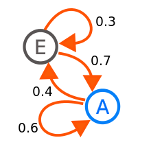
_Markov chain — Wikipedia_

Here we have two states E and A, and the probabilities of going from one state to another, e.g. there is 70% chance of going to state A starting from state E. In this model, you start from a node of the graph, and simply experience the transition probabilities.

这里我们有两个状态 E 和 A，以及从一个状态转到另一个状态的概率，例如从状态 E 开始有 70% 的概率转到状态 A。在这个模型中，你从图的一个节点开始，然后简单地经历转换概率。

## Markov Decision Process

马尔可夫决策过程

A Markov Decision Process (MDP) is an extension of the Markov chain and it is used to model more complex environments. In this extension, we add the possibility to make a choice at every state which is called an action. We also add a reward which is a feedback from the environment for going from one state to another through an action.

马尔可夫决策过程 (Markov Decision Process, MDP) 是马尔可夫链的扩展，用于建模更复杂的环境。在这个扩展中，我们增加了在每个状态做出选择的可能性，这被称为动作 (action)。我们还添加了奖励 (reward)，它是环境对通过动作从一个状态转到另一个状态的反馈。


_Image by Author_

In the image above, we are in the initial state don't understand, where we have two possible actions, study and don't study. For the study action, we may end up in different states according to a probabilistic rule. This is what we call a stochastic environment (random), in the sense that for one same action taken in the same state, we might have different results (understand and don't understand).

在上图中，我们处于初始状态"不理解"，在这里我们有两个可能的动作："学习"和"不学习"。对于"学习"动作，我们可能根据概率规则最终处于不同的状态。这就是我们所说的随机环境 (stochastic environment)，即在同一状态下采取相同的动作，可能会有不同的结果（"理解"和"不理解"）。

In reinforcement learning, this is how we model a game or environment, and our goal will be to maximize the reward we get from that environment.

在强化学习中，这就是我们建模游戏或环境的方式，我们的目标是最大化从该环境中获得的奖励。

## Reward

奖励

The reward is the feedback from the environment that tells us how good we are doing. It can be the number of coins you grab in a game for example. Our goal is to maximize the total reward.

奖励 (reward) 是环境给我们的反馈，告诉我们做得如何。例如，它可以是你在游戏中抓取的金币数量。我们的目标是最大化总奖励。

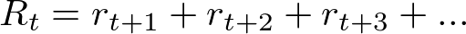

We write Rt to denote the total reward we can get starting at some point t in time, as the sum of all the subsequent rewards earned at each time step.

我们用 Rt 表示从时间点 t 开始可以获得的总奖励，即在每个时间步获得的所有后续奖励的总和。

For example, if we use the MDP presented above. We're initially in the state don't understand, we take the study action which takes us randomly to don't understand. Therefore we experienced the reward r(t+1)=-1. Now we can decide to take another action which will give r(t+2) and so on. The total reward is the sum of all the immediate rewards we get for taking actions in the environment.

例如，如果我们使用上面展示的 MDP。我们最初处于"不理解"状态，采取"学习"动作，随机地又回到"不理解"状态。因此我们获得了奖励 r(t+1)=-1。现在我们可以决定采取另一个动作，这将给出 r(t+2)，依此类推。总奖励是我们在环境中采取动作所获得的所有即时奖励的总和。

Defining the reward this way leads to two major problems :

以这种方式定义奖励会导致两个主要问题：

One way to fix up these problems is to use a decreasing factor for future rewards.

解决这些问题的一种方法是对未来奖励使用递减因子 (discount factor)。

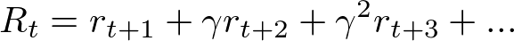

Setting γ=1 takes us back to the first expression where every reward is equally important. Setting γ=0 results in only looking for the immediate reward (always acting for the optimal next step). Setting γ between 0 and 1 is a compromise to look more for immediate reward but still account for future rewards.

设置 γ=1 会回到第一个表达式，其中每个奖励同等重要。设置 γ=0 会导致只关注即时奖励（总是为最优的下一步行动）。将 γ 设置在 0 和 1 之间是一种折衷，更关注即时奖励但仍考虑未来奖励。

We can rewrite that expression in a recursive manner, that will come handy later on.

我们可以用递归的方式重写该表达式，这在后面会很有用。

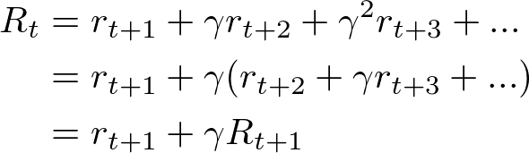

## Policy

策略

A policy is a function that tells what action to take in a certain state. This function is usually denoted π(s,a) and yields the probability of taking action a in state s. We want to find the policy that maximizes the reward function.

策略 (policy) 是一个函数，它告诉我们在某个状态下应该采取什么动作。这个函数通常表示为 π(s,a)，表示在状态 s 中采取动作 a 的概率。我们想要找到能最大化奖励函数的策略。

If we get back to the previous MDP for example, the policy can tell you the probability of taking action study when you're in the state don't understand.

例如，如果我们回到之前的 MDP，策略可以告诉你当你处于"不理解"状态时采取"学习"动作的概率。

Moreover, because this is a probability distribution, the sum over all the possible actions in a given state must be equal to 1.

此外，因为这是一个概率分布，给定状态下所有可能动作的概率之和必须等于 1。

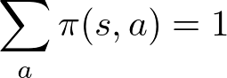

## Notations

符号表示

We are going to start playing around with some equations, and for that we need to introduce new notations.

我们将开始处理一些方程，为此我们需要引入新的符号表示。

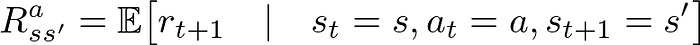

This is the expected immediate reward r(t+1) for going from state s to state s' through action a.

这是通过动作 a 从状态 s 转到状态 s' 的期望即时奖励 r(t+1)。

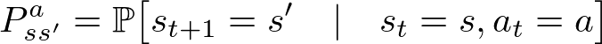

This is the transition probability of going from state s to state s' through action a. In other words, the probability of ending up in state s' by taking action a in state s.

这是通过动作 a 从状态 s 转到状态 s' 的转移概率。换句话说，在状态 s 中采取动作 a 后最终到达状态 s' 的概率。

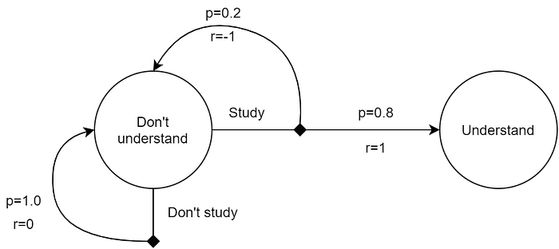
_Image by Author_

In this example :

在这个例子中：（具体数值请参考图片）

## Value functions

价值函数

Two so-called "value functions" exist. The state value function, and the action value function. These functions are a way to measure the "value", or how good some state is, or how good some action is, by looking at the reward obtained for being in a given state or taking a certain action.

存在两个所谓的"价值函数 (value functions)"。状态价值函数 (state value function) 和动作价值函数 (action value function)。这些函数是一种衡量"价值"的方法，即通过查看处于给定状态或采取某个动作所获得的奖励，来衡量某个状态有多好，或某个动作有多好。

### State value

状态价值

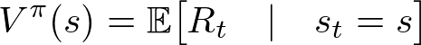

The value of a state is the expected total reward we can get starting from that state. It depends on the policy π which dictates the actions to take.

状态的价值是从该状态开始可以获得的期望总奖励。它取决于策略 π，该策略决定要采取的动作。

### Action Value function

动作价值函数

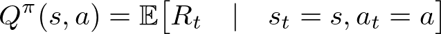

The value of an action taken in some state is the expected total reward we can get starting from that state and taking that action. It also depends on the policy π.

在某个状态下采取某个动作的价值是从该状态开始并采取该动作可以获得的期望总奖励。它也取决于策略 π。

## Bellman Equation for Q-Learning

Q-Learning 的贝尔曼方程

Now that we are settled with notations we can finally start playing around with the math! Looking at the following diagram during the calculation can help you understand.

现在我们已经确定了符号表示，终于可以开始处理数学了！在计算过程中查看下图可以帮助你理解。

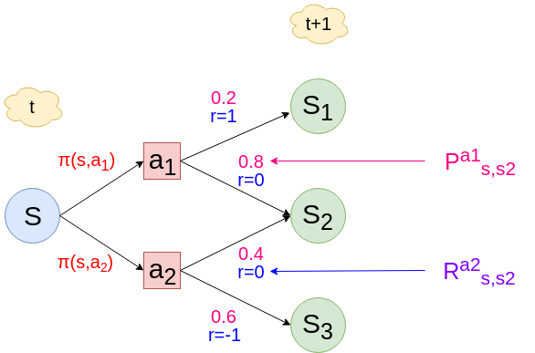
_Image by Author_

We will start by expanding the state value function. The expected operator is linear.

我们将从展开状态价值函数开始。期望算子是线性的。

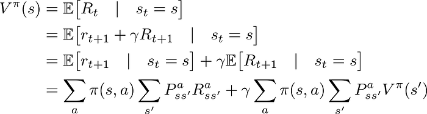

Next, we can expand the action value function.

接下来，我们可以展开动作价值函数。

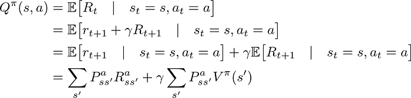

This form of the Q-Value is very generic. It handles stochastic environments, but we could write it down in a deterministic one. Meaning, whenever you take an action you always end up in the same next state and receive the same reward. In that case, we simply do not need to make a weighted sum with probabilities, and the equation becomes:

这种形式的 Q 值非常通用。它处理随机环境，但我们也可以在确定性环境中写出来。意思是，每当你采取一个动作时，你总是会到达相同的下一个状态并获得相同的奖励。在这种情况下，我们不需要用概率进行加权求和，方程变为：

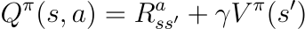

Where s' is the state you end up in for taking action a in state s. Written, more explicitly, this is:

其中 s' 是在状态 s 中采取动作 a 后到达的状态。更明确地写出来，就是：

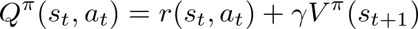

You can read that as the value of (the goodness of) taking action a in state s(t), is the immediate reward obtained for taking action a in state s(t) plus the value of being in state s(t+1) (the expected future rewards for being in state s(t+1)…).

你可以理解为：在状态 s(t) 中采取动作 a 的价值（好坏程度），等于在状态 s(t) 中采取动作 a 获得的即时奖励，加上处于状态 s(t+1) 的价值（处于状态 s(t+1) 的期望未来奖励...）。

### Greedy Policy

贪婪策略

You probably already came across greedy policy reading on the internet. A greedy policy is a policy where you always choose the optimal next step.

你可能已经在网上读到过贪婪策略 (greedy policy)。贪婪策略是一种总是选择最优下一步的策略。


_Greedy Algorithm — Wikipedia_

In a greedy policy context, we can write a relation between the state value and the action value functions.

在贪婪策略的背景下，我们可以写出状态价值函数和动作价值函数之间的关系。

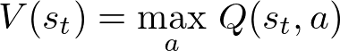

Therefore, plugging this into the previous equation, we get the Q-Value of a (state, action) pair in a deterministic environment, following a greedy policy.

因此，将其代入前面的方程，我们得到在确定性环境中遵循贪婪策略的（状态，动作）对的 Q 值。

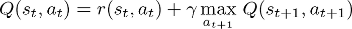

Or simply,

或者简单地说，

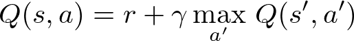

And this is the Bellman equation in the Q-Learning context ! It says that the value of an action a in some state s is the immediate reward you get for taking that action, plus the maximum expected future rewards you can get in the next state.

这就是 Q-Learning 背景下的贝尔曼方程！它说的是，在某个状态 s 中采取动作 a 的价值，等于采取该动作获得的即时奖励，加上在下一个状态中可以获得的最大期望未来奖励。

It actually makes sense when you think about it.

仔细想想，这确实很有道理。

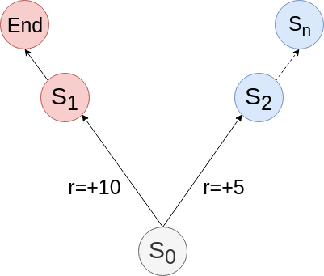
_left or right ? — Image by Author_

Here, if you only look at the immediate reward, you surely choose to go left. Unfortunately, the game ends after and you cannot get more points.

在这里，如果你只看即时奖励，你肯定会选择向左走。不幸的是，游戏之后就结束了，你无法获得更多分数。

If you add the maximum expected reward of the next state, then you will most probably go to the right since the maximum expected reward of S1 is equal to zero and the maximum expected reward of S2 is probably higher than 10–5=5.

如果你加上下一个状态的最大期望奖励，那么你很可能会向右走，因为 S1 的最大期望奖励等于零，而 S2 的最大期望奖励可能高于 10-5=5。

You can also tweak γ to specify how important are the next rewards.

你还可以调整 γ 来指定下一个奖励的重要程度。

## Python Code

Python 代码实现

Here is a simple environment which consists of a 10-by-10 grid. A treasure (T) is placed at the bottom right corner of the grid. The agent (O) starts at the top left corner of the grid.

这是一个简单的环境，由 10x10 的网格组成。宝藏 (T) 放置在网格的右下角。智能体 (agent, O) 从网格的左上角开始。

```
O.........
..........
..........
..........
.........T
```

The agent needs to get to the treasure using the 4 available actions : left, right, up, down.

智能体需要使用 4 个可用动作到达宝藏：左、右、上、下。

If the agent takes an action that leads it directly to T then it gets a reward of 1, otherwise a reward of 0.

如果智能体采取的动作直接到达 T，则获得奖励 1，否则奖励为 0。

### Environment Implementation | 环境实现

```python
import abc


class Env(abc.ABC):
    @abc.abstractmethod
    def actions(self) -> int:
        raise NotImplementedError()

    @abc.abstractmethod
    def states(self) -> int:
        raise NotImplementedError()

    @abc.abstractmethod
    def step(self, action: int) -> tuple[int, int, bool]:
        raise NotImplementedError()

    @abc.abstractmethod
    def reset(self) -> tuple[int, int, bool]:
        raise NotImplementedError()

    @abc.abstractmethod
    def render(self):
        raise NotImplementedError()


class GridEnv(Env):
    def __init__(self, size: int):
        self.x = 0
        self.y = 0
        self.size = size
        self.end_x = size - 1
        self.end_y = size - 1
        self.done = False

    def actions(self) -> int:
        return 4

    def states(self) -> int:
        return self.size ** 2

    def step(self, action: int) -> tuple[int, int, bool]:
        if action == 0:  # left
            self.x = self.x - 1 if self.x > 0 else self.x
        if action == 1:  # right
            self.x = self.x + 1 if self.x < self.size - 1 else self.x
        if action == 2:  # up
            self.y = self.y - 1 if self.y > 0 else self.y
        if action == 3:  # down
            self.y = self.y + 1 if self.y < self.size - 1 else self.y

        done = self.x == self.end_x and self.y == self.end_y
        next_state = self.size * self.y + self.x
        reward = 1 if done else 0
        return next_state, reward, done

    def reset(self) -> tuple[int, int, bool]:
        self.x = 0
        self.y = 0
        self.done = False
        return 0, 0, False

    def render(self):
        for i in range(self.size):
            for j in range(self.size):
                if self.y == i and self.x == j:
                    print("O", end='')
                elif self.end_y == i and self.end_x == j:
                    print("T", end='')
                else:
                    print(".", end='')
            print("")
```

### Q-Learning Algorithm | Q-Learning 算法

The idea of the algorithm is to keep a so called q-table, which, over time will approximate the optimal policy π\*(s,a) that maximizes the total reward. Hence, the q-table has a dimension of states × actions. Initially this table is random.

算法的思想是维护一个所谓的 q-table（Q表），随着时间推移，它会逼近最优策略 π\*(s,a)，从而最大化总奖励。因此，q-table 的维度是 states × actions（状态数 × 动作数）。最初这个表是随机的。

We start in a state of the environment, and we pick the best action to take according to our q-table. The environment gives us a reward, which we use to update the q-table with the Bellman equation. And we start again.

我们从环境的某个状态开始，根据 q-table 选择最佳动作。环境给我们一个奖励，我们用贝尔曼方程更新 q-table。然后重新开始。

To allow for exploration, we allow the agent to pick a random action (not the optimal one) with a small probability. This probability decreases over time as the agent becomes better at picking the optimal action.

为了允许探索 (exploration)，我们允许智能体以小概率选择随机动作（而不是最优动作）。随着智能体越来越擅长选择最优动作，这个概率会随时间递减。

```python
import os
import env
import time
import random


def train(e: env.Env) -> list[list[float]]:
    qtable = [
        [random.random() for _ in range(e.actions())]
        for _ in range(e.states())
    ]

    # hyperparameters
    epochs = 50
    gamma = 0.1
    epsilon = 0.08
    decay = 0.5

    # training loop
    for i in range(epochs):
        state, reward, done = e.reset()
        steps = 0

        while not done:
            os.system('clear')
            print("epoch #", i+1, "/", epochs)
            e.render()
            time.sleep(0.01)

            # count steps to finish game
            steps += 1

            if random.random() < epsilon:
                # act randomly to allow exploration
                action = random.choice(range(e.actions()))
            else:
                # act greedy and select action with max probability
                action = qtable[state].index(max(qtable[state]))

            # take action
            next_state, reward, done = e.step(action)

            # update qtable value with Bellman equation
            qtable[state][action] = reward + gamma * max(qtable[next_state])

            # update state
            state = next_state

        # The more we learn, the less we take random actions
        epsilon -= decay * epsilon

        print("\nDone in", steps, "steps".format(steps))
        time.sleep(0.8)

    return qtable


grid = env.GridEnv(10)
train(grid)
```

As the agent trains, it takes shorter and shorter paths to reach the target.

随着智能体的训练，它到达目标的路径越来越短。

### Run the code | 运行代码

Put both of the above files in the same directory (save as `env.py` and `train.py`), and run:

将上述两个文件放在同一目录中（保存为 `env.py` 和 `train.py`），然后运行：

```bash
python train.py
```

Around the epoch number 40, the agent should have learned to get to the treasure using one of the shortest paths (8 steps).

在第 40 轮左右，智能体应该已经学会使用最短路径之一到达宝藏（8 步）。

## Conclusion

结论

We have seen how to derive statistical formulas to find the Bellman equation and used it to teach an AI how to play a simple game. Notice that in this game, the number of possible states is finite (the number of different cells you might end up in), which is why building a Q-Table (a table of values that approaches the real value of the Q function for discrete values) is still manageable. What about a graphical game, such as Flappy Bird, Mario Bros, or Call Of Duty ? Every frame displayed by the game can be considered as a different state. In that case it's impossible to build a Q-Table, and what we do instead is use a neural network who's goal will be to learn the Q function. That neural network will typically take as input the current state of the game, and output the best possible action to take in that state. This is known as Deep Q Learning and is exactly how AIs such as Deep Blue or Alpha Go managed to beat world champions at Chess or Go.

我们已经看到了如何推导统计公式来找到贝尔曼方程，并用它来教 AI 如何玩简单的游戏。请注意，在这个游戏中，可能的状态数量是有限的（你可能最终到达的不同单元格的数量），这就是为什么构建 Q-Table（一个接近离散值的 Q 函数真实值的值表）仍然是可行的。那么图形游戏呢，比如 Flappy Bird、Mario Bros 或 Call Of Duty？游戏显示的每一帧都可以被视为不同的状态。在这种情况下，构建 Q-Table 是不可能的，我们所做的是使用神经网络 (neural network)，其目标是学习 Q 函数。该神经网络通常将游戏的当前状态作为输入，并输出在该状态下采取的最佳可能动作。这被称为深度 Q 学习 (Deep Q Learning)，这正是 Deep Blue 或 Alpha Go 等 AI 如何在国际象棋或围棋中击败世界冠军的方法。

---

## 术语表 | Technical Glossary

- **Q-Learning**: Q学习
- **Reinforcement Learning**: 强化学习
- **Machine Learning**: 机器学习
- **agent**: 智能体
- **environment**: 环境
- **Markov Decision Process (MDP)**: 马尔可夫决策过程
- **state**: 状态
- **action**: 动作
- **reward**: 奖励
- **policy**: 策略
- **Q-function**: Q函数
- **Markov chain**: 马尔可夫链
- **stochastic**: 随机的
- **deterministic**: 确定性的
- **Bellman equation**: 贝尔曼方程
- **value function**: 价值函数
- **state value function**: 状态价值函数
- **action value function**: 动作价值函数
- **greedy policy**: 贪婪策略
- **discount factor (γ)**: 折扣因子
- **exploration**: 探索
- **exploitation**: 利用
- **Q-table**: Q表
- **Deep Q Learning**: 深度Q学习
- **neural network**: 神经网络

---

## 学习建议 | Study Tips

1. **理解核心概念** - 仔细阅读原文和翻译，理解 MDP、奖励、策略等基本概念
2. **推导数学公式** - 跟随文章一步步推导贝尔曼方程，理解每一步的含义
3. **实践代码** - 运行提供的代码示例，观察智能体如何学习
4. **实验参数** - 尝试修改 γ、epsilon 等超参数，观察对学习效果的影响
5. **扩展应用** - 尝试将 Q-Learning 应用到其他简单游戏或问题上

## 进阶学习 | Advanced Topics

- **Deep Q-Network (DQN)**: 使用神经网络近似 Q 函数
- **Double DQN**: 解决 Q 值过估计问题
- **Dueling DQN**: 分离状态价值和动作优势
- **Policy Gradient Methods**: 直接优化策略的方法
- **Actor-Critic**: 结合价值函数和策略梯度的方法
